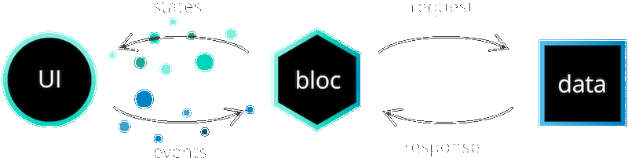
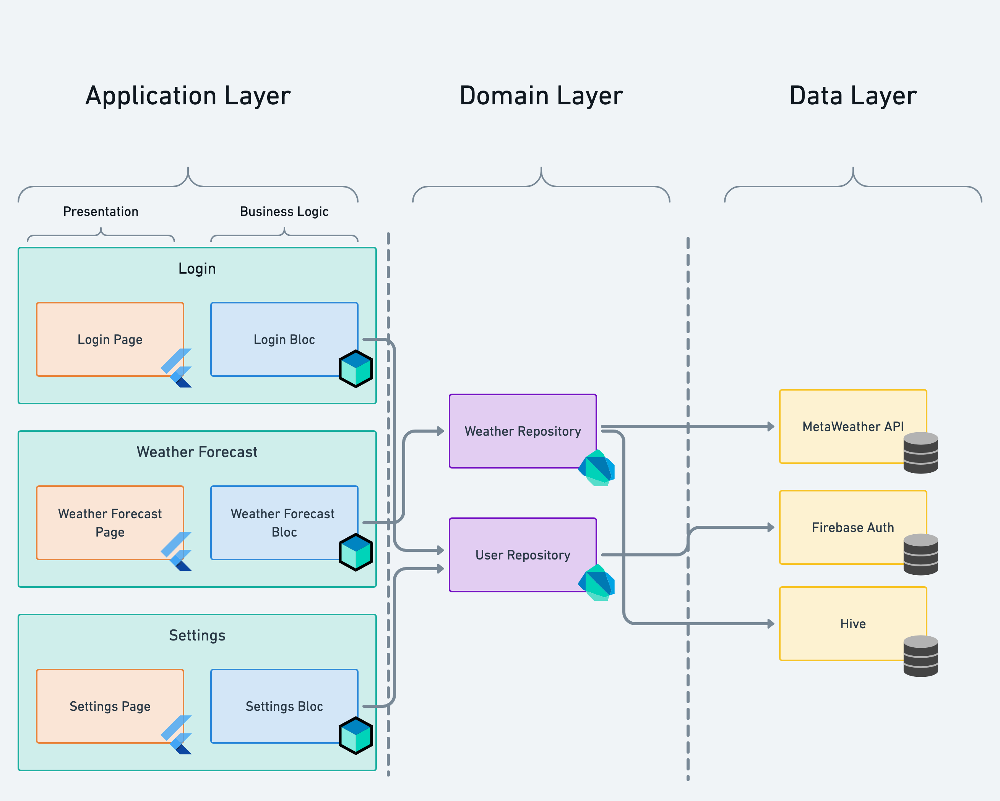

# Architecture

Using the bloc library allows us to separate our application into three layers:

- Presentation
- Business Logic
- Data
  - Repository
  - Data Provider

We're going to start at the lowest level layer (farthest from the user interface) and work our way up to the presentation layer.

## Data Layer

> The data layer's responsibility is to retrieve/manipulate data from one or more sources.

The data layer can be split into two parts:

- Repository
- Data Provider

This layer is the lowest level of the application and interacts with databases, network requests, and other asynchronous data sources.

### Data Provider

> The data provider's responsibility is to provide raw data. The data provider should be generic and versatile.

The data provider will usually expose simple APIs to perform [CRUD](https://en.wikipedia.org/wiki/Create,_read,_update_and_delete) operations.
We might have a `createData`, `readData`, `updateData`, and `deleteData` method as part of our data layer.

[data_provider.dart](_snippets/architecture/data_provider.dart.md ':include')

### Repository

> The repository layer is a wrapper around one or more data providers with which the Bloc Layer communicates.

[repository.dart](_snippets/architecture/repository.dart.md ':include')

As you can see, our repository layer can interact with multiple data providers and perform transformations on the data before handing the result to the business logic Layer.

## Business Logic Layer

> The business logic layer's responsibility is to respond to input from the presentation layer with new states. This layer can depend on one or more repositories to retrieve data needed to build up the application state.

Think of the business logic layer as the bridge between the user interface (presentation layer) and the data layer. The business logic layer is notified of events/actions from the presentation layer and then communicates with repository in order to build a new state for the presentation layer to consume.

[business_logic_component.dart](_snippets/architecture/business_logic_component.dart.md ':include')

### Bloc-to-Bloc Communication

Because blocs expose streams, it may be tempting to make a bloc which listens to another bloc. You should **not** do this. There are better alternatives than resorting to the code below:

[do_not_do_this_at_home.dart](_snippets/architecture/do_not_do_this_at_home.dart.md ':include')

While the code above is error free (and even cleans up after itself), it has a bigger problem: it creates a dependency between two blocs.

Generally, sibling dependencies between two entities in the same architectural layer should be avoided at all costs, as it creates tight-coupling which is hard to maintain. Since blocs reside in the business logic architectural layer, no bloc should know about any other bloc.

A bloc should only receive information through events and from injected repositories (i.e., repositories given to the bloc in its constructor).

If you're in a situation where a bloc needs to respond to another bloc, you have two other options. You can push the problem up a layer (into the presentation layer), or down a layer (into the domain layer).

#### Connecting Blocs through Presentation

You can use a `BlocListener` to listen to one bloc and add an event to another bloc whenever the first bloc changes.

[blocs_presentation.dart.md](_snippets/architecture/blocs_presentation.dart.md ':include')

The code above prevents `SecondBloc` from needing to know about `FirstBloc`, encouraging loose-coupling. The [flutter_weather](flutterweathertutorial.md) application [uses this technique](https://github.com/felangel/bloc/blob/b4c8db938ad71a6b60d4a641ec357905095c3965/examples/flutter_weather/lib/weather/view/weather_page.dart#L38-L42) to change the app's theme based on the weather information that is received.

In some situations, you may not want to couple two blocs in the presentation layer. Instead, it can often make sense for two blocs to share the same source of data and update whenever the data changes.

#### Connecting Blocs through Domain

Two blocs can listen to a stream from a repository and update their states independent of each other whenever the repository data changes. Using reactive repositories to keep state synchronized is common in large-scale enterprise applications.

First, create or use a repository which provides a data `Stream`. For example, the following repository exposes a never-ending stream of the same few app ideas:

[app_ideas_repo.dart.md](_snippets/architecture/app_ideas_repo.dart.md ':include')

The same repository can be injected into each bloc that needs to react to new app ideas. Below is an `AppIdeaRankingBloc` which yields a state out for each incoming app idea from the repository above:

[blocs_domain.dart.md](_snippets/architecture/blocs_domain.dart.md ':include')

For more about using streams with Bloc, see [How to use Bloc with streams and concurrency](https://verygood.ventures/blog/how-to-use-bloc-with-streams-and-concurrency).

## Presentation Layer

> The presentation layer's responsibility is to figure out how to render itself based on one or more bloc states. In addition, it should handle user input and application lifecycle events.

Most applications flows will start with a `AppStart` event which triggers the application to fetch some data to present to the user.

In this scenario, the presentation layer would add an `AppStart` event.

In addition, the presentation layer will have to figure out what to render on the screen based on the state from the bloc layer.

[presentation_component.dart](_snippets/architecture/presentation_component.dart.md ':include')

So far, even though we've had some code snippets, all of this has been fairly high level. In the tutorial section we're going to put all this together as we build several different example apps.
