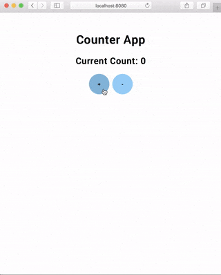

# Tutoriál: Počátadlo v AngularDartu

?> **Poznámka:** Tento tutoriál ještě nemá překlad.

> In the following tutorial, we're going to build a Counter in AngularDart using the Bloc library.

## Setup

We'll start off by creating a brand new AngularDart project with [stagehand](https://github.com/dart-lang/stagehand).

[script](../_snippets/angular_counter_tutorial/stagehand.sh.md ':include')

!> Activate stagehand by running `pub global activate stagehand`

We can then go ahead and replace the contents of `pubspec.yaml` with:

[pubspec.yaml](../_snippets/angular_counter_tutorial/pubspec.yaml.md ':include')

and then install all of our dependencies

[script](../_snippets/angular_counter_tutorial/install.sh.md ':include')

Our counter app is just going to have two buttons to increment/decrement the counter value and an element to display the current value. Let's get started designing the `CounterEvents`.

## Counter Events

[counter_event.dart](../_snippets/angular_counter_tutorial/counter_event.dart.md ':include')

## Counter States

Since our counter's state can be represented by an integer we don't need to create a custom class!

## Counter Bloc

[counter_bloc.dart](../_snippets/angular_counter_tutorial/counter_bloc.dart.md ':include')

?> **Note**: Just from the class declaration we can tell that our `CounterBloc` will be taking `CounterEvents` as input and outputting integers.

## Counter App

Now that we have our `CounterBloc` fully implemented, we can get started creating our AngularDart App Component.

Our `app.component.dart` should look like:

[app.component.dart](../_snippets/angular_counter_tutorial/app_component.dart.md ':include')

and our `app.component.html` should look like:

[app.component.html](../_snippets/angular_counter_tutorial/app_component.html.md ':include')

## Counter Page

Finally, all that's left is to build our Counter Page Component.

Our `counter_page_component.dart` should look like:

[counter_page_component.dart](../_snippets/angular_counter_tutorial/counter_page_component.dart.md ':include')

?> **Note**: We are able to access the `CounterBloc` instance using AngularDart's dependency injection system. Because we have registered it as a `Provider`, AngularDart can properly resolve `CounterBloc`.

?> **Note**: We are closing the `CounterBloc` in `ngOnDestroy`.

?> **Note**: We are importing the `BlocPipe` so that we can use it in our template.

Lastly, our `counter_page_component.html` should look like:

[counter_page_component.html](../_snippets/angular_counter_tutorial/counter_page_component.html.md ':include')

?> **Note**: We are using the `BlocPipe` so that we can display our counterBloc state as it is updated.

That's it! We've separated our presentation layer from our business logic layer. Our `CounterPageComponent` has no idea what happens when a user presses a button; it just adds an event to notify the `CounterBloc`. Furthermore, our `CounterBloc` has no idea what is happening with the state (counter value); it's simply converting the `CounterEvents` into integers.

We can run our app with `webdev serve` and can view it [locally](http://localhost:8080).

The full source for this example can be found [here](https://github.com/felangel/Bloc/tree/master/examples/angular_counter).
