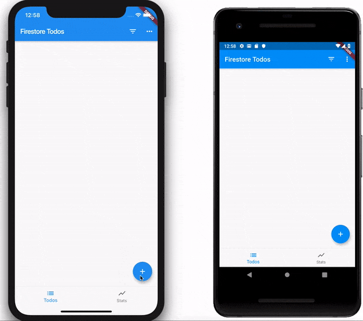

# Flutter Firestore Todos Tutorial

> In the following tutorial, we're going to build a reactive Todos App which hooks up to Firestore. We're going to be building on top of the [flutter todos](https://bloclibrary.dev/#/fluttertodostutorial) example so we won't go into the UI since it will all be the same.

The only things we're going to be refactoring in our existing [todos example](https://github.com/felangel/Bloc/tree/master/examples/flutter_todos) are the repository layer and parts of the bloc layer.

We'll start off in the repository layer with the `TodosRepository`.

## Todos Repository

Create a new package at the root level of our app called `todos_repository`.

?> **Note:** The reason for making the repository a standalone package is to illustrate that the repository should be decoupled from the application and can be reused across multiple apps.

Inside our `todos_repository` create the following folder/file structure.

[todos_repository_dir.sh](_snippets/flutter_firestore_todos_tutorial/todos_repository_dir.sh.md ':include')

### Dependencies

The `pubspec.yaml` should look like:

[pubspec.yaml](_snippets/flutter_firestore_todos_tutorial/todos_repository_pubspec.yaml.md ':include')

?> **Note:** We can immediately see our `todos_repository` has a dependency on `firebase_core` and `cloud_firestore`.

### Package Root

The `todos_repository.dart` directly inside `lib` should look like:

[todos_repository.dart](_snippets/flutter_firestore_todos_tutorial/todos_repository_library.dart.md ':include')

?> This is where all of our public classes are exported. If we want a class to be private to the package we should make sure to omit it.

### Entities

> Entities represent the data provided by our data provider.

The `entities.dart` file is a barrel file that exports the `todo_entity.dart`
file.

[entities.dart](_snippets/flutter_firestore_todos_tutorial/entities_barrel.dart.md ':include')

Our `TodoEntity` is the representation of our `Todo` inside Firestore.
Create `todo_entity.dart` and let's implement it.

[todo_entity.dart](_snippets/flutter_firestore_todos_tutorial/todo_entity.dart.md ':include')

The `toJson` and `fromJson` are standard methods for converting to/from json.
The `fromSnapshot` and `toDocument` are specific to Firestore.

?> **Note:** Firestore will automatically create the id for the document when we insert it. As such we don't want to duplicate data by storing the id in an id field.

### Models

> Models will contain plain dart classes which we will work with in our Flutter Application. Having the separation between models and entities allows us to switch our data provider at any time and only have to change the the `toEntity` and `fromEntity` conversion in our model layer.

Our `models.dart` is another barrel file.
Inside the `todo.dart` let's put the following code.

[todo.dart](_snippets/flutter_firestore_todos_tutorial/todo.dart.md ':include')

### Todos Repository

> `TodosRepository` is our abstract base class which we can extend whenever we want to integrate with a different `TodosProvider`.

Let's create `todos_repository.dart`

[todos_repository.dart](_snippets/flutter_firestore_todos_tutorial/todos_repository.dart.md ':include')

?> **Note:** Because we have this interface it is easy to add another type of datastore. If, for example, we wanted to use something like [sembast](https://pub.dev/flutter/packages?q=sembast) all we would need to do is create a separate repository for handling the sembast specific code.

#### Firebase Todos Repository

> `FirebaseTodosRepository` manages the integration with Firestore and implements our `TodosRepository` interface.

Let's open `firebase_todos_repository.dart` and implement it!

[firebase_todos_repository.dart](_snippets/flutter_firestore_todos_tutorial/firebase_todos_repository.dart.md ':include')

That's it for our `TodosRepository`, next we need to create a simple `UserRepository` to manage authenticating our users.

## User Repository

Create a new package at the root level of our app called `user_repository`.

Inside our `user_repository` create the following folder/file structure.

[user_repository_dir.sh](_snippets/flutter_firestore_todos_tutorial/user_repository_dir.sh.md ':include')

### Dependencies

The `pubspec.yaml` should look like:

[pubspec.yaml](_snippets/flutter_firestore_todos_tutorial/user_repository_pubspec.yaml.md ':include')

?> **Note:** We can immediately see our `user_repository` has a dependency on `firebase_auth`.

### Package Root

The `user_repository.dart` directly inside `lib` should look like:

[user_repository.dart](_snippets/flutter_firestore_todos_tutorial/user_repository_library.dart.md ':include')

### User Repository

> `UserRepository` is our abstract base class which we can extend whenever we want to integrate with a different provider`.

Let's create `user_repository.dart`

[user_repository.dart](_snippets/flutter_firestore_todos_tutorial/user_repository.dart.md ':include')

#### Firebase User Repository

> `FirebaseUserRepository` manages the integration with Firebase and implements our `UserRepository` interface.

Let's open `firebase_user_repository.dart` and implement it!

[firebase_user_repository.dart](_snippets/flutter_firestore_todos_tutorial/firebase_user_repository.dart.md ':include')

That's it for our `UserRepository`, next we need to setup our Flutter app to use our new repositories.

## Flutter App

### Setup

Let's create a new Flutter app called `flutter_firestore_todos`. We can replace the contents of the `pubspec.yaml` with the following:

[pubspec.yaml](_snippets/flutter_firestore_todos_tutorial/pubspec.yaml.md ':include')

?> **Note:** We're adding our `todos_repository` and `user_repository` as external dependencies.

### Authentication Bloc

Since we want to be able to sign in our users, we'll need to create an `AuthenticationBloc`.

?> If you haven't already checked out the [flutter firebase login tutorial](https://bloclibrary.dev/#/flutterfirebaselogintutorial), I highly recommend checking it out now because we're simply going to reuse the same `AuthenticationBloc`.

#### Authentication Events

[authentication_event.dart](_snippets/flutter_firestore_todos_tutorial/authentication_event.dart.md ':include')

#### Authentication States

[authentication_state.dart](_snippets/flutter_firestore_todos_tutorial/authentication_state.dart.md ':include')

#### Authentication Bloc

[authentication_bloc.dart](_snippets/flutter_firestore_todos_tutorial/authentication_bloc.dart.md ':include')

Now that our `AuthenticationBloc` is finished, we need to modify the `TodosBloc` from the original [Todos Tutorial](https://bloclibrary.dev/#/fluttertodostutorial) to consume the new `TodosRepository`.

### Todos Bloc

[todos_bloc.dart](_snippets/flutter_firestore_todos_tutorial/todos_bloc.dart.md ':include')

The main difference between our new `TodosBloc` and the original one is in the new one, everything is `Stream` based rather than `Future` based.

[todos_bloc.dart](_snippets/flutter_firestore_todos_tutorial/map_load_todos_to_state.dart.md ':include')

?> When we load our todos, we are subscribing to the `TodosRepository` and every time a new todo comes in, we add a `TodosUpdated` event. We then handle all `TodosUpdates` via:

[todos_bloc.dart](_snippets/flutter_firestore_todos_tutorial/map_todos_updated_to_state.dart.md ':include')

## Putting it all together

The last thing we need to modify is our `main.dart`.

[main.dart](_snippets/flutter_firestore_todos_tutorial/main.dart.md ':include')

The main differences to note are the fact that we've wrapped our entire application in a `MultiBlocProvider` which initializes and provides the `AuthenticationBloc` and `TodosBloc`. We then, only render the todos app if the `AuthenticationState` is `Authenticated` using `BlocBuilder`. Everything else remains the same as in the previous `todos tutorial`.

That’s all there is to it! We’ve now successfully implemented a firestore todos app in flutter using the [bloc](https://pub.dev/packages/bloc) and [flutter_bloc](https://pub.dev/packages/flutter_bloc) packages and we’ve successfully separated our presentation layer from our business logic while also building an app that updates in real-time.

The full source for this example can be found [here](https://github.com/felangel/Bloc/tree/master/examples/flutter_firestore_todos).
