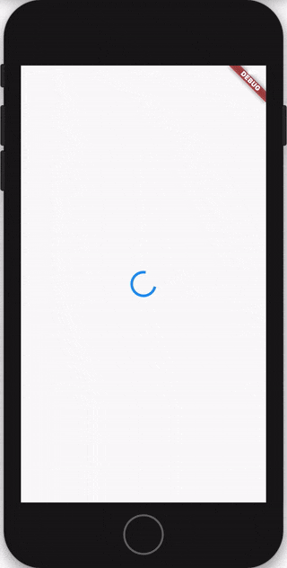

# Flutter Login Tutorial

> In the following tutorial, we're going to build a Login Flow in Flutter using the Bloc library.

## Setup

We'll start off by creating a brand new Flutter project

[script](_snippets/flutter_login_tutorial/flutter_create.sh.md ':include')

We can then go ahead and replace the contents of `pubspec.yaml` with

[pubspec.yaml](_snippets/flutter_login_tutorial/pubspec.yaml.md ':include')

and then install all of our dependencies

[script](_snippets/flutter_login_tutorial/flutter_packages_get.sh.md ':include')

## User Repository

We're going to need to create a `UserRepository` which helps us manage a user's data.

[user_repository.dart](_snippets/flutter_login_tutorial/user_repository.dart.md ':include')

?> **Note**: Our user repository is just mocking all of the different implementations for the sake of simplicity but in a real application you might inject a [HttpClient](https://pub.dev/packages/http) as well as something like [Flutter Secure Storage](https://pub.dev/packages/flutter_secure_storage) in order to request tokens and read/write them to keystore/keychain.

## Authentication States

Next, we’re going to need to determine how we’re going to manage the state of our application and create the necessary blocs (business logic components).

At a high level, we’re going to need to manage the user’s Authentication State. A user's authentication state can be one of the following:

- AuthenticationInitial - waiting to see if the user is authenticated or not on app start.
- AuthenticationInProgress - waiting to persist/delete a token
- AuthenticationSuccess - successfully authenticated
- AuthenticationFailure - not authenticated

Each of these states will have an implication on what the user sees.

For example:

- if the authentication state was AuthenticationInitial, the user might be seeing a splash screen.
- if the authentication state was AuthenticationInProgress, the user might be seeing a progress indicator.
- if the authentication state was AuthenticationSuccess, the user might see a home screen.
- if the authentication state was AuthenticationFailure, the user might see a login form.

> It's critical to identify what the different states are going to be before diving into the implementation.

Now that we have our authentication states identified, we can implement our `AuthenticationState` class.

[authentication_state.dart](_snippets/flutter_login_tutorial/authentication_state.dart.md ':include')

?> **Note**: The [`equatable`](https://pub.dev/packages/equatable) package is used in order to be able to compare two instances of `AuthenticationState`. By default, `==` returns true only if the two objects are the same instance.

## Authentication Events

Now that we have our `AuthenticationState` defined we need to define the `AuthenticationEvents` which our `AuthenticationBloc` will be reacting to.

We will need:

- an `AuthenticationStarted` event to notify the bloc that it needs to check if the user is currently authenticated or not.
- a `AuthenticationLoggedIn` event to notify the bloc that the user has successfully logged in.
- a `AuthenticationLoggedOut` event to notify the bloc that the user has successfully logged out.

[authentication_event.dart](_snippets/flutter_login_tutorial/authentication_event.dart.md ':include')

?> **Note**: the `meta` package is used to annotate the `AuthenticationEvent` parameters as `@required`. This will cause the dart analyzer to warn developers if they don't provide the required parameters.

## Authentication Bloc

Now that we have our `AuthenticationState` and `AuthenticationEvents` defined, we can get to work on implementing the `AuthenticationBloc` which is going to manage checking and updating a user's `AuthenticationState` in response to `AuthenticationEvents`.

We'll start off by creating our `AuthenticationBloc` class.

[authentication_bloc.dart](_snippets/flutter_login_tutorial/authentication_bloc_constructor.dart.md ':include')

?> **Note**: Just from reading the class definition, we already know this bloc is going to be converting `AuthenticationEvents` into `AuthenticationStates`.

?> **Note**: Our `AuthenticationBloc` has a dependency on the `UserRepository`.

We can start by overriding `initialState` to the `AuthenticationInitial()` state.

[authentication_bloc.dart](_snippets/flutter_login_tutorial/authentication_bloc_initial_state.dart.md ':include')

Now all that's left is to implement `mapEventToState`.

[authentication_bloc.dart](_snippets/flutter_login_tutorial/authentication_bloc_map_event_to_state.dart.md ':include')

Great! Our final `AuthenticationBloc` should look like

[authentication_bloc.dart](_snippets/flutter_login_tutorial/authentication_bloc.dart.md ':include')

Now that we have our `AuthenticationBloc` fully implemented, let’s get to work on the presentational layer.

## Splash Page

The first thing we’ll need is a `SplashPage` widget which will serve as our Splash Screen while our `AuthenticationBloc` determines whether or not a user is logged in.

[splash_page.dart](_snippets/flutter_login_tutorial/splash_page.dart.md ':include')

## Home Page

Next, we will need to create our `HomePage` so that we can navigate users there once they have successfully logged in.

[home_page.dart](_snippets/flutter_login_tutorial/home_page.dart.md ':include')

?> **Note**: This is the first class in which we are using `flutter_bloc`. We will get into `BlocProvider.of<AuthenticationBloc>(context)` shortly but for now just know that it allows our `HomePage` to access our `AuthenticationBloc`.

?> **Note**: We are adding a `AuthenticationLoggedOut` event to our `AuthenticationBloc` when a user pressed the logout button.

Next up, we need to create a `LoginPage` and `LoginForm`.

Because the `LoginForm` will have to handle user input (Login Button Pressed) and will need to have some business logic (getting a token for a given username/password), we will need to create a `LoginBloc`.

Just like we did for the `AuthenticationBloc`, we will need to define the `LoginState`, and `LoginEvents`. Let’s start with `LoginState`.

## Login States

[login_state.dart](_snippets/flutter_login_tutorial/login_state.dart.md ':include')

`LoginInitial` is the initial state of the LoginForm.

`LoginInProgress` is the state of the LoginForm when we are validating credentials

`LoginFailure` is the state of the LoginForm when a login attempt has failed.

Now that we have the `LoginState` defined let’s take a look at the `LoginEvent` class.

## Login Events

[login_event.dart](_snippets/flutter_login_tutorial/login_event.dart.md ':include')

`LoginButtonPressed` will be added when a user pressed the login button. It will notify the `LoginBloc` that it needs to request a token for the given credentials.

We can now implement our `LoginBloc`.

## Login Bloc

[login_bloc.dart](_snippets/flutter_login_tutorial/login_bloc.dart.md ':include')

?> **Note**: `LoginBloc` has a dependency on `UserRepository` in order to authenticate a user given a username and password.

?> **Note**: `LoginBloc` has a dependency on `AuthenticationBloc` in order to update the AuthenticationState when a user has entered valid credentials.

Now that we have our `LoginBloc` we can start working on `LoginPage` and `LoginForm`.

## Login Page

The `LoginPage` widget will serve as our container widget and will provide the necessary dependencies to the `LoginForm` widget (`LoginBloc` and `AuthenticationBloc`).

[login_page.dart](_snippets/flutter_login_tutorial/login_page.dart.md ':include')

?> **Note**: `LoginPage` is a `StatelessWidget`. The `LoginPage` widget uses the `BlocProvider` widget to create, close, and provide the `LoginBloc` to the sub-tree.

?> **Note**: We are using the injected `UserRepository` in order to create our `LoginBloc`.

?> **Note**: We are using `BlocProvider.of<AuthenticationBloc>(context)` again in order to access the `AuthenticationBloc` from the `LoginPage`.

Next up, let’s go ahead and create our `LoginForm`.

## Login Form

[login_form.dart](_snippets/flutter_login_tutorial/login_form.dart.md ':include')

?> **Note**: Our `LoginForm` uses the `BlocBuilder` widget so that it can rebuild whenever there is a new `LoginState`. `BlocBuilder` is a Flutter widget which requires a Bloc and a builder function. `BlocBuilder` handles building the widget in response to new states. `BlocBuilder` is very similar to `StreamBuilder` but has a more simple API to reduce the amount of boilerplate code needed and various performance optimizations.

There’s not much else going on in the `LoginForm` widget so let's move on to creating our loading indicator.

## Loading Indicator

[loading_indicator.dart](_snippets/flutter_login_tutorial/loading_indicator.dart.md ':include')

Now it’s finally time to put it all together and create our main App widget in `main.dart`.

## Putting it all together

[main.dart](_snippets/flutter_login_tutorial/main.dart.md ':include')

?> **Note**: Again, we are using `BlocBuilder` in order to react to changes in `AuthenticationState` so that we can show the user either the `SplashPage`, `LoginPage`, `HomePage`, or `LoadingIndicator` based on the current `AuthenticationState`.

?> **Note**: Our app is wrapped in a `BlocProvider` which makes our instance of `AuthenticationBloc` available to the entire widget subtree. `BlocProvider` is a Flutter widget which provides a bloc to its children via `BlocProvider.of(context)`. It is used as a dependency injection (DI) widget so that a single instance of a bloc can be provided to multiple widgets within a subtree.

Now `BlocProvider.of<AuthenticationBloc>(context)` in our `HomePage` and `LoginPage` widget should make sense.

Since we wrapped our `App` within a `BlocProvider<AuthenticationBloc>` we can access the instance of our `AuthenticationBloc` by using the `BlocProvider.of<AuthenticationBloc>(BuildContext context)` static method from anywhere in the subtree.

At this point we have a pretty solid login implementation and we have decoupled our presentation layer from the business logic layer by using Bloc.

The full source for this example can be found [here](https://github.com/felangel/Bloc/tree/master/examples/flutter_login).
