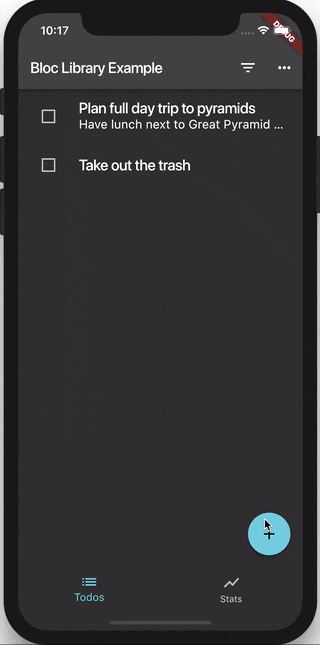

# Flutter Todos Tutorial

> In the following tutorial, we're going to build a Todos App in Flutter using the Bloc library.

## Setup

We'll start off by creating a brand new Flutter project

[script](_snippets/flutter_todos_tutorial/flutter_create.sh.md ':include')

We can then replace the contents of `pubspec.yaml` with

[pubspec.yaml](_snippets/flutter_todos_tutorial/pubspec.yaml.md ':include')

and then install all of the dependencies

[script](_snippets/flutter_todos_tutorial/flutter_packages_get.sh.md ':include')

?> **Note:** We're overriding some dependencies because we're going to be reusing them from [Brian Egan's Flutter Architecture Samples](https://github.com/brianegan/flutter_architecture_samples).

## App Keys

Before we jump into the application code, let's create `flutter_todos_keys.dart`. This file will contain keys which we will use to uniquely identify important widgets. We can later write tests that find widgets based on keys.

[flutter_todos_keys.dart](_snippets/flutter_todos_tutorial/flutter_todos_keys.dart.md ':include')

We will reference these keys throughout the rest of the tutorial.

?> **Note:** You can check out the integration tests for the application [here](https://github.com/brianegan/flutter_architecture_samples/tree/master/integration_tests). You can also check out unit and widget tests [here](https://github.com/brianegan/flutter_architecture_samples/tree/master/bloc_library/test).

## Localization

One last concept that we will touch on before going into the application itself is localization. Create `localization.dart` and we'll create the foundation for multi-language support.

[localization.dart](_snippets/flutter_todos_tutorial/localization.dart.md ':include')

We can now import and provide our `FlutterBlocLocalizationsDelegate` to our `MaterialApp` (later in this tutorial).

For more information on localization check out the [official flutter docs](https://flutter.dev/docs/development/accessibility-and-localization/internationalization).

## Todos Repository

In this tutorial we're not going to go into the implementation details of the `TodosRepository` because it was implemented by [Brian Egan](https://github.com/brianegan) and is shared among all of the [Todo Architecture Samples](https://github.com/brianegan/flutter_architecture_samples). At a high level, the `TodosRepository` will expose a method to `loadTodos` and to `saveTodos`. That's pretty much all we need to know so for the rest of the tutorial we'll focus on the Bloc and Presentation layers.

## Todos Bloc

> Our `TodosBloc` will be responsible for converting `TodosEvents` into `TodosStates` and will manage the list of todos.

### Model

The first thing we need to do is define our `Todo` model. Each todo will need to have an id, a task, an optional note, and an optional completed flag.

Let's create a `models` directory and create `todo.dart`.

[todo.dart](_snippets/flutter_todos_tutorial/todo.dart.md ':include')

?> **Note:** We're using the [Equatable](https://pub.dev/packages/equatable) package so that we can compare instances of `Todos` without having to manually override `==` and `hashCode`.

Next up, we need to create the `TodosState` which our presentation layer will receive.

### States

Let's create `blocs/todos/todos_state.dart` and define the different states we'll need to handle.

The three states we will implement are:

- `TodosLoadInProgress` - the state while our application is fetching todos from the repository.
- `TodosLoadSuccess` - the state of our application after the todos have successfully been loaded.
- `TodosLoadFailure` - the state of our application if the todos were not successfully loaded.

[todos_state.dart](_snippets/flutter_todos_tutorial/todos_state.dart.md ':include')

Next, let's implement the events we will need to handle.

### Events

The events we will need to handle in our `TodosBloc` are:

- `TodosLoadSuccess` - tells the bloc that it needs to load the todos from the `TodosRepository`.
- `TodoAdded` - tells the bloc that it needs to add an new todo to the list of todos.
- `TodoUpdated` - tells the bloc that it needs to update an existing todo.
- `TodoDeleted` - tells the bloc that it needs to remove an existing todo.
- `ClearCompleted` - tells the bloc that it needs to remove all completed todos.
- `ToggleAll` - tells the bloc that it needs to toggle the completed state of all todos.

Create `blocs/todos/todos_event.dart` and let's implement the events we described above.

[todos_event.dart](_snippets/flutter_todos_tutorial/todos_event.dart.md ':include')

Now that we have our `TodosStates` and `TodosEvents` implemented we can implement our `TodosBloc`.

### Bloc

Let's create `blocs/todos/todos_bloc.dart` and get started! We just need to implement `initialState` and `mapEventToState`.

[todos_bloc.dart](_snippets/flutter_todos_tutorial/todos_bloc.dart.md ':include')

!> When we yield a state in the private `mapEventToState` handlers, we are always yielding a new state instead of mutating the `state`. This is because every time we yield, bloc will compare the `state` to the `nextState` and will only trigger a state change (`transition`) if the two states are **not equal**. If we just mutate and yield the same instance of state, then `state == nextState` would evaluate to true and no state change would occur.

Our `TodosBloc` will have a dependency on the `TodosRepository` so that it can load and save todos. It will have an initial state of `TodosLoadInProgress` and defines the private handlers for each of the events. Whenever the `TodosBloc` changes the list of todos it calls the `saveTodos` method in the `TodosRepository` in order to keep everything persisted locally.

### Barrel File

Now that we're done with our `TodosBloc` we can create a barrel file to export all of our bloc files and make it convenient to import them later on.

Create `blocs/todos/todos.dart` and export the bloc, events, and states:

[bloc.dart](_snippets/flutter_todos_tutorial/todos_bloc_barrel.dart.md ':include')

## Filtered Todos Bloc

> The `FilteredTodosBloc` will be responsible for reacting to state changes in the `TodosBloc` we just created and will maintain the state of filtered todos in our application.

### Model

Before we start defining and implementing the `TodosStates`, we will need to implement a `VisibilityFilter` model that will determine which todos our `FilteredTodosState` will contain. In this case, we will have three filters:

- `all` - show all Todos (default)
- `active` - only show Todos which have not been completed
- `completed` only show Todos which have been completed

We can create `models/visibility_filter.dart` and define our filter as an enum:

[visibility_filter.dart](_snippets/flutter_todos_tutorial/visibility_filter.dart.md ':include')

### States

Just like we did with the `TodosBloc`, we'll need to define the different states for our `FilteredTodosBloc`.

In this case, we only have two states:

- `FilteredTodosLoadInProgress` - the state while we are fetching todos
- `FilteredTodosLoadSuccess` - the state when we are no longer fetching todos

Let's create `blocs/filtered_todos/filtered_todos_state.dart` and implement the two states.

[filtered_todos_state.dart](_snippets/flutter_todos_tutorial/filtered_todos_state.dart.md ':include')

?> **Note:** The `FilteredTodosLoadSuccess` state contains the list of filtered todos as well as the active visibility filter.

### Events

We're going to implement two events for our `FilteredTodosBloc`:

- `FilterUpdated` - which notifies the bloc that the visibility filter has changed
- `TodosUpdated` - which notifies the bloc that the list of todos has changed

Create `blocs/filtered_todos/filtered_todos_event.dart` and let's implement the two events.

[filtered_todos_event.dart](_snippets/flutter_todos_tutorial/filtered_todos_event.dart.md ':include')

We're ready to implement our `FilteredTodosBloc` next!

### Bloc

Our `FilteredTodosBloc` will be similar to our `TodosBloc`; however, instead of having a dependency on the `TodosRepository`, it will have a dependency on the `TodosBloc` itself. This will allow the `FilteredTodosBloc` to update its state in response to state changes in the `TodosBloc`.

Create `blocs/filtered_todos/filtered_todos_bloc.dart` and let's get started.

[filtered_todos_bloc.dart](_snippets/flutter_todos_tutorial/filtered_todos_bloc.dart.md ':include')

!> We create a `StreamSubscription` for the stream of `TodosStates` so that we can listen to the state changes in the `TodosBloc`. We override the bloc's close method and cancel the subscription so that we can clean up after the bloc is closed.

### Barrel File

Just like before, we can create a barrel file to make it more convenient to import the various filtered todos classes.

Create `blocs/filtered_todos/filtered_todos.dart` and export the three files:

[bloc.dart](_snippets/flutter_todos_tutorial/filtered_todos_bloc_barrel.dart.md ':include')

Next, we're going to implement the `StatsBloc`.

## Stats Bloc

> The `StatsBloc` will be responsible for maintaining the statistics for number of active todos and number of completed todos. Similarly, to the `FilteredTodosBloc`, it will have a dependency on the `TodosBloc` itself so that it can react to changes in the `TodosBloc` state.

### State

Our `StatsBloc` will have two states that it can be in:

- `StatsLoadInProgress` - the state when the statistics have not yet been calculated.
- `StatsLoadSuccess` - the state when the statistics have been calculated.

Create `blocs/stats/stats_state.dart` and let's implement our `StatsState`.

[stats_state.dart](_snippets/flutter_todos_tutorial/stats_state.dart.md ':include')

Next, let's define and implement the `StatsEvents`.

### Events

There will just be a single event our `StatsBloc` will respond to: `StatsUpdated`. This event will be added whenever the `TodosBloc` state changes so that our `StatsBloc` can recalculate the new statistics.

Create `blocs/stats/stats_event.dart` and let's implement it.

[stats_event.dart](_snippets/flutter_todos_tutorial/stats_event.dart.md ':include')

Now we're ready to implement our `StatsBloc` which will look very similar to the `FilteredTodosBloc`.

### Bloc

Our `StatsBloc` will have a dependency on the `TodosBloc` itself which will allow it to update its state in response to state changes in the `TodosBloc`.

Create `blocs/stats/stats_bloc.dart` and let's get started.

[stats_bloc.dart](_snippets/flutter_todos_tutorial/stats_bloc.dart.md ':include')

That's all there is to it! Our `StatsBloc` recalculates its state which contains the number of active todos and the number of completed todos on each state change of our `TodosBloc`.

Now that we're done with the `StatsBloc` we just have one last bloc to implement: the `TabBloc`.

## Tab Bloc

> The `TabBloc` will be responsible for maintaining the state of the tabs in our application. It will be taking `TabEvents` as input and outputting `AppTabs`.

### Model / State

We need to define an `AppTab` model which we will also use to represent the `TabState`. The `AppTab` will just be an `enum` which represents the active tab in our application. Since the app we're building will only have two tabs: todos and stats, we just need two values.

Create `models/app_tab.dart`:

[app_tab.dart](_snippets/flutter_todos_tutorial/app_tab.dart.md ':include')

### Event

Our `TabBloc` will be responsible for handling a single `TabEvent`:

- `TabUpdated` - which notifies the bloc that the active tab has updated

Create `blocs/tab/tab_event.dart`:

[tab_event.dart](_snippets/flutter_todos_tutorial/tab_event.dart.md ':include')

### Bloc

Our `TabBloc` implementation will be super simple. As always, we just need to implement `initialState` and `mapEventToState`.

Create `blocs/tab/tab_bloc.dart` and let's quickly do the implementation.

[tab_bloc.dart](_snippets/flutter_todos_tutorial/tab_bloc.dart.md ':include')

I told you it'd be simple. All the `TabBloc` is doing is setting the initial state to the todos tab and handling the `TabUpdated` event by yielding a new `AppTab` instance.

### Barrel File

Lastly, we'll create another barrel file for our `TabBloc` exports. Create `blocs/tab/tab.dart` and export the two files:

[bloc.dart](_snippets/flutter_todos_tutorial/tab_bloc_barrel.dart.md ':include')

## Bloc Delegate

Before we move on to the presentation layer, we will implement our own `BlocDelegate` which will allow us to handle all state changes and errors in a single place. It's really useful for things like developer logs or analytics.

Create `blocs/simple_bloc_delegate.dart` and let's get started.

[simple_bloc_delegate.dart](_snippets/flutter_todos_tutorial/simple_bloc_delegate.dart.md ':include')

All we're doing in this case is printing all state changes (`transitions`) and errors to the console just so that we can see what's going on when we're running our app. You can hook up your `BlocDelegate` to google analytics, sentry, crashlytics, etc...

## Blocs Barrel

Now that we have all of our blocs implemented we can create a barrel file.
Create `blocs/blocs.dart` and export all of our blocs so that we can conveniently import any bloc code with a single import.

[blocs.dart](_snippets/flutter_todos_tutorial/blocs_barrel.dart.md ':include')

Up next, we'll focus on implementing the major screens in our Todos application.

## Screens

### Home Screen

> Our `HomeScreen` will be responsible for creating the `Scaffold` of our application. It will maintain the `AppBar`, `BottomNavigationBar`, as well as the `Stats`/`FilteredTodos` widgets (depending on the active tab).

Let's create a new directory called `screens` where we will put all of our new screen widgets and then create `screens/home_screen.dart`.

[home_screen.dart](_snippets/flutter_todos_tutorial/home_screen.dart.md ':include')

The `HomeScreen` accesses the `TabBloc` using `BlocProvider.of<TabBloc>(context)` which will be made available from our root `TodosApp` widget (we'll get to it later in this tutorial).

Next, we'll implement the `DetailsScreen`.

### Details Screen

> The `DetailsScreen` displays the full details of the selected todo and allows the user to either edit or delete the todo.

Create `screens/details_screen.dart` and let's build it.

[details_screen.dart](_snippets/flutter_todos_tutorial/details_screen.dart.md ':include')

?> **Note:** The `DetailsScreen` requires a todo id so that it can pull the todo details from the `TodosBloc` and so that it can update whenever a todo's details have been changed (a todo's id cannot be changed).

The main things to note are that there is an `IconButton` which adds a `TodoDeleted` event as well as a checkbox which adds an `TodoUpdated` event.

There is also another `FloatingActionButton` which navigates the user to the `AddEditScreen` with `isEditing` set to `true`. We'll take a look at the `AddEditScreen` next.

### Add/Edit Screen

> The `AddEditScreen` widget allows the user to either create a new todo or update an existing todo based on the `isEditing` flag that is passed via the constructor.

Create `screens/add_edit_screen.dart` and let's have a look at the implementation.

[add_edit_screen.dart](_snippets/flutter_todos_tutorial/add_edit_screen.dart.md ':include')

There's nothing bloc-specific in this widget. It's simply presenting a form and:

- if `isEditing` is true the form is populated it with the existing todo details.
- otherwise the inputs are empty so that the user can create a new todo.

It uses an `onSave` callback function to notify its parent of the updated or newly created todo.

That's it for the screens in our application so before we forget, let's create a barrel file to export them.

### Screens Barrel

Create `screens/screens.dart` and export all three.

[screens.dart](_snippets/flutter_todos_tutorial/screens_barrel.dart.md ':include')

Next, let's implement all of the "widgets" (anything that isn't a screen).

## Widgets

### Filter Button

> The `FilterButton` widget will be responsible for providing the user with a list of filter options and will notify the `FilteredTodosBloc` when a new filter is selected.

Let's create a new directory called `widgets` and put our `FilterButton` implementation in `widgets/filter_button.dart`.

[filter_button.dart](_snippets/flutter_todos_tutorial/filter_button.dart.md ':include')

The `FilterButton` needs to respond to state changes in the `FilteredTodosBloc` so it uses `BlocProvider` to access the `FilteredTodosBloc` from the `BuildContext`. It then uses `BlocBuilder` to re-render whenever the `FilteredTodosBloc` changes state.

The rest of the implementation is pure Flutter and there isn't much going on so we can move on to the `ExtraActions` widget.

### Extra Actions

> Similarly to the `FilterButton`, the `ExtraActions` widget is responsible for providing the user with a list of extra options: Toggling Todos and Clearing Completed Todos.

Since this widget doesn't care about the filters it will interact with the `TodosBloc` instead of the `FilteredTodosBloc`.

Let's create the `ExtraAction` model in `models/extra_action.dart`.

[extra_action.dart](_snippets/flutter_todos_tutorial/extra_action.dart.md ':include')

And don't forget to export it from the `models/models.dart` barrel file.

Next, let's create `widgets/extra_actions.dart` and implement it.

[extra_actions.dart](_snippets/flutter_todos_tutorial/extra_actions.dart.md ':include')

Just like with the `FilterButton`, we use `BlocProvider` to access the `TodosBloc` from the `BuildContext` and `BlocBuilder` to respond to state changes in the `TodosBloc`.

Based on the action selected, the widget adds an event to the `TodosBloc` to either `ToggleAll` todos' completion states or `ClearCompleted` todos.

Next we'll take a look at the `TabSelector` widget.

### Tab Selector

> The `TabSelector` widget is responsible for displaying the tabs in the `BottomNavigationBar` and handling user input.

Let's create `widgets/tab_selector.dart` and implement it.

[tab_selector.dart](_snippets/flutter_todos_tutorial/tab_selector.dart.md ':include')

You can see that there is no dependency on blocs in this widget; it just calls `onTabSelected` when a tab is selected and also takes an `activeTab` as input so it knows which tab is currently selected.

Next, we'll take a look at the `FilteredTodos` widget.

### Filtered Todos

> The `FilteredTodos` widget is responsible for showing a list of todos based on the current active filter.

Create `widgets/filtered_todos.dart` and let's implement it.

[filtered_todos.dart](_snippets/flutter_todos_tutorial/filtered_todos.dart.md ':include')

Just like the previous widgets we've written, the `FilteredTodos` widget uses `BlocProvider` to access blocs (in this case both the `FilteredTodosBloc` and the `TodosBloc` are needed).

?> The `FilteredTodosBloc` is needed to help us render the correct todos based on the current filter

?> The `TodosBloc` is needed to allow us to add/delete todos in response to user interactions such as swiping on an individual todo.

From the `FilteredTodos` widget, the user can navigate to the `DetailsScreen` where it is possible to edit or delete the selected todo. Since our `FilteredTodos` widget renders a list of `TodoItem` widgets, we'll take a look at those next.

### Todo Item

> `TodoItem` is a stateless widget which is responsible for rendering a single todo and handling user interactions (taps/swipes).

Create `widgets/todo_item.dart` and let's build it.

[todo_item.dart](_snippets/flutter_todos_tutorial/todo_item.dart.md ':include')

Again, notice that the `TodoItem` has no bloc-specific code in it. It simply renders based on the todo we pass via the constructor and calls the injected callback functions whenever the user interacts with the todo.

Next up, we'll create the `DeleteTodoSnackBar`.

### Delete Todo SnackBar

> The `DeleteTodoSnackBar` is responsible for indicating to the user that a todo was deleted and allows the user to undo his/her action.

Create `widgets/delete_todo_snack_bar.dart` and let's implement it.

[delete_todo_snack_bar.dart](_snippets/flutter_todos_tutorial/delete_todo_snack_bar.dart.md ':include')

By now, you're probably noticing a pattern: this widget also has no bloc-specific code. It simply takes in a todo in order to render the task and calls a callback function called `onUndo` if a user presses the undo button.

We're almost done; just two more widgets to go!

### Loading Indicator

> The `LoadingIndicator` widget is a stateless widget that is responsible for indicating to the user that something is in progress.

Create `widgets/loading_indicator.dart` and let's write it.

[loading_indicator.dart](_snippets/flutter_todos_tutorial/loading_indicator.dart.md ':include')

Not much to discuss here; we're just using a `CircularProgressIndicator` wrapped in a `Center` widget (again no bloc-specific code).

Lastly, we need to build our `Stats` widget.

### Stats

> The `Stats` widget is responsible for showing the user how many todos are active (in progress) vs. completed.

Let's create `widgets/stats.dart` and take a look at the implementation.

[stats.dart](_snippets/flutter_todos_tutorial/stats.dart.md ':include')

We're accessing the `StatsBloc` using `BlocProvider` and using `BlocBuilder` to rebuild in response to state changes in the `StatsBloc` state.

## Putting it all together

Let's create `main.dart` and our `TodosApp` widget. We need to create a `main` function and run our `TodosApp`.

[main.dart](_snippets/flutter_todos_tutorial/main1.dart.md ':include')

?> **Note:** We are setting our BlocSupervisor's delegate to the `SimpleBlocDelegate` we created earlier so that we can hook into all transitions and errors.

?> **Note:** We are also wrapping our `TodosApp` widget in a `BlocProvider` which manages initializing, closing, and providing the `TodosBloc` to our entire widget tree from [flutter_bloc](https://pub.dev/packages/flutter_bloc). We immediately add the `TodosLoadSuccess` event in order to request the latest todos.

Next, let's implement our `TodosApp` widget.

[main.dart](_snippets/flutter_todos_tutorial/todos_app.dart.md ':include')

Our `TodosApp` is a `StatelessWidget` which accesses the provided `TodosBloc` via the `BuildContext`.

The `TodosApp` has two routes:

- `Home` - which renders a `HomeScreen`
- `TodoAdded` - which renders a `AddEditScreen` with `isEditing` set to `false`.

The `TodosApp` also makes the `TabBloc`, `FilteredTodosBloc`, and `StatsBloc` available to the widgets in its subtree by using the `MultiBlocProvider` widget from [flutter_bloc](https://pub.dev/packages/flutter_bloc).

[multi_bloc_provider.dart](_snippets/flutter_todos_tutorial/multi_bloc_provider.dart.md ':include')

is equivalent to writing

[nested_bloc_providers.dart](_snippets/flutter_todos_tutorial/nested_bloc_providers.dart.md ':include')

You can see how using `MultiBlocProvider` helps reduce the levels of nesting and makes the code easier to read and maintain.

The entire `main.dart` should look like this:

[main.dart](_snippets/flutter_todos_tutorial/main2.dart.md ':include')

That’s all there is to it! We’ve now successfully implemented a todos app in flutter using the [bloc](https://pub.dev/packages/bloc) and [flutter_bloc](https://pub.dev/packages/flutter_bloc) packages and we’ve successfully separated our presentation layer from our business logic.

The full source for this example can be found [here](https://github.com/felangel/Bloc/tree/master/examples/flutter_todos).
