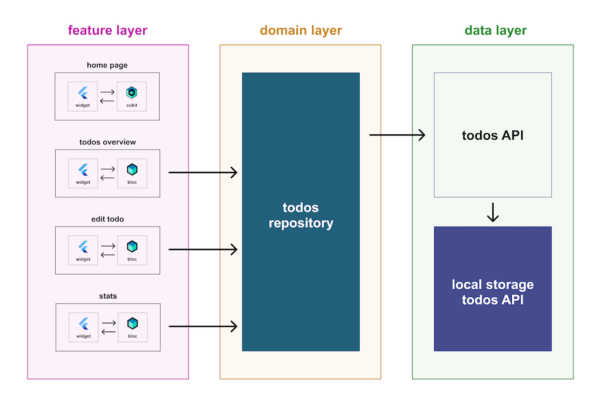
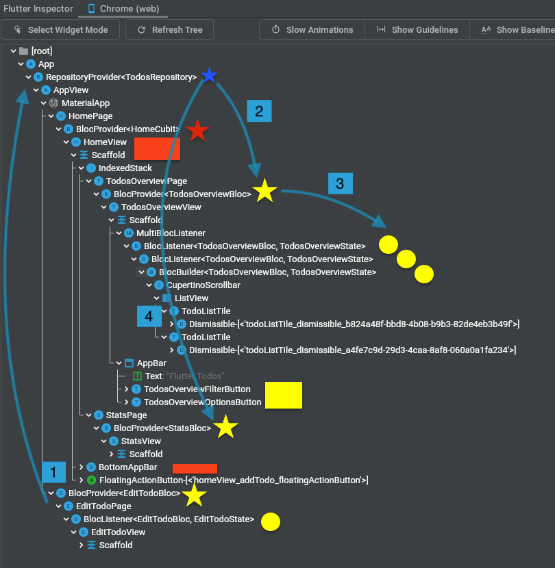
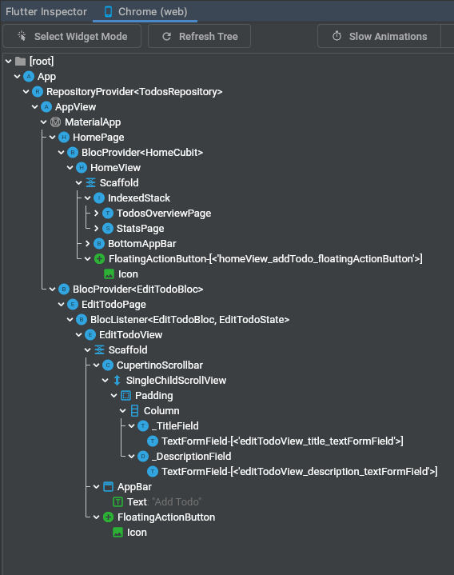

# Flutter Todos Tutorial


> In the following tutorial, we're going to build a Todos App in Flutter using the Bloc library.


## Key Topics

- [Bloc and Cubit](/coreconcepts?id=cubit-vs-bloc) to manage the various feature states.
- [Layered Architecture](/architecture) for separation of concerns and to facilitate reusability.
- [BlocObserver](/coreconcepts?id=blocobserver) to observe state changes.
- [BlocProvider](/flutterbloccoreconcepts?id=blocprovider), a Flutter widget which provides a bloc to its children.
- [BlocBuilder](/flutterbloccoreconcepts?id=blocbuilder), a Flutter widget that handles building the widget in response to new states.
- [BlocListener](/flutterbloccoreconcepts?id=bloclistener), a Flutter widget that handlers performing side-effects in response to state changes.
- [RespositoryProvider](/flutterbloccoreconcepts?id=respositoryprovider), a Flutter widget to provide a repository to its children.
- [Equatable](/faqs?id=when-to-use-equatable) to prevent unnecessary rebuilds.
- [MultiBlocListener](/flutterbloccoreconcepts?id=multibloclistener), a Flutter widget that reduces nesting when using multiple BlocListeners.

## Setup

We'll start off by creating a brand new Flutter project using the [`very_good_cli`](https://pub.dev/packages/very_good_cli). We'll use the default `very_good_core` template:

```sh
very_good create flutter_todos --desc "An example todos app that showcases bloc state management patterns."
```

?> **💡 Tip**: you can install `very_good_cli` via `dart pub global activate very_good_cli`.

Next we'll create the `todos_api`, `local_storage_todos_api`, and `todos_repository` packages:

```sh
# create package:todos_api under packages/todos_api
very_good create packages/todos_api -t dart_pkg --desc "The interface and models for an API providing access to todos."

# create package:local_storage_todos_api under packages/local_storage_todos_api
very_good create packages/local_storage_todos_api -t flutter_pkg --desc "A Flutter implementation of the TodosApi that uses local storage."

# create package:todos_repository under packages/todos_repository
very_good create packages/todos_repository -t dart_pkg --desc "A repository that handles todo related requests."
```

We can then replace the contents of `pubspec.yaml` with:

[pubspec.yaml](https://raw.githubusercontent.com/felangel/bloc/docs/flutter-todos-v8.0.0/examples/flutter_todos/pubspec.yaml ':include')

and finally install all the dependencies:

```sh
very_good packages get --recursive
```

## Project Structure

Our application project structure should look like:

```sh
├── lib
├── packages
│   ├── local_storage_todos_api
│   ├── todos_api
│   └── todos_repository
└── test
```

We split the project into multiple packages in order to maintain explicit dependencies for each package with clear boundaries that enforce the single responsibility principle.
Modularizing our project like this has many benefits including but not limited to:
- easy to reuse packages across multiple projects
- CI/CD improvements in terms of efficiency (run checks on only the code that has changed)
- easy to maintain the packages in isolation with their dedicated test suites, semantic versioning, and release cycle/cadence

## Architecture



## Data Layer

### TodosApi

The `todos_api` package will export a generic interface for interacting/managing todos. Later we'll implement the `TodosApi` using `shared_preferences` but having an abstraction will make it easy to support other implementations without having to change any other part of our application. For example, we can later add a `FirestoreTodosApi` which uses `cloud_firestore` instead of `shared_preferences` with minimal code changes to the rest of the application. 

[pubspec.yaml](https://raw.githubusercontent.com/felangel/bloc/docs/flutter-todos-v8.0.0/examples/flutter_todos/packages/todos_api/pubspec.yaml ':include')

[todos_api.dart](https://raw.githubusercontent.com/felangel/bloc/docs/flutter-todos-v8.0.0/examples/flutter_todos/packages/todos_api/lib/src/todos_api.dart ':include')

#### Todo model

Now is a good time to introduce the model for a `Todo`.

The first thing of note is that the `Todo` model doesn't live in our app -- it's part of the `todos_api` package. This is because the `TodosApi` defines APIs that returns/accept `Todo` objects and the model is a Dart representation of the raw Todo object that will be stored/retrieved.

The `Todo` model uses [json_serializable](https://pub.dev/packages/json_serializable) to handle the json (de)serialization. If you are following along you will have to run the [code generation step](https://pub.dev/packages/json_serializable#running-the-code-generator) to resolve the compiler errors.

[todo.dart](https://raw.githubusercontent.com/felangel/bloc/docs/flutter-todos-v8.0.0/examples/flutter_todos/packages/todos_api/lib/src/models/todo.dart ':include')

`json_map.dart` provides a `typedef` for code checking and linting.

[json_map.dart](https://raw.githubusercontent.com/felangel/bloc/docs/flutter-todos-v8.0.0/examples/flutter_todos/packages/todos_api/lib/src/models/json_map.dart ':include')

The model of the `Todo` is defined in: `todos_api/models/todo.dart` and is exported by `package:todos_api/todos_api.dart`.

#### Streams vs Futures

In a previous version of this tutorial, the `TodosApi` was `Future`-based rather than `Stream`-based.

For an example of a `Future`-based API see [Brian Egan's implementation in his Architecture Samples](https://github.com/brianegan/flutter_architecture_samples/tree/master/todos_repository_core).

A `Future`-based implementation could consist of two methods: `loadTodos` and `saveTodos` (note the plural). This means, a full list of Todos must be provided to the method each time.

- One limitation of this approach is that the standard CRUD (Create, Read, Update, and Delete) operation requires sending the full list of Todos with each call. For example, on an Add Todo screen, one cannot just send the added todo item. Instead, we must keep track of the entire list and provide the entire new list of todos when persisting the updated list.
- A second limitation is that `loadTodos` is a one-time delivery of data. The app must contain logic to ask for updates periodically. This is okay if an app is for a single-user, on a single device, and not connected to the cloud; however, many modern apps support
  - a single user signed in on multiple devices at once
  - multiple users adding to the same data-set (like a group todo-list)

As a result, in the current implementation, the `TodosApi` exposes a `Stream<List<Todo>>` via `getTodos()` which will report real-time updates to all subscribers when the list of todos has changed.

In addition, Todos can be created, deleted, or updated individually. For example, both deleting and saving a Todo are done with only the `todo` as the argument. It's not necessary to provide the newly updated list of todos each time.

### LocalStorageTodosApi

This package implements the `todos_api` using the [`shared_preferences`](https://pub.dev/packages/shared_preferences) package.

[pubspec.yaml](https://raw.githubusercontent.com/felangel/bloc/docs/flutter-todos-v8.0.0/examples/flutter_todos/packages/local_storage_todos_api/pubspec.yaml ':include')

[local_storage_todos_api.dart](https://raw.githubusercontent.com/felangel/bloc/docs/flutter-todos-v8.0.0/examples/flutter_todos/packages/local_storage_todos_api/lib/src/local_storage_todos_api.dart ':include')

## Repository Layer

### TodosRepository

A [repository](/architecture?id=repository) is part of the "business layer". A repository depends on one or more data providers that have no business value, and composes their public API into APIs that represent business value. In addition, having a repository layer helps abstract data-acquisition from the rest of the application allowing us to change where/how data is being stored without affecting other parts of the app.

[todos_repository.dart](https://raw.githubusercontent.com/felangel/bloc/docs/flutter-todos-v8.0.0/examples/flutter_todos/packages/todos_repository/lib/src/todos_repository.dart ':include')

Instantiating or constructing the repository requires specifying a `TodosApi`, which we discussed earlier in this tutorial, so we added it as a dependency in our `pubspec.yaml`:

[pubspec.yaml](https://raw.githubusercontent.com/felangel/bloc/docs/flutter-todos-v8.0.0/examples/flutter_todos/packages/todos_repository/pubspec.yaml ':include')

#### Library Exports

In addition to exporting the `TodosRepository` class, we also export the `Todo` model from the `todos_api` package from the `todos_repository` in order to prevent tight coupling between the application and the data providers.

[todos_repository.dart](https://raw.githubusercontent.com/felangel/bloc/docs/flutter-todos-v8.0.0/examples/flutter_todos/packages/todos_repository/lib/todos_repository.dart ':include')

We decided to re-export the same `Todo` model from the `todos_api` rather than re-defining a separate model in the `todos_repository` because in this case we are in complete control of the data model. In many cases, the data provider will not be something that you as a developer can control and in those cases it becomes increasingly important to maintain your own model definitions in the repository layer in order to maintain full control of the interface and API contract.

## Feature Layer

### Entrypoint

Our app's entrypoint is `main.dart`. In this case, there are three versions:

The most notable thing is that this is where the concrete implementation of the `todos_api` is instantiated -- in our case it's the `local_storage_todos_api`.

#### `main_development.dart`

[main_development.dart](https://raw.githubusercontent.com/felangel/bloc/docs/flutter-todos-v8.0.0/examples/flutter_todos/lib/main_development.dart ':include')

#### `main_staging.dart`

[main_staging.dart](https://raw.githubusercontent.com/felangel/bloc/docs/flutter-todos-v8.0.0/examples/flutter_todos/lib/main_staging.dart ':include')

#### `main_production.dart`

[main_production.dart](https://raw.githubusercontent.com/felangel/bloc/docs/flutter-todos-v8.0.0/examples/flutter_todos/lib/main_production.dart ':include')

### Bootstrapping

`bootstrap.dart` loads our `BlocObserver` and creates the instance of `TodosRepository`.

[bootstrap.dart](https://raw.githubusercontent.com/felangel/bloc/docs/flutter-todos-v8.0.0/examples/flutter_todos/lib/bootstrap.dart ':include')

### App

`App` and `AppView` are near top-level widgets.

`App` wraps a `RepositoryProvider` widget that provides the repository to all children/descendents. Since both `EditTodoPage` subtree and the `HomePage` subtree's are descendents, all the blocs and cubits can access the repository.

`AppView` creates the `MaterialApp` and configures the theme and localizations.

[app.dart](https://raw.githubusercontent.com/felangel/bloc/docs/flutter-todos-v8.0.0/examples/flutter_todos/lib/app/app.dart ':include')

### Theme

This provides theme definition for light and dark mode.

[theme.dart](https://raw.githubusercontent.com/felangel/bloc/docs/flutter-todos-v8.0.0/examples/flutter_todos/lib/theme/theme.dart ':include')

### Home

The home feature is responsible for managing the state of the currently selected tab and display the correct sub-tree.

#### HomeState

There are only two states associated with the two screens: `todos` and `stats`. `EditTodo` is a separate route therefore it isn't part of the `HomeState`.

[home_state.dart](https://raw.githubusercontent.com/felangel/bloc/docs/flutter-todos-v8.0.0/examples/flutter_todos/lib/home/cubit/home_state.dart ':include')

#### HomeCubit

A cubit is appropriate in this case due to the simplicity of the business logic. We have one method `setTab` to change the tab.

[home_cubit.dart](https://raw.githubusercontent.com/felangel/bloc/docs/flutter-todos-v8.0.0/examples/flutter_todos/lib/home/cubit/home_cubit.dart ':include')

#### HomeView

`view.dart` is a barrel file that exports all relevant UI components for the home feature.

[view.dart](https://raw.githubusercontent.com/felangel/bloc/docs/flutter-todos-v8.0.0/examples/flutter_todos/lib/home/view/view.dart ':include')

`home_page.dart` contains the UI for the root page that the user will say when the app is launched.

[home_page.dart](https://raw.githubusercontent.com/felangel/bloc/docs/flutter-todos-v8.0.0/examples/flutter_todos/lib/home/view/home_page.dart ':include')

A simplified representation of the widget tree for the `HomePage` is:

```
├── HomePage
│   └── BlocProvider<HomeCubit>
│       └── HomeView
│           ├── context.select<HomeCubit, HomeTab>
│           └── BottomAppBar
│               └── HomeTabButton(s)
│                   └── context.read<HomeCubit>
```

The `HomePage` provides an instance of `HomeCubit` to `HomeView`. `HomeView` uses `context.select` to selectively rebuild whenever the tab changes.
This allows us to easily widget test `HomeView` by providing a mock `HomeCubit` and stubbing the state.

The `BottomAppBar` contains `HomeTabButton` widgets which call `setTab` on the `HomeCubit`. The instance of the cubit is looked up via `context.read` and the appropriate method is invoked on the cubit instance.

!> `context.read` doesn't listen for changes, but this is just used to access to `HomeCubit` to call the `setTab` -- no updating is needed.

### TodosOverview

The todos overview feature allows users to manage their todos by creating, editing, deleting, and filtering todos.

#### TodosOverviewEvent

Let's create `todos_overview/bloc/todos_overview_event.dart` and define the events.

[todos_overview_event.dart](https://raw.githubusercontent.com/felangel/bloc/docs/flutter-todos-v8.0.0/examples/flutter_todos/lib/todos_overview/bloc/todos_overview_event.dart ':include')

- `TodosOverviewSubscriptionRequested` - This is the startup event. The intention is to have the bloc get a subscription to the `TodosRepository`. In this case, that will be a `Stream`.
- `TodosOverviewTodoSaved` - This saves a Todo. Note: The Todo could be either a new Todo (create) or an existing Todo (update).
- `TodosOverviewTodoDeleted` - This deletes a Todo.
- `TodosOverviewTodoCompletionToggled` - This toggles a Todo's completed. It also takes `isCompleted` as a second argument.
- `TodosOverviewToggleAllRequested` - Toggles completion for all. Like "Mark all as Done". If all Todos are marked as done, then this event will toggle them to not done.
- `TodosOverviewClearCompletedRequested` - Deletes all completed Todos.
- `TodosOverviewUndoDeletionRequested` - This undoes a Todo delete, e.g. an accidental deletion. Note: As implemented, this doesn't provide a Todo as an argument. So, this suggests that the `TodosOverviewState` will have to keep track of the most recently deleted Todo.
- `TodosOverviewFilterChanged` - This takes a `TodosViewFilter` as an argument and changes the view by applying a filter. This suggests that `TodosOverviewState` will keep track of the current view filter.

#### TodosOverviewState

Let's create `todos_overview/bloc/todos_overview_state.dart` and define the different states we'll need to handle.

[todos_overview_state.dart](https://raw.githubusercontent.com/felangel/bloc/docs/flutter-todos-v8.0.0/examples/flutter_todos/lib/todos_overview/bloc/todos_overview_state.dart ':include')

`TodosOverviewState` will keep track of a list of Todos, but also the active filter, the `lastDeletedTodo`, and the status.

Looking at the annotated default constructor below, we see the elements of the state.

Notice that in addition to the default getters and setters, we have a custom getter called `filteredTodos`. 

Later in the UI we can use `BlocBuilder` and access either `state.filteredTodos` or `state.todos`. The UI doesn't have to understand the filtering logic.

#### TodosOverviewBloc

Let's create `todos_overview/bloc/todos_overview_bloc.dart` and get started defining the business logic!

[todos_overview_bloc.dart](https://raw.githubusercontent.com/felangel/bloc/docs/flutter-todos-v8.0.0/examples/flutter_todos/lib/todos_overview/bloc/todos_overview_bloc.dart ':include')

> To review, this bloc is like all blocs: `TodosOverviewBloc` will:

1. Respond to UI events.
2. Emit states.
3. React to data from the repository layer
4. Implement the business logic needed to transform incoming events into zero or more states.

The constructor creates handlers for the UI events. Notice that the events in the earlier section [TodosOverviewEvent](#todos_overview_event.dart) exactly match the `on` handlers here. They are then mapped to private methods for the class.

Another thing to notice is that `TodosRepository` needs to be passed as an argument when the `TodosOverviewBloc` is created, like in a `BlocProvider` widget. The bloc is not creating an instance of the repository internally. Instead, it relies on an instance of the repository to be injected via constructor.

##### onSubscriptionRequested

The first statement emits a state of `loading`. The UI widget can then create an appropriate loading state, like a `CircleProgressIndicator`.

The second statement is `emit.forEach<List<Todo>>( ... )`. This sets up the listener for the data stream (i.e. a "sink" for the bloc). This is the data stream from the repository.

!> `emit.forEach()` is not the `forEach()` used by lists. This forEach is for a Stream. It can be thought of as "forEach item yielded by the stream, do these tasks...". It has nothing to do with traversing the list of Todos.

!> The `await` here can be confusing. It's designed to not complete. The `await` is needed to keep the subscription alive. `_onSubscriptionRequested` doesn't complete until the stream is closed by the repository or the event handler is closed, for example when the bloc is closed.

> You don't see `stream.listen` called directly in this tutorial. Using `await emit.forEach()` is a newer standard canonical pattern for subscribing to a stream.

> Even though the callback is named `_onSubscriptionRequested` suggesting this code only runs on startup, the effect is long lasting. It creates the subscription but also processes future items generated by the subscription.

The result of the `_onSubscriptionRequested` event is that the callback set to `onData` is called each time the list of Todos in the `TodosRepository` changes. The `onData` callback emits a the new state and the Flutter framework determines what widgets need to be re-rendered.

Now that the subscription is handled, we handle the other events, like adding, modifying, and deleting Todos.

##### onTodoSaved

`_onTodoSaved` simply calls `_todosRepository.saveTodo(event.todo)`.

> Notice that `emit` is never called. This raises the question, how does the state get updated? If the state isn't updated, the UI won't update.

!> The answer is that the repository will send/stream an updated `List<Todo>`. That update is handled in the `await emit.forEach<List<Todo>>()` in `_onSubscriptionRequested()`. When that happens, then the `emit()` occurs.

!> In fact, *none* of the other event handlers emit states with modified `List<Todos>` directly. The pattern is always that (1) the handlers change the Todo list with the `TodosRepository`, and then (2) the new state is streamed from `TodosRepository` , to `TodosOverviewBloc._onSubscriptionRequested` and then finally to the UI via `BlocBuilders` and `BlocListeners`.

Let's now cover the other methods for Undo and ViewFiltering.

##### Undo

The undo feature allows undeleting the last deleted item. This business logic is not handled by the repository. This is handled via the bloc.

`_onTodoDeleted` in the bloc does two things. First, it emits a new state with the `Todo` to be deleted. Then, it deletes the `Todo` via a call to the repository.

Eventually (outside of this code), the state is emitted via the Stream. For more details on this, see a discussion of [event flow](#commentary-event-flow)

When the undo deletion request event comes from the UI, `_onUndoDeletionRequested` is run.

`_onUndoDeletionRequested` does the following:

- Temporarily saves a copy of the last deleted Todo. 
- Updates the state by removing the `lastDeletedTodo` from the state. 
- Finally, reverts the deletion.


!> Notice: like in other bloc event handler methods, the _onUndoDeletionRequested doesn't directly modify the List. It goes through the repository, which then updates via the stream.

##### Filtering

View filtering is handled via `_onFilterChanged`. The relevant code emits a new state with the new event filter. Note that the list in `TodosOverviewState.todos` is not modified and the bloc doesn't send a filtered list as part of the state. It merely provides the information. The UI decides what needs to be displayed.

#### Models

!> Note: You might be expecting a model for a list of Todos or for `TodosOverview` here. They aren't here. Why? Because we are using bloc, the overall "model" for ToolsOverview is the bloc for ToolsOverview, specifically [ToolsOverviewState](#TodosOverview-States), which holds the Todo list and 3 other state variables.

There is one model file and that deals with the view filtering.

`todos_view_filter.dart` is an enum that represents the 3 view filters and the methods to apply the filter.

[todos_view_filter.dart](https://raw.githubusercontent.com/felangel/bloc/docs/flutter-todos-v8.0.0/examples/flutter_todos/lib/todos_overview/models/todos_view_filter.dart ':include')

`models.dart` is the barrel file for exports.

[models.dart](https://raw.githubusercontent.com/felangel/bloc/docs/flutter-todos-v8.0.0/examples/flutter_todos/lib/todos_overview/models/models.dart ':include')

Next, let's take a look at the `TodosOverviewPage`.

#### TodosOverviewPage

[todos_overview_page.dart](https://raw.githubusercontent.com/felangel/bloc/docs/flutter-todos-v8.0.0/examples/flutter_todos/lib/todos_overview/view/todos_overview_page.dart ':include')

A simplified representation of the widget tree for the `TodosOverviewPage` is:

```
├── TodosOverviewPage
│   └── BlocProvider<TodosOverviewBloc>
│       └── TodosOverviewView
│           ├── BlocListener<TodosOverviewBloc>
│           └── BlocListener<TodosOverviewBloc>
│               └── BlocBuilder<TodosOverviewBloc>
│                   └── ListView
```

Notice that just as with the `Home` feature, the page provides and instance of the `TodosOverviewBloc` to the subtree via `BlocProvider<TodosOverviewBloc>`. This scopes the `TodosOverviewBloc` to just the widgets below `TodosOverviewPage`.

> Notably, `EditTodoPage`, described later, won't have direct access to `TodosOverviewBloc`.  `EditTodoPage` will use communicate with a separate bloc to adjust with the list of Todos. And the repository's stream will push updates to the `TodosOverviewBloc`, which then will tell `TodosOverviewPage` to re-render. The key is the use of Streams. See a discussion of [event flow](#commentary-event-flow).

There are three widgets that are listening for changes in the `TodosOverviewBloc`.

1. The first is a `BlocListener` dealing with errors. `listenWhen` determines how often the listener will be called. The listener will only be called when `listenWhen` returns `true` (in this case only when the status changes). The `SnackBar` is only displayed when the status is `TodosOverviewStatus.failure`.

?> **User challenge**: Add a success snack bar in addition to the failure snack bar.

2. The second is another `BlocListener` that deals with deletions, as shown below. `listenWhen` restricts listening so we don't react to unnecessary state changes, like added Todo items or changes of the view. It shows a snack bar and if undo is pressed, it will add the `TodosOverviewUndoDeletionRequested` event to the bloc.

3. The third is a `BlocBuilder` which builds the ListView that displays the todos. Notice how `TodosOverviewTodoCompletionToggled` and `TodosOverviewTodoDeleted` are added to the bloc via `context.read`.

The `AppBar`contains two actions which are dropdowns for filtering and manipulating the todos.

`view.dart` is the barrel file that exports `todos_overview_page.dart`.

[view.dart](https://raw.githubusercontent.com/felangel/bloc/docs/flutter-todos-v8.0.0/examples/flutter_todos/lib/todos_overview/view/view.dart ':include')

#### Widgets

`widgets.dart` is another barrel file that exports all the components used within the `todos_overview` feature.

[widgets.dart](https://raw.githubusercontent.com/felangel/bloc/docs/flutter-todos-v8.0.0/examples/flutter_todos/lib/todos_overview/widgets/widgets.dart ':include')

`todo_deletion_confirmation_snack_bar.dart` is the deletion snack bar that supports undo.

[todo_deletion_confirmation_snack_bar.dart](https://raw.githubusercontent.com/felangel/bloc/docs/flutter-todos-v8.0.0/examples/flutter_todos/lib/todos_overview/widgets/todo_deletion_confirmation_snack_bar.dart ':include')

`todo_list_tile.dart` is the `ListTile` for each todo item.

[todo_list_tile.dart](https://raw.githubusercontent.com/felangel/bloc/docs/flutter-todos-v8.0.0/examples/flutter_todos/lib/todos_overview/widgets/todo_list_tile.dart ':include')

`todos_overview_options_button.dart` exposes two options for manipulating todos:
  - toggleAll
  - clearCompleted

[todos_overview_options_button.dart](https://raw.githubusercontent.com/felangel/bloc/docs/flutter-todos-v8.0.0/examples/flutter_todos/lib/todos_overview/widgets/todos_overview_options_button.dart ':include')

`todos_overview_filter_button.dart` exposes three filter options:
  - all
  - activeOnly
  - completedOnly

[todos_overview_filter_button.dart](https://raw.githubusercontent.com/felangel/bloc/docs/flutter-todos-v8.0.0/examples/flutter_todos/lib/todos_overview/widgets/todos_overview_filter_button.dart ':include')

### Stats

The stats feature displays statistics about the active and completed todos.

#### StatsState

`StatsState` keeps track of summary information and the current `StatsStatus`.

[stats_state.dart](https://raw.githubusercontent.com/felangel/bloc/docs/flutter-todos-v8.0.0/examples/flutter_todos/lib/stats/bloc/stats_state.dart ':include')

#### StatsEvent

`StatsEvent` has only one event called `StatsSubscriptionRequested`: 

[stats_event.dart](https://raw.githubusercontent.com/felangel/bloc/docs/flutter-todos-v8.0.0/examples/flutter_todos/lib/stats/bloc/stats_event.dart ':include')

#### StatsBloc

`StatsBloc` depends on the `TodosRepository` just like `TodosOverviewBloc`. It subscribes to the todos stream via `_todosRepository.getTodos`.

> How does state change? State changes are triggered by the stream, not by any UI event. See a discussion of [event flow](#commentary-event-flow).

> How will the the UI update? The StatsBloc gets notified of todos updates via the `onData` in `emit.forEach()` and emits a new state. When the state changes, the `BlocBuilder<StatsBloc>` in [stats_page.dart](#stats-view) will rebuild. See a discussion of [event flow](#commentary-event-flow).

[stats_bloc.dart](https://raw.githubusercontent.com/felangel/bloc/docs/flutter-todos-v8.0.0/examples/flutter_todos/lib/stats/bloc/stats_bloc.dart ':include')

#### Stats View

`view.dart` is the barrel file for the `stats_page`.

[view.dart](https://raw.githubusercontent.com/felangel/bloc/docs/flutter-todos-v8.0.0/examples/flutter_todos/lib/stats/view/view.dart ':include')

`stats_page.dart` contains the UI for the page that displays the todos statistics.

[stats_page.dart](https://raw.githubusercontent.com/felangel/bloc/docs/flutter-todos-v8.0.0/examples/flutter_todos/lib/stats/view/stats_page.dart ':include')

A simplified representation of the widget tree for the `StatsPage` is:

```
├── StatsPage
│   └── BlocProvider<StatsBloc>
│       └── StatsView
│           ├── context.watch<StatsBloc>
│           └── Column
```

Notice how it does not directly get any information from the `List<Todos>` which lives in `TodosOverviewState`. The stats feature is self-contained -- the UI gets all the information from the `StatsBloc` and the `StatsState`.

!> The `TodosOverviewBloc` and `StatsBloc` both communicate with the `TodosRepository` but it is important to note there is no direct communication between the blocs. See a discussion of [event flow](#commentary-event-flow).

### EditTodo

#### EditTodoState

`EditTodoState` keeps track of the information needed when editing a Todo. It has the following properties:

1. `status` - Tracks the status, mindful of the async possibilities that the repository or data providers are offline.
2. `initialTodo` - The initial Todo that we are editing.  

  > NOTE: This bloc will also handled creation of a new Todo. In that case, the initial Todo could be null, hence the nullable `Todo?` in the code below.

3. `title` - The title of the Todo. Note: This will be continuosly updated as the UI is updated. Hence we avoid needing to use a TextEditingController.
4. `description` - The description of the Todo.

[edit_todo_state.dart.md](_snippets/flutter_todos_tutorial/lib/edit_todo_state.dart.md ':include')

#### EditTodoEvent

1. `EditTodoEvent` - When the UI starts an edit (or a new Todo). Note: No arguments. The Todo's information is provided to the state of the bloc.
2. `EditTodoTitleChanged` - When the title changes, even if by one character. Note: requires one argument, the title from the UI. The bloc will later change the state and emit a new state.
3. `EditTodoDescriptionChanged` - When the description changes, even if by one character. Note: requires one argument, the title from the UI. The bloc will later change the state and emit a new state.
4. `EditTodoSubmitted` - Submitting, when editing is complete. Note: No arguments. The Todo's edits are stored in the state of the bloc.

[edit_todo_event.dart.md](_snippets/flutter_todos_tutorial/lib/edit_todo_event.dart.md ':include')

#### EditTodoBloc

`EditTodoBloc` does connect to `TodosRepository`, just like `TodosOverviewBloc` and `StatsBloc`. 

!> Unlike the other Blocs, `EditTodoBloc` does not subscribe to `_todosRepository.getTodos()`. It is a "write-only" bloc. It doesn't need to read any information from the repository.

[edit_todo_bloc.dart.md](_snippets/flutter_todos_tutorial/lib/edit_todo_bloc.dart.md ':include')

##### Event Flow

> How will the the Stats UI and the main list of Todos UI know to update? Where in the code does it tell the other screens to redraw?

 The other parts of the UI gets a state change notification because of their subscription to `TodosRepository`.  There is no direct bloc-to-bloc communication. EditTodosBloc has zero logic about what needs to be done elsewhere. Everything goes through the repository.

This is best explained with the help of a widget tree diagram:



This is the flow when the UI submits a `EditTodoSubmitted` event. 

1. The `EditTodoBloc` handles the business logic to update the `TodosRepository`. (In the diagram, the arrow and the Blue box labelled 1. It starts in the bottom left.)
2. `TodosRepository` then notifies `TodosOverviewBloc`. (Blue box 2 and arrow.)
3. `TodosOverviewBloc` notifies the listeners which then re-render widgets. (Blue box 3 and arrow.)
4. `TodosRepository` also notifies `StatsBloc`. (Blue box 4 and arrow.) The listening widgets will also re-render.

#### EditTodoPage

[edit_todo_page.dart.md](_snippets/flutter_todos_tutorial/lib/edit_todo_page.dart.md ':include')

This page uses `BlocListener` rather than `BlocBuilder` for a very specific reason. `BlocListener` here is restricting re-rendering to after we submit via `current.status == EditTodoStatus.success` in the code snippet below.

```dart
return BlocListener<EditTodoBloc, EditTodoState>(
  listenWhen: (previous, current) =>
    previous.status != current.status &&
    current.status == EditTodoStatus.success,
// ...
```

> What happens if we use `BlocBuilder` instead? Our UI will re-render with every keystroke. For example, if we type "LUNCH", it will re-render 5 times. Each modification generates a new `EditTodoState` which stores the current working string.
 The 5 changes are for "L", "LU", "LUN", "LUNC", and "LUNCH".

> Another common approach is to use a TextEditingController to store the local state, but that [requires a StatefulWidget](https://stackoverflow.com/questions/59652639/why-is-texteditingcontroller-always-used-in-stateful-widgets). In this tutorial, we construct zero stateful widgets to demonstrate that bloc can eliminate most needs to use a stateful widget directly. (Stateful widgets are still used in the underlying abstraction layers (aka packages), like [provider](https://pub.dev/documentation/provider/latest/). But those low-level details are abstracted away by bloc.)


It is instructive to look at the structure using Flutter Inspector. This is the widget tree:



Notice how `EditTodosPage` is in the bottom half of the displayed widget tree. It is a sibling to `HomePage`. 

!> Does `EditTodosPage` need access to the whole list of Todos or other state? It has no access to the list of Todos provided by `ToolsOverviewBloc` because it isn't under the `BlocProvider<ToolsOverviewBloc>`. (Not displayed in the widget tree, because it is under `TodosOverviewPage`)
But, importantly, because of the [architectural decisions](#commentary), it doesn't need any access to that.

## Summary

The full source for this example can be found [here](https://github.com/felangel/Bloc/tree/master/examples/flutter_todos).