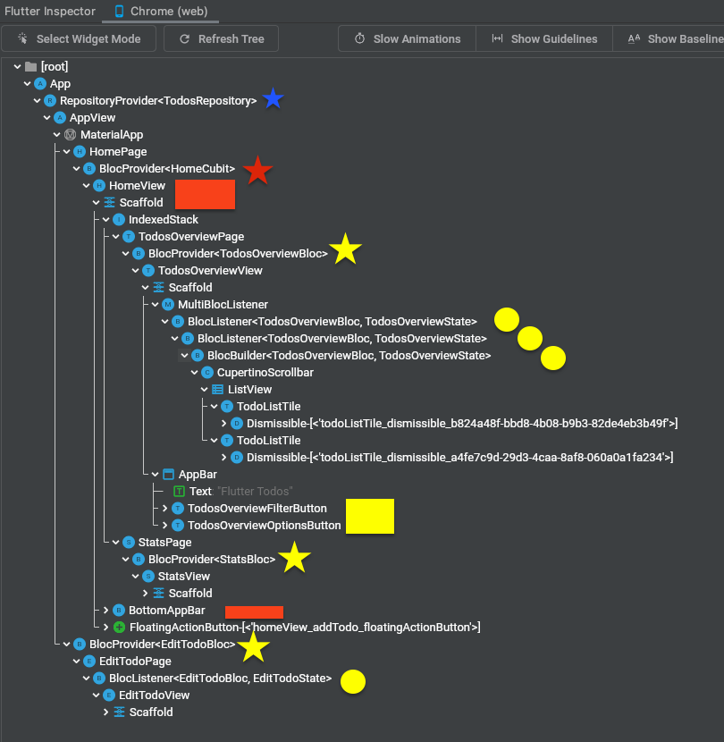

# Flutter Todos Tutorial


> In the following tutorial, we're going to build a Todos App in Flutter using the Bloc library.


> ZZTODO: Update gif with the movie in the issue tracker.

## Key Topics

- Observe state changes with [BlocObserver](/coreconcepts?id=blocobserver).
- [BlocProvider](/flutterbloccoreconcepts?id=blocprovider), Flutter widget which provides a bloc to its children.
- [BlocBuilder](/flutterbloccoreconcepts?id=blocbuilder), Flutter widget that handles building the widget in response to new states.
- [BlocListener](/flutterbloccoreconcepts?id=bloclistener), a Flutter widget which invokes the listener code in response to state changes in the bloc.
- Using 3 Blocs and  1 Cubit. [What's the difference?](/coreconcepts?id=cubit-vs-bloc)
- Uses a [Repository and API layer](architecture/repository) separately for the data.
- [RespositoryProvider](/flutterbloccoreconcepts?id=respositoryprovider), a flutter widget to provide a repository to its children.
- Prevent unnecessary rebuilds with [Equatable](/faqs?id=when-to-use-equatable).
- [MultiBlocListener](/flutterbloccoreconcepts?id=multibloclistener), a Flutter widget that merges multiple BlocListener widgets into one.


## Setup

We'll start off by creating a brand new Flutter project

```shell
flutter create flutter_login
```

We can then replace the contents of `pubspec.yaml` with

[pubspec.yaml](_snippets/flutter_todos_tutorial/pubspec.yaml.md ':include')

and then install all of the dependencies

```shell
flutter pacakages get
```

[comment]: <> (> ZTODO: Is below still true? I think so, but I don't know the history of this.)
[comment]: <> (> **Note:** We're overriding some dependencies because we're going to be reusing them from [Brian Egan's Flutter Architecture Samples]&#40;https://github.com/brianegan/flutter_architecture_samples&#41;.)

## Directory Structure

Because this is a long tutorial, presenting the directory structure is helpful.

> Alternatively, explore the files on github or clone them locally and open in your IDE. The full source for this example can be found [here](https://github.com/felangel/Bloc/tree/master/examples/flutter_todos).

We will be using 3 blocs, 1 cubit, and 3 packages.

At a high level, the directory structure should look like this:
```sh
├── android
├── ios
├── lib
├── packages
└── test
```

### `lib/`
The `lib/` directory will have the following structure:

```sh
|-app
|-edit_todo
|---bloc
|---view
|-home
|---cubit
|---view
|-l10n
|---arb
|-stats
|---bloc
|---view
|-theme
|-todos_overview
|---bloc
|---models
|---view
|---widgets
```

The three blocs are associated with `edit_todo`, `stats`, and `todos_overview` directories. Files are organized first by features and then by function (bloc, view, model, etc.)

The one cubit is for the `home` screen which will handle navigation.

Note also the four view directories.

`li0n` is for international localization. `theme` is for theming, and `app` has initialization/startup elements.

The tree with filenames is here:
```shell
|-edit_todo
| |-view
| | |-edit_todo_page.dart
| | |-view.dart
| |-edit_todo.dart
| |-bloc
| | |-edit_todo_event.dart
| | |-edit_todo_bloc.dart
| | |-edit_todo_state.dart
|-home
| |-home.dart
| |-cubit
| | |-home_state.dart
| | |-home_cubit.dart
| |-view
| | |-view.dart
| | |-home_page.dart
|-main_development.dart
|-l10n
| |-l10n.dart
| |-arb
| | |-app_en.arb
|-bootstrap.dart
|-app
| |-app_bloc_observer.dart
| |-app.dart
|-todos_overview
| |-todos_overview.dart
| |-models
| | |-todos_view_filter.dart
| | |-models.dart
| |-view
| | |-todos_overview_page.dart
| | |-view.dart
| |-widgets
| | |-widgets.dart
| | |-todo_deletion_confirmation_snack_bar.dart
| | |-todos_overview_options_button.dart
| | |-todos_overview_filter_button.dart
| | |-todo_list_tile.dart
| |-bloc
| | |-todos_overview_bloc.dart
| | |-todos_overview_event.dart
| | |-todos_overview_state.dart
|-main_production.dart
|-generated_plugin_registrant.dart
|-theme
| |-theme.dart
|-main_staging.dart
|-stats
| |-stats.dart
| |-view
| | |-stats_page.dart
| | |-view.dart
| |-bloc
| | |-stats_state.dart
| | |-stats_event.dart
| | |-stats_bloc.dart

```
### `packages/`

The `packages/` directory  will have the following structure:
```sh
|-local_storage_todos_api
|---lib
|-----src
|---test
|-todos_api
|---lib
|-----src
|-------models
|---test
|-----models
|-todos_repository
|---lib
|-----src
|---test
```

The three packages are `todos_repository`, `todos_api`, `local_storage_todos_api`.

---

## Architecture

!> NOTE TO REVIEWERS: THIS SECTION IS OPTIONAL. Giving a high level overview is very helpful, as is the widget tree.


The architecture follows the [Bloc Architecture](/architecture), as diagrammed above. To review:
- The UI layer never talks directly to the Data layer. The UI layer only talks to the Bloc layer.
- (not diagrammed above) The Data layer in this project is split up into a Repository Layer and an DataProvider/API layer. The Bloc never directly talks to the APIs. It talks to the Repository layer.

---
### Widget tree

It is also instructive to look at the Widget Tree to get a sense of where the BlocProviders and RepositoryProviders live in the widget tree: 



Each of the three Blocs talks to the `todos_repository` package. In fact, they do so independently and communicate to each other through the repository. In the widget tree, these are marked:
- Yellow markers
  - The three yellow stars are the BlocProviders for the 3 blocs
  - The yellow circles are BlocListeners. They listen only to their specific bloc. The cluster of three in the middle listen to `TodosOverviewBloc`. The single circle on the bottom is for `EditTodoBloc`.
  - The yellow rectangle is used to denote consumers/listeners not displayed in the widget tree. In this case, they use a `context.read<TodosOverviewBloc>()` pattern to access the bloc, rather than a BlocListener/BlocBuilder. In this case, it is because these don't require the state to change the UI. They are fixed menus that interact with `TodosOverviewBloc`.
- Red markers
  - The one red star is the BlocProvider for the 1 cubit. The `HomeCubit` is for navigating the Home page. In this case, it navigates the index of the `IndexedStack` widget.
  - The two rectangles denote consumers/listeners not displayed in the widget three. 
    - In HomeView, it changes the index of the IndexedStack.
    - In BottomAppBar, it calls the cubit function that changes the displayed page.
      > Note: `EditTodoBloc` is not part of the IndexedStack and in a different widget subtree. It appears via a Navigator.push() style event. Note how `HomePage` and `EditTodoPage` are "siblings" and both children of `MaterialApp'. 
- Blue marker
  - The one blue star is the `RepositoryProvider` for the `TodosRepository`, the Apps datastore for the Todos list. It is that high because both all three blocs (yellow stars) need access. So, it is placed at or slightly above the most common parent widget, i.e. above MaterialApp.

!> The principle used is that BlocProviders should be put as low in the widget tree as possible. Note that `EditTodoPage` is not a descendent of `TodosOverviewBloc`'s BlocProvider. Hence, the edit page doesn't have direct access to the TodosOverviewBloc which is what holds the state of the whole Todo list. This is a subtle design choice.

---

The `todos_repository` package communicates with the `todos_api` package. The `todos_api` package is an implementation-agnostic specification of what an API will need to provide.

`local_storage_todos_api` package is a specific implementation of the `todos_api`, as we will see later. If we want to use Firebase cloudFirestore or another database/datastore provider, we would implement another `todos_api` with that provider.


## Todos Repository

### Defining interface
A [repository](/architecture?id=repository) should specify the interface that the application uses and may provide some other logic.  Here, the `TodosRepository` in this project has 3 files.

The main file `todos_repository.dart` defines the interface. The 5 interface methods are described in the source code comments.

[todos_repository.dart2.md](_snippets/flutter_todos_tutorial/packages/todos_repository.dart2.md ':include') [//]: # (HCTOKEN)

Instantiating/constructing the repository requires specifying a TodosApi, which we will discuss [later](#main) in this tutorial.

### Helper files
This file defines the exports. Notice that the `Todo` model is exported and exposed to the main app via the repository.

[todos_repository.dart.md](_snippets/flutter_todos_tutorial/packages/todos_repository.dart.md ':include') [//]: # (HCTOKEN)

A second helper file provides mocking for tests. It is in the source code, which we don't discuss in this tutorial. It can be viewed here.
[todos_repository_test.dart.md](_snippets/flutter_todos_tutorial/packages/todos_repository_test.dart.md)

### Commentary

#### Stream vs Fetch

In an older version of this tutorial, Streams were not used. Instead a "fetch" pattern is used. It is instructive to look at the difference between a Stream approach and a "fetch" approach.

The repository interface in a fetch might be:

```dart
// NOT USED, SHOWN FOR COMPARISON
abstract class OldTodosRepository {
  /// Loads todos first from File storage. If they don't exist or encounter an
  /// error, it attempts to load the Todos from a Web Client.
  Future<List<TodoEntity>> loadTodos();

  // Persists todos to local disk and the web
  Future saveTodos(List<TodoEntity> todos);
}
```

The above is based on the implementation by [Brian Egan](https://github.com/brianegan).
His TodosRepository is [described here](https://github.com/brianegan/flutter_architecture_samples/tree/master/todos_repository_core).
It is shared among all of the [Todo Architecture Samples](https://github.com/brianegan/flutter_architecture_samples).

Brian Egan's `TodosRepository` has only two methods to `loadTodos` and to `saveTodos` (note the plural). Hence, a full list of Todos must be sent each time.
- One limitation of this approach is that the standard CRUD (Create, Read, Update, and Delete) operation requires sending the full list of Todos with each repository call. For example, on an AddTodo type of screen, one cannot just send the added item. One must send the full list with the added item.
- A second limitation is that `loadTodos` is a one-time delivery of data. `loadToDos` is not a Stream. The app must ask for updates. This is okay if an app is for a single-user, on a single device, and not connected to the cloud. However, many modern apps allow
  - one user signed in on multiple devices at once
  - multiple users adding to the same data repository (like a group todo-list)

#### Stream approach

The new way used here for `TodosRepository` has two defining differences from the original:
1. The list of Todos is a Stream that can be subscribed to. (see `getTodos()` below)
```dart
/// Provides a [Stream] of all Todos.
Stream<List<Todo>> getTodos() => _todosApi.getTodos();
```

2. Individual Todos can be created, deleted, or updated. For example, both deleting and saving a Todo are done with only the `todo` as the argument. The whole list isn't needed.
```dart
  Future<void> saveTodo(Todo todo) => _todosApi.saveTodo(todo);
  Future<void> deleteTodo(String id) => _todosApi.deleteTodo(id);
```

For now all that is needed is to understand the 5 interfaces. Let's move to talking about the blocs.


## TodosOverview Bloc

> Our `TodosOverviewBloc` will be responsible for converting `TodosOverviewEvents` into `TodosOverviewStates`. The "overview" in the name refers to how this bloc will manage both the list of `Todos` and the views and possibly other things. 
> 
> A special feature of this tutorial is that it will also implement an Undo feature.

### todos_overview_event.dart

Although it is typical to start with describing the underlying `Todo` model, it is instructive to wait. We can understand `TodosOverviewEvents` without understanding the underlying structure of a `Todo`. This way, if we change our `Todo` model, we don't have to change the associated Events.

There are 8 events. Here is the code first, and a detailed discussion below.

Let's create `todos_overview/bloc/todos_overview_event.dart` and define the events.

[todos_overview_event.dart.md](_snippets/flutter_todos_tutorial/lib/todos_overview_event.dart.md ':include') [//]: # (HCTOKEN)

Here is a discussion of events grouped by function:
- Startup events (no arguments)
  - `TodosOverviewSubscriptionRequested` - This is the startup event. The intention is to have the bloc get a subscription to the `TodosRepository`. In this case, that will be a `Stream`.
- Modifying a single Todo (these take a Todo as an argument)
  - `TodosOverviewTodoSaved` - This saves a Todo. Note: The Todo could be either a new Todo (create) or an existing Todo (update).
  - `TodosOverviewTodoDeleted` - This deletes a Todo.
  - `TodosOverviewTodoCompletionToggled` - This toggles a Todo's completed. It also takes `isCompleted` as a second argument. <!--- 'HCcomment, the event maybe should be renamed TodosOverviewTodoCompletionSet. A toggle wouldn't take the 2nd argument' -->
- Modifying multiple Todos (these operate on multiple Todos, no arguments)
  - `TodosOverviewToggleAllRequested` - Toggles completion for all. Like "Mark all as Done". If all Todos are marked as done, then this event will toggle them to not done.
  - `TodosOverviewClearCompletedRequested` - Deletes all completed Todos.
- Special
  - `TodosOverviewUndoDeletionRequested` - This undoes a Todo delete, e.g. an accidental deletion. Note: As implemented, this doesn't provide a Todo as an argument. So, this suggests that the `TodosOverviewState` will have to keep track of the most recently deleted Todo.
  - `TodosOverviewFilterChanged` - This takes a `TodosViewFilter` as an argument and changes the view by applying a filter. This suggests that `TodosOverviewState` will keep track of the current view filter.
  

### todos_overview_state.dart

Let's create `todos_overview/bloc/todos_overview_state.dart` and define the different states we'll need to handle.

Here is the code first, and a detailed discussion below.

[todos_overview_state.dart.md](_snippets/flutter_todos_tutorial/lib/todos_overview_state.dart.md ':include') [//]: # (HCTOKEN)

!> As discussed when explaining the events, `TodosOverviewState` will keep track of a list of Todos, but also the view filter state, the `lastDeletedTodo`, and the status.

Looking at the annotated default Constructor below, we see the 4 elements of the state.

```dart
const TodosOverviewState({
  this.status = TodosOverviewStatus.initial,
  this.todos = const [],
  this.filter = TodosViewFilter.all,
  this.lastDeletedTodo,
});

final TodosOverviewStatus status;   // The status
final List<Todo> todos;             // The list of Todos.
final TodosViewFilter filter;       // A filter for the view
final Todo? lastDeletedTodo;        // A Todo of the last deleted item, used for Undo
```

`TodosOverviewStatus` has the following four options/statuses. Because we are using Streams and async calls to the TodosRepository, this keeps track of the lifecycle of async calls. The instantiation (during app startup) sets it to `initial`. The business logic of the bloc will use the other 3 statuses

```dart
enum TodosOverviewStatus { initial, loading, success, failure }
```

Lastly, notice that in addition to the default getters and setters, we have a custom getter called `filteredTodos`. 
```dart
Iterable<Todo> get filteredTodos => filter.applyAll(todos);
```

- Thinking ahead to Widgets and views using `BlocBuilder`, we can use either `state.filteredTodos` or `state.todos`. The UI doesn't have to understand the filtering logic.

### todos_overview_bloc.dart

Let's create `todos_overview/bloc/todos_overview_bloc.dart` and get started defining the business logic! 

Here is the code first, and a detailed discussion below.

[todos_overview_bloc.dart.md](_snippets/flutter_todos_tutorial/lib/todos_overview_bloc.dart.md ':include') [//]: # (HCTOKEN)


> To review, this bloc is like all blocs: `TodosOverviewBloc` will <br />
(1) respond to UI events, <br /> 
(2) emit states, <br />
(3) listen to non-UI messages, like input data Streams (AKA "sinks"), and <br />
(4) implement the business logic of what to do.

Breaking the code down, we first have the Constructor.

```dart
class TodosOverviewBloc extends Bloc<TodosOverviewEvent, TodosOverviewState> {
  TodosOverviewBloc({
    required TodosRepository todosRepository,
  })  : _todosRepository = todosRepository,
        super(const TodosOverviewState()) {
    on<TodosOverviewSubscriptionRequested>(_onSubscriptionRequested);
    on<TodosOverviewTodoSaved>(_onTodoSaved);
    on<TodosOverviewTodoCompletionToggled>(_onTodoCompletionToggled);
    on<TodosOverviewTodoDeleted>(_onTodoDeleted);
    on<TodosOverviewUndoDeletionRequested>(_onUndoDeletionRequested);
    on<TodosOverviewFilterChanged>(_onFilterChanged);
    on<TodosOverviewToggleAllRequested>(_onToggleAllRequested);
    on<TodosOverviewClearCompletedRequested>(_onClearCompletedRequested);
  }

  final TodosRepository _todosRepository;
```

The Constructor creates handlers for the UI events. Notice that the 8 events in the earlier section [TodosOverviewEvent](#todos_overview_eventdart) exactly match the 8 `on` handlers here. They are then mapped to 8 callback methods for the class.

Another thing to notice is that `TodosRepository` needs to be passed as an argument when the `TodosOverviewBloc` is created, like in a `BlocProvider` widget. The bloc is not handling the initial connection to the Repository. Instead, the startup process of the app (or something that happens before loading this bloc) will create the repository connection.

The next section to discuss is the `_onSubscriptionRequested` method.
```dart
  Future<void> _onSubscriptionRequested(
    TodosOverviewSubscriptionRequested event,
    Emitter<TodosOverviewState> emit,
    ) async {
  emit(state.copyWith(status: () => TodosOverviewStatus.loading));

  await emit.forEach<List<Todo>>(
    _todosRepository.getTodos(),
    onData: (todos) => state.copyWith(
      status: () => TodosOverviewStatus.success,
      todos: () => todos,
    ),
    onError: (_, __) => state.copyWith(
      status: () => TodosOverviewStatus.failure,
    ),
  );
}
```

The first statement emits a state of `loading`. The UI widget can then create an appropriate loading state, like a circle progress indicator.

The second statement is `emit.forEach<List<Todo>>( ... )`. This sets up the listener for the data stream (i.e. a "sink" for the bloc). This is the data stream from the repository.

!> `emit.forEach()` is not the `forEach()` used by lists. This forEach is for a Stream. It can be thought of as "forEach item yielded by the stream, do these tasks...". It has nothing to do with traversing the list of Todos.

!> The `await` here can be confusing. It's designed to not complete. The `await` is needed to keep the subscription alive. _onSubscriptionRequest doesn't complete until the stream is closed by the repository or the event handler is closed, for example when the bloc is closed.

> You don't see `stream.listen` called directly in this tutorial. Using `await emit.forEach()` is a newer standard canonical pattern for subscribing to a stream.

> Even though the callback is named `_onSubscriptionRequested()` suggesting this code only runs on startup, the effect is long lasting. It creates the subscription but also processes future items generated by the subscription.

<!--- Consider renaming `_onSubscriptionRequested` to `_createSubscriptionAndListen` -->

The result of the _onSubscriptionRequested event is that the callback set to `onData` is called each time the list of Todos in the `TodosRepository` changes. The `onData` callback emits a the new state and the Flutter framework determines what widgets need to be re-rendered.

---

Now that the subscription is handled, we handle the other events, like adding, modifying, and deleting Todos.

```dart
  Future<void> _onTodoSaved(
    TodosOverviewTodoSaved event,
    Emitter<TodosOverviewState> emit,
    ) async {
  await _todosRepository.saveTodo(event.todo);
}
```

`onTodoSaved()` simply fires a `_todosRepository.saveTodo(event.todo)`.  

> Notice that no `emit` happens to set the new state. This raises the question, how does the state get updated? If the state isn't updated, the UI won't update.

!> The answer is that the repository will send/stream an updated `List<Todo>`. That update is handled in the `await emit.forEach<List<Todo>>()` in `_onSubscriptionRequested()`. When that happens, then the `emit()` occurs.

!> In fact, *none* of the other event handlers emit states with modified `List<Todos>` directly. The pattern is always that (1) the handlers change the Todo list with the `TodosRepository`, and then (2) the new state is streamed from `TodosRepository` , to `TodosOverviewBloc._onSubscriptionRequested` and then finally to the UI via BlocBuilders and BlocListeners.

<!--- consider adding a TodosOverviewStatus.processing status that is set until the handlers are completed. -->

Let's now cover the other methods for Undo and ViewFiltering.

#### Undo

The undo feature allows undeleting the last deleted item. This business logic is not handled by the repository. This is handled via the bloc.

Review the `TodosOverviewState`, re-annotated below. List<Todo> is handled via the repository. Notice that the other 3 parts of the state need to be handled by the bloc.

```dart
const TodosOverviewState({
...
});

final TodosOverviewStatus status;   // handled via the bloc
final List<Todo> todos;             // handled via the repository
final TodosViewFilter filter;       // handled via the bloc
final Todo? lastDeletedTodo;        // handled via the bloc
```

`_onTodoDeleted` in the bloc does two things. First, it emits a new state in line `//1` with the Todo to be deleted. Then, it deletes the Todo in line `//2` via the repository. 
```dart
  Future<void> _onTodoDeleted(
    TodosOverviewTodoDeleted event,
    Emitter<TodosOverviewState> emit,
  ) async {
    emit(state.copyWith(lastDeletedTodo: () => event.todo)); // 1
    await _todosRepository.deleteTodo(event.todo.id);        // 2
  }
```

Eventually (and outside of this code), the state is emitted via the Stream. For more details on this, see a discussion of [event flow](#commentary-event-flow)


---

When the undeletion request event comes from the UI, `_onUndoDeletionRequested()` is run.
- Line `//3` temporarily saves a copy of the last deleted Todo. 
- Line `//4` updates the state by removing the lastDeletedTodo from the state. 
- Finally, line `//5` does the undeletion.


```dart
  Future<void> _onUndoDeletionRequested(
    TodosOverviewUndoDeletionRequested event,
    Emitter<TodosOverviewState> emit,
  ) async {
    assert(
      state.lastDeletedTodo != null,
      'Last deleted todo can not be null.',
    );

    final todo = state.lastDeletedTodo!;               //3
    emit(state.copyWith(lastDeletedTodo: () => null)); //4
    await _todosRepository.saveTodo(todo);             //5
  }
```

!> Notice: like in other bloc event handler methods, the undeletion doesn't directly modify the List. <!--- like via a TodosOverviewState.todos.remove(todo); --> It goes through the repository, which then updates via the stream. See a discussion of [event flow](#commentary-event-flow).


#### ViewFilter

View filtering is handled via `_onFilterChanged()`. The code below emits a new state with the new event filter. Note that the list in `TodosOverviewState.todos` is not modified and the bloc doesn't send a filtered list as part of the state. It merely provides the information. The UI decides what needs to be displayed in line with UI=f(state).

```dart
  void _onFilterChanged(
    TodosOverviewFilterChanged event,
    Emitter<TodosOverviewState> emit,
  ) {
    emit(state.copyWith(filter: () => event.filter));
  }
```

## Todo Model
Now is a good time to introduce the model for a Todo.

!> Notice that we've completely discussed the TodosOverviewBloc **without** every defining the `Todo`. This level of abstraction is a helpful feature of the chosen architecture and the bloc. This means that if we change the model for the Todo, we do not have to change anything in the TodosObserverBloc.

The first thing of note is that the `Todo` model doesn't live in our App. It is set in a separate package, in this case the `todos_api`.

The Constructor shows the fields associated with a Todo are four:
- `id` - either provided or set by Uuid in line `//1`.
- `title`,
- `description`, and
- `isCompleted`

and described in the code comments.

```dart
class Todo extends Equatable {
  /// {@macro todo}
  Todo({
    String? id,
    required this.title,
    this.description = '',
    this.isCompleted = false,
  }) : 
        id = id ?? const Uuid().v4(); //1
  ...
  
  /// The unique identifier of the todo.
  ///
  /// Cannot be empty.
  final String id;

  /// The title of the todo.
  ///
  /// Note that the title may be empty.
  final String title;

  /// The description of the todo.
  ///
  /// Defaults to an empty string.
  final String description;

  /// Whether the todo is completed.
  ///
  /// Defaults to `false`.
  final bool isCompleted;
}
```

<!--- there is an error. The assertion is two parts. If none is provided, it should be null or not empty. After the Uuid, it should check that (id != null && id.isNotEmpty). -->

Here is the full file that includes `@JsonSerializable()` annotations. To build the project, you will have to run the [code generation](https://pub.dev/packages/json_serializable#running-the-code-generator) before building your package.

`packages/todos_api/lib/src/models/todo.dart`:

[todo.dart.md](_snippets/flutter_todos_tutorial/packages/todo.dart.md ':include') [//]: # (HCTOKEN)


## TodosOverview Other

There are multiple other files organized into the `models/`, `view/`, and `widget/` directories. We've already covered the files in the `bloc/` folder.

```shell
|-todos_overview
| |-todos_overview.dart
| |-models
| | |-todos_view_filter.dart
| | |-models.dart
| |-view
| | |-todos_overview_page.dart
| | |-view.dart
| |-widgets
| | |-widgets.dart
| | |-todo_deletion_confirmation_snack_bar.dart
| | |-todos_overview_options_button.dart
| | |-todos_overview_filter_button.dart
| | |-todo_list_tile.dart
| |-bloc
| | |-todos_overview_bloc.dart         // alrady covered in tutorial
| | |-todos_overview_event.dart        // alrady covered in tutorial
| | |-todos_overview_state.dart        // alrady covered in tutorial
```

### Barrel file
The main barrel file manages exports of the four subdirectories.

`todos_overview.dart`

[todos_overview.dart.md](_snippets/flutter_todos_tutorial/lib/todos_overview.dart.md ':include') [//]: # (HCTOKEN)


### Models

!> Note: You might be expecting a model for a list of Todos or for `TodosOverview` here. They aren't here. Why? Because we are using bloc, the overall "model" for ToolsOverview is the bloc for ToolsOverview, specifically [ToolsOverviewState](#TodosOverview-States), which holds the Todo list and 3 other state variables.

There is one model file and that deals with the view filtering.

`todos_view_filter.dart` enums the 3 view filters and the methods to apply the filter.

[todos_view_filter.dart.md](_snippets/flutter_todos_tutorial/lib/todos_view_filter.dart.md ':include') [//]: # (HCTOKEN)

`models.dart` is the barrel file for exports.

[models.dart.md](_snippets/flutter_todos_tutorial/lib/models.dart.md ':include') [//]: # (HCTOKEN)


### View

The full `todos_overview_page.dart` is first presented and then discussed below.

[todos_overview_page.dart.md](_snippets/flutter_todos_tutorial/lib/todos_overview_page.dart.md ':include') [//]: # (HCTOKEN)

It is instructive to look at the structure using Flutter Inspector. This is the widget subtree:


Notice where `BlocProvider<TodosOverviewBloc>` is.
- Every widget below this one will have access to the `TodosOverviewBloc`.
- Any other widget (for example, the main MaterialApp widget, or different subtrees) will not have access to it. 

> Notably, `EditTodoPage`, described later, won't have access to `TodosOverviewBloc`.  `EditTodoPage` will use the repository to adjust with the list of Todos. And the repository's stream will talk to the `TodosOverviewBloc`, which then will tell `TodosOverviewPage` to re-render. The key is using the Stream. See a discussion of [event flow](#commentary-event-flow).

`BlocProvider<TodosOverviewBloc>` is accessed three times under `MultiBlocListener`
1. The first is a `BlocListener` dealing with errors, as shown below. `listenWhen` restricts this listener will be called. <br>
   It won't be called for all state changes, only those that correspond to line `//1`.
   Also, the `SnackBar` is only displayed when TodosOverviewStatus.failure at line `//2`. (User Challenge: Add a success snackBar by modifying the if statement.)

```dart
          BlocListener<TodosOverviewBloc, TodosOverviewState>(
            listenWhen: (previous, current) =>
                previous.status != current.status,   //1
            listener: (context, state) {
              if (state.status == TodosOverviewStatus.failure) { //2
                ScaffoldMessenger.of(context)
                  ..hideCurrentSnackBar()
                  ..showSnackBar(
                    SnackBar(
                      content: Text(l10n.todosOverviewErrorSnackbarText),
                    ),
                  );
              }
            },
```

2. The second is a `BlocListener` dealing with deletions, as shown below. `listenWhen` restricts listening so we don't react to unnecessary state changes, like added Todo items or changes of the view. It shows a snack bar and if Undo is selected, it will send a message of `TodosOverviewUndoDeletionRequested` to the bloc.

```dart
         BlocListener<TodosOverviewBloc, TodosOverviewState>(
            listenWhen: (previous, current) =>
                previous.lastDeletedTodo != current.lastDeletedTodo &&
                current.lastDeletedTodo != null,
            listener: (context, state) {
              final deletedTodo = state.lastDeletedTodo!;
              final messenger = ScaffoldMessenger.of(context);
              messenger
                ..hideCurrentSnackBar()
                ..showSnackBar(
                  TodoDeletionConfirmationSnackBar(
                    todo: deletedTodo,
                    onUndo: () {
                      messenger.hideCurrentSnackBar();
                      context
                          .read<TodosOverviewBloc>()
                          .add(const TodosOverviewUndoDeletionRequested());
                    },
                  ),
                );
            },
          ),
```

3. The third is a `BlocBuilder` which builds the ListView that displays the Todos. In focusing on the bloc pattern, notice how and when the  `TodosOverviewTodoCompletionToggled()` and `TodosOverviewTodoDeleted()` events are sent to the bloc.

```dart
                    TodoListTile(
                      todo: todo,
                      onToggleCompleted: (isCompleted) {
                        context.read<TodosOverviewBloc>().add(
                              TodosOverviewTodoCompletionToggled(
                                todo: todo,
                                isCompleted: isCompleted,
                              ),
                            );
                      },
                      onDismissed: (_) {
                        context
                            .read<TodosOverviewBloc>()
                            .add(TodosOverviewTodoDeleted(todo));
                      },
                      onTap: () {
                        Navigator.of(context).push(
                          EditTodoPage.route(initialTodo: todo),
                        );
                      },
                    )
```

The `AppBar` of this scaffold also has two actions which are the top-right dropdowns. These are covered below in Widgets.
```dart
        actions: const [
          TodosOverviewFilterButton(),
          TodosOverviewOptionsButton(),
        ],
```

`view.dart` is the export barrel file.

[view.dart3.md todos_overview](_snippets/flutter_todos_tutorial/lib/view.dart3.md ':include') [//]: # (HCTOKEN)


### Widgets

```shell
| |-widgets
| | |-widgets.dart
| | |-todo_deletion_confirmation_snack_bar.dart
| | |-todos_overview_options_button.dart
| | |-todos_overview_filter_button.dart
| | |-todo_list_tile.dart
```

`widgets.dart` is a barrel file

[widgets.dart.md](_snippets/flutter_todos_tutorial/lib/widgets.dart.md ':include') [//]: # (HCTOKEN)

`todo_deletion_confirmation_snack_bar.dart` is the deletion snack bar that also implements undelete.

[todo_deletion_confirmation_snack_bar.dart.md](_snippets/flutter_todos_tutorial/lib/todo_deletion_confirmation_snack_bar.dart.md ':include') [//]: # (HCTOKEN)

`todo_list_tile.dart` is the ListTile for each Todo.

[todo_list_tile.dart.md](_snippets/flutter_todos_tutorial/lib/todo_list_tile.dart.md ':include') [//]: # (HCTOKEN)

`todos_overview_options_button.dart` exposes two options. Paying attention to the bloc pattern, notice how events are passed to the bloc in `onSelected`.

[todos_overview_options_button.dart.md](_snippets/flutter_todos_tutorial/lib/todos_overview_options_button.dart.md ':include') [//]: # (HCTOKEN)

`todos_overview_filter_button.dart` exposes three filter options. Paying attention to the bloc pattern, notice how events are passed to the bloc in `onSelected`.

[todos_overview_filter_button.dart.md](_snippets/flutter_todos_tutorial/lib/todos_overview_filter_button.dart.md ':include') [//]: # (HCTOKEN)


## Stats Bloc
```shell
|-stats
| |-stats.dart
| |-view
| | |-stats_page.dart
| | |-view.dart
| |-bloc
| | |-stats_state.dart
| | |-stats_event.dart
| | |-stats_bloc.dart
```

### stats_state.dart

`StatsState` keeps track of summary information and the current `StatsStatus`.

[stats_state.dart.md](_snippets/flutter_todos_tutorial/lib/stats_state.dart.md ':include') [//]: # (HCTOKEN)

### stats_event.dart

`StatsEvent` has only one event, the subscription event. 

[stats_event.dart.md](_snippets/flutter_todos_tutorial/lib/stats_event.dart.md ':include') [//]: # (HCTOKEN)

### stats_bloc.dart

`StatsBloc` does connect to `TodosRepository`, just like `TodosOverviewBloc`. It subscribes via `_todosRepository.getTodos()`.

> How does StatsBloc know to update? Updates are triggered by the stream, not by any UI event. See a discussion of [event flow](#commentary-event-flow).

> How will the the Stats UI know to update? It gets a state change notification via the `onData` in `emit.forEach()`. When state changes, the `BlocBuilder<StatsBloc>` in [stats_page.dart](#stats-view) knows to rebuild. See a discussion of [event flow](#commentary-event-flow).


[stats_bloc.dart.md](_snippets/flutter_todos_tutorial/lib/stats_bloc.dart.md ':include') [//]: # (HCTOKEN)

## Stats Other

### Barrel File

The main barrel file manages exports of the two subdirectories.

[stats.dart.md](_snippets/flutter_todos_tutorial/lib/stats.dart.md ':include') [//]: # (HCTOKEN)

### Stats View

`view.dart` manages the export.

[view.dart4.md stats](_snippets/flutter_todos_tutorial/lib/view.dart4.md ':include') [//]: # (HCTOKEN)

`stats_page.dart` is the UI page view.

[stats_page.dart.md](_snippets/flutter_todos_tutorial/lib/stats_page.dart.md ':include') [//]: # (HCTOKEN)

It is instructive to look at the structure using Flutter Inspector. This is the widget subtree:


Notice how it does not directly get any information from the `List<Todos>` which lives in `TodosOverviewState`. The UI gets all the information from the `StatsBloc` and the `StatsState`. 

!> The commonality between `TodosOverviewBloc` and `StatsBloc` is that they both communicate with the `TodosRepository`. There is no direct communication between the blocs. See a discussion of [event flow](#commentary-event-flow).


## EditTodo Bloc

```shell
|-edit_todo
| |-view
| | |-edit_todo_page.dart
| | |-view.dart
| |-edit_todo.dart
| |-bloc
| | |-edit_todo_event.dart
| | |-edit_todo_bloc.dart
| | |-edit_todo_state.dart
```

### edit_todo_state.dart

`EditTodoState` keeps track of the information needed when editing a Todo. It has four variables:
1. `status` - Tracks the status, mindful of the async possibilities that the repository or data providers are offline.
2. `initialTodo` - The initial Todo that we are editing.  <br> NOTE: This bloc will also handled creation of a new Todo. In that case, the initial Todo could be null, hence the nullable `Todo?` in the code below.   

3. `title` - The title. Note: This will be continuosly updated as the UI is updated. Hence we avoid needing to use a TextEditingController.
4. `description` - The description.

[edit_todo_state.dart.md](_snippets/flutter_todos_tutorial/lib/edit_todo_state.dart.md ':include') [//]: # (HCTOKEN)

### edit_todo_event.dart

`EditTodoEvent` has 4 events:
1. `EditTodoEvent` - When the UI starts an edit (or a new Todo). Note: No arguments. The Todo's information is provided to the state of the bloc.
2. `EditTodoTitleChanged` - When the title changes, even if by one character. Note: requires one argument, the title from the UI. The bloc will later change the state and emit a new state.
3. `EditTodoDescriptionChanged` - When the description changes, even if by one character. Note: requires one argument, the title from the UI. The bloc will later change the state and emit a new state.
4. `EditTodoSubmitted` - Submitting, when editing is complete. Note: No arguments. The Todo's edits are stored in the state of the bloc.


[edit_todo_event.dart.md](_snippets/flutter_todos_tutorial/lib/edit_todo_event.dart.md ':include') [//]: # (HCTOKEN)

### edit_todo_bloc.dart

`EditTodoBloc` does connect to `TodosRepository`, just like `TodosOverviewBloc` and `StatsBloc`. 

!> Unlike the other Blocs, `EditTodoBloc` does not subscribe to `_todosRepository.getTodos()`. It is a "write-only" bloc. It doesn't need to read any information from the repository.

[edit_todo_bloc.dart.md](_snippets/flutter_todos_tutorial/lib/edit_todo_bloc.dart.md ':include') [//]: # (HCTOKEN)

#### Commentary - Event Flow

> How will the the Stats UI and the main list of Todos UI know to update? Where in the code does it tell the other screens to redraw? <br>
ANSWER: The other parts of the UI gets a state change notification because of their subscription to `TodosRepository`.  There is no direct bloc-to-bloc communication. EditTodosBloc has zero logic about what needs to be done elsewhere. Everything goes through the repository.

This is best explained with the help of a widget tree diagram:


This is the "flow" when the UI submits a `EditTodoSubmitted` event. 
1. The `EditTodoBloc` handles the business logic to update the `TodosRepository`. (In the diagram, the arrow and the Blue box labelled 1. It starts in the bottom left.)
2. `TodosRepository` then notifies `TodosOverviewBloc`. (Blue box 2 and arrow.)
3. `TodosOverviewBloc` notifies the listeners which then re-render widgets. (Blue box 3 and arrow.)
4. `TodosRepository` also notifies `StatsBloc`. (Blue box 4 and arrow.) The listening widgets will also re-render.


## EditTodo Other

### Barrel File

The main barrel file manages exports of the one subdirectory.

[edit_todo.dart.md](_snippets/flutter_todos_tutorial/lib/edit_todo.dart.md ':include') [//]: # (HCTOKEN)

### EditTodo View

`view.dart` manages the export.

[view.dart.md edit](_snippets/flutter_todos_tutorial/lib/view.dart.md ':include') [//]: # (HCTOKEN)

`edit_todo_page.dart` is the UI page view.

[edit_todo_page.dart.md](_snippets/flutter_todos_tutorial/lib/edit_todo_page.dart.md ':include') [//]: # (HCTOKEN)

This page uses `BlocListener` rather than `BlocBuilder` for a very specific reason. `BlocListener` here is restricting re-rendering to after we submit via `current.status == EditTodoStatus.success` in the code snippet below.

```dart
return BlocListener<EditTodoBloc, EditTodoState>(
  listenWhen: (previous, current) =>
    previous.status != current.status &&
    current.status == EditTodoStatus.success,
// ...
```

> What happens if we use `BlocBuilder` instead? Our UI will re-render with every keystroke. For example, if we type "LUNCH", it will re-render 5 times. Each modification generates a new `EditTodoState` which stores the current working string.
 The 5 changes are for "L", "LU", "LUN", "LUNC", and "LUNCH".

> Another common approach is to use a TextEditingController to store the local state, but that [requires a StatefulWidget](https://stackoverflow.com/questions/59652639/why-is-texteditingcontroller-always-used-in-stateful-widgets). In this tutorial, we construct zero stateful widgets to demonstrate that bloc can eliminate most needs to use a stateful widget directly. (Stateful widgets are still used in the underlying abstraction layers (aka packages), like [provider](https://pub.dev/documentation/provider/latest/). But those low-level details are abstracted away by bloc.)


It is instructive to look at the structure using Flutter Inspector. This is the widget tree:


Notice how `EditTodosPage` is in the bottom half of the displayed widget tree. It is a sibling to `HomePage`. 

!> Does `EditTodosPage` need access to the whole list of Todos or other state? It has no access to the list of Todos provided by `ToolsOverviewBloc` because it isn't under the `BlocProvider<ToolsOverviewBloc>`. (Not displayed in the widget tree, because it is under `TodosOverviewPage`)
But, importantly, because of the [architectural decisions](#commentary), it doesn't need any access to that.


## Home Cubit

The following is the directory stucture for the home page and corresponding `HomeCubit`. We first present the cubit code, and then the other 3 files.
```dart
|-home
| |-home.dart
| |-cubit
| | |-home_state.dart
| | |-home_cubit.dart
| |-view
| | |-view.dart
| | |-home_page.dart
```

### home_state.dart

There are only two states associated with the two screens: `todos` and `stats`. EditTodo is not a screen controlled by the Home Cubit.

[home_state.dart.md](_snippets/flutter_todos_tutorial/lib/home_state.dart.md ':include') [//]: # (HCTOKEN)

### home_cubit.dart

A cubit is appropriate due to the simplicity of the business logic. We have one function `setTab` to change the tab.

[home_cubit.dart.md](_snippets/flutter_todos_tutorial/lib/home_cubit.dart.md ':include') [//]: # (HCTOKEN)


## Home Other

### Barrel File

[home.dart.md](_snippets/flutter_todos_tutorial/lib/home.dart.md ':include') [//]: # (HCTOKEN)

### Home View

`view.dart` manages the export.

[view.dart2.md edit](_snippets/flutter_todos_tutorial/lib/view.dart2.md ':include') [//]: # (HCTOKEN)

`home_page.dart` is the UI page view.

[home_page.dart.md](_snippets/flutter_todos_tutorial/lib/home_page.dart.md ':include') [//]: # (HCTOKEN)

It is instructive to look at the structure using Flutter Inspector. This is the widget tree:


`HomePage` is near the top, followed by `BlocProvider<HomeCubit>`. The next widget, `Homeview` uses the `HomeCubit` state via the following line:

```dart
Widget build(BuildContext context) {
  final selectedTab = context.select((HomeCubit cubit) => cubit.state.tab);
  //...
```

BlocBuilders and BlocListeners could be used, but they are unnecessary. The `context.select` will listen for any changes and trigger a rebuild.

---

`BottomAppBar` is several steps below. The key line for is when the cubit function call is sent from the UI to the cubit. 

```dart
    onPressed: () => context.read<HomeCubit>().setTab(value),
```

This is the key line, and uses a `context.read`.

!> `context.read` doesn't listen for changes, but this is just used to access to `HomeCubit` to call the `setTab`, so no updating is needed.

## Packages

### Files and directories

```sh
packages
|-local_storage_todos_api
|---lib
|-----src
|---test
|-todos_api
|---lib
|-----src
|-------models
|---test
|-----models
|-todos_repository
|---lib
|-----src
|---test
```


Under `packages/`, there are three packages.
1. `todos_repository` - was presented [earlier](#todos-repository) and talks to the blocs.
2. `todos_api` - abstractly specifies the data interface (sometimes called "data providers", not to be confused with the provider package)
   that `todos_repository` uses to actually set and get data.
3. `local_storage_todos_api` - implements the data interface with an actual provider. In this case, it uses local storage.

### todos_repository
```shell
|-todos_repository
| |-test
| | |-todos_repository_test.dart
| |-README.md
| |-pubspec.yaml
| |-.gitignore
| |-lib
| | |-todos_repository.dart
| | |-src
| | | |-todos_repository.dart
| |-analysis_options.yaml
```

The main `todos_repository.dart` file was described [earlier](#todos-repository)

Here, we just present the directory structure. The pubspec.yaml for all three packages is provided later below.


### todos_api

```shell
|-todos_api
| |-test
| | |-todos_api_test.dart
| | |-models
| | | |-todo_test.dart
| |-README.md
| |-pubspec.yaml
| |-.gitignore
| |-lib
| | |-todos_api.dart
| | |-src
| | | |-todos_api.dart
| | | |-models
| | | | |-json_map.dart
| | | | |-todo.dart
| | | | |-todo.g.dart
| | | | |-models.dart
| |-analysis_options.yaml
```

The main `todos_api.dart` file specifies the interfaces that an API is expected to have. If we add another data provider, like cloud_firestore or mongoDB or AWS, all we have to do is make sure this API interface is followed. If we do that, then almost no other code needs to change. The  only change needed is that we will need to establish the connection to the service at App startup.

The methods are well documented in the code comments.

[todos_api.dart2.md](_snippets/flutter_todos_tutorial/packages/todos_api.dart2.md ':include') [//]: # (HCTOKEN)

---

The model of the `Todo` is specified in one place only: `todos_api/models/todo.dart`. 
By specifying in one place, we know that if we make any changes, they will propogate everywhere needed. If there is a breaking change, we will know either via our linter, a failed test, or a runtime error.

`packages/todos_api/lib/src/models/todo.dart`:
[todo.dart.md](_snippets/flutter_todos_tutorial/packages/todo.dart.md ':include') [//]: # (HCTOKEN)

This file was discussed [earlier](#todo-model) when discussing the `TodosRepository`.

---

#### Miscellaneous

The following file is the barrel file for the export.

[todos_api.dart.md](_snippets/flutter_todos_tutorial/packages/todos_api.dart.md ':include') [//]: # (HCTOKEN)


`todo.g.dart` code is generated code, by json serialization.

[todo.g.dart.md](_snippets/flutter_todos_tutorial/packages/todo.g.dart.md ':include') [//]: # (HCTOKEN)

`json_map.dart` provides a typeDef for code checking and linting.

[json_map.dart.md](_snippets/flutter_todos_tutorial/packages/json_map.dart.md ':include') [//]: # (HCTOKEN)


A barrel file for the `models.dart`

[models.dart.md](_snippets/flutter_todos_tutorial/packages/models.dart.md ':include') [//]: # (HCTOKEN)


#### Test files

There are two test files for this package. We don't include them, but you can view them via the links to markdown or find them in the source code.

[todo_test.dart.md](_snippets/flutter_todos_tutorial/packages/todo_test.dart.md) 

[todos_api_test.dart.md](_snippets/flutter_todos_tutorial/packages/todos_api_test.dart.md) 


### local_storage_todos_api

```shell
|-local_storage_todos_api
| |-test
| | |-local_storage_todos_api_test.dart
| |-README.md
| |-pubspec.yaml
| |-.gitignore
| |-lib
| | |-local_storage_todos_api.dart
| | |-src
| | | |-local_storage_todos_api.dart
| |-analysis_options.yaml
```

This package implements the todos_api using local storage. `local_storage_todos_api.dart` is the main file.

[local_storage_todos_api.dart2.md](_snippets/flutter_todos_tutorial/packages/local_storage_todos_api.dart2.md ':include') [//]: # (HCTOKEN)

This is the associated barrel file.

[local_storage_todos_api.dart.md](_snippets/flutter_todos_tutorial/packages/local_storage_todos_api.dart.md ':include') [//]: # (HCTOKEN)


#### Test files

There are two test files for this package. We don't include them, but you can view them via the link to markdown or the source code.

[local_storage_todos_api_test.dart.md](_snippets/flutter_todos_tutorial/packages/local_storage_todos_api_test.dart.md) 


### pubspec.yaml's

These are the 3 pubspec.yaml files for the three packages.

[pubspec.yaml.md](_snippets/flutter_todos_tutorial/packages/pubspec.yaml.md ':include') [//]: # (HCTOKEN)

[pubspec.yaml2.md](_snippets/flutter_todos_tutorial/packages/pubspec.yaml2.md ':include') [//]: # (HCTOKEN)

[pubspec.yaml3.md](_snippets/flutter_todos_tutorial/packages/pubspec.yaml3.md ':include') [//]: # (HCTOKEN)


## Internationalization

```
|-l10n
| |-l10n.dart
| |-arb
| | |-app_en.arb
```

Package 'package:flutter_gen/gen_l10n/app_localizations.dart' is used to handle localizations.

ZZTODO: I'm not sure how to test or demonstrate this. The tutorial is already huge, so I recommend just directing them to the docs.

ZZTODO: This is stale, from the old tutorial. One last concept that we will touch on before going into the application itself is localization.
Create `localization.dart` and we'll create the foundation for multi-language support.

For more information on localization check out the [official flutter docs](https://flutter.dev/docs/development/accessibility-and-localization/internationalization).

`l10n.dart`

[l10n.dart.md](_snippets/flutter_todos_tutorial/lib/l10n.dart.md ':include') [//]: # (HCTOKEN)


`app_en.arb` is a localization file

```json
{
  "@@locale": "en",
  "todosOverviewAppBarTitle": "Flutter Todos",
  "@todosOverviewAppBarTitle": {
    "description": "Title text shown in the AppBar of the Todos Overview Page"
  },
  "todosOverviewFilterTooltip": "Filter",
  "@todosOverviewFilterTooltip": {
    "description": "Tooltip text shown in the filter dropdown of the Todos Overview Page"
  },
  "todosOverviewFilterAll": "All",
  "@todosOverviewFilterAll": {
    "description": "Text shown in the filter dropdown of the Todos Overview Page for the option to display all todos"
  },
  "todosOverviewFilterActiveOnly": "Active only",
  "@todosOverviewFilterActiveOnly": {
    "description": "Text shown in the filter dropdown of the Todos Overview Page for the option to display active todos only"
  },
  "todosOverviewFilterCompletedOnly": "Completed only",
  "@todosOverviewFilterCompletedOnly": {
    "description": "Text shown in the filter dropdown of the Todos Overview Page for the option to display completed todos only"
  },
  "todosOverviewMarkAllCompleteButtonText": "Mark all complete",
  "@todosOverviewMarkAllCompleteButtonText": {
    "description": "Button text shown in the options dropdown of the Todos Overview Page that marks all current todos as complete"
  },
  "todosOverviewClearCompletedButtonText": "Clear completed",
  "@todosOverviewClearCompletedButtonText": {
    "description": "Button text shown in the options dropdown of the Todos Overview Page that deletes all completed todos"
  },
  "todosOverviewEmptyText": "No todos found with the selected filters.",
  "@todosOverviewEmptyText": {
    "description": "Text shown in the Todos Overview Page when no todos are found with the selected filters"
  },
  "todosOverviewTodoDeletedSnackbarText": "Todo \"{todoTitle}\" deleted.",
  "@todosOverviewTodoDeletedSnackbarText": {
    "description": "Snackbar text shown when a todo is deleted from the Todos Overview Page",
    "placeholders": {
      "todoTitle": {
        "description": "The title of the todo that was deleted"
      }
    }
  },
  "todosOverviewUndoDeletionButtonText": "Undo",
  "@todosOverviewUndoDeletionButtonText": {
    "description": "Button text shown in the snackbar that undoes a deletion of a todo"
  },
  "todosOverviewErrorSnackbarText": "An error occurred while loading todos.",
  "@todosOverviewErrorSnackbarText": {
    "description": "Snackbar text shown when an error occurs while loading todos"
  },
  "todosOverviewOptionsTooltip": "Options",
  "@todosOverviewOptionsTooltip": {
    "description": "Tooltip text shown in the options dropdown of the Todos Overview Page"
  },
  "todosOverviewOptionsMarkAllComplete": "Mark all as completed",
  "@todosOverviewOptionsMarkAllComplete": {
    "description": "Button text shown in the options dropdown of the Todos Overview Page that marks all todos as complete"
  },
  "todosOverviewOptionsMarkAllIncomplete": "Mark all as incomplete",
  "@todosOverviewOptionsMarkAllIncomplete": {
    "description": "Button text shown in the options dropdown of the Todos Overview Page that marks all todos as incomplete"
  },
  "todosOverviewOptionsClearCompleted": "Clear completed",
  "@todosOverviewOptionsClearCompleted": {
    "description": "Button text shown in the options dropdown of the Todos Overview Page that deletes all completed todos"
  },
  "todoDetailsAppBarTitle": "Todo Details",
  "@todoDetailsAppBarTitle": {
    "description": "Title text shown in the AppBar of the Todo Details Page"
  },
  "todoDetailsDeleteButtonTooltip": "Delete",
  "@todoDetailsDeleteButtonTooltip": {
    "description": "Tooltip text shown in the delete button on the Todo Details Page"
  },
  "todoDetailsEditButtonTooltip": "Edit",
  "@todoDetailsEditButtonTooltip": {
    "description": "Tooltip text shown in the edit button on the Todo Details Page"
  },
  "editTodoEditAppBarTitle": "Edit Todo",
  "@editTodoEditAppBarTitle": {
    "description": "Title text shown in the AppBar of the Todo Edit Page when editing an existing todo"
  },
  "editTodoAddAppBarTitle": "Add Todo",
  "@editTodoAddAppBarTitle": {
    "description": "Title text shown in the AppBar of the Todo Edit Page when adding a new todo"
  },
  "editTodoTitleLabel": "Title",
  "@editTodoTitleLabel": {
    "description": "Label text shown in the title input field of the Todo Edit Page"
  },
  "editTodoDescriptionLabel": "Description",
  "@editTodoDescriptionLabel": {
    "description": "Label text shown in the description input field of the Todo Edit Page"
  },
  "editTodoSaveButtonTooltip": "Save changes",
  "@editTodoSaveButtonTooltip": {
    "description": "Tooltip text shown in the save button on the Todo Edit Page"
  },
  "statsAppBarTitle": "Stats",
  "@statsAppBarTitle": {
    "description": "Title text shown in the AppBar of the Stats Page"
  },
  "statsCompletedTodoCountLabel": "Completed todos",
  "@statsCompletedTodoCountLabel": {
    "description": "Label text shown in the completed todos count section of the Stats Page"
  },
  "statsActiveTodoCountLabel": "Active todos",
  "@statsActiveTodoCountLabel": {
    "description": "Label text shown in the active todos count section of the Stats Page"
  }
}
```

Not included: app_en.arb

## Putting it together

### App directory
```shell
|-app
| |-app_bloc_observer.dart
| |-app.dart
```

#### Bloc Observer

We will implement our own `BlocObserver` which will allow us to handle all state changes and errors in a single place. It's really useful for things like developer logs or analytics.

Create `app/app_bloc_observer.dart` and let's get started.

[app_bloc_observer.dart.md](_snippets/flutter_todos_tutorial/lib/app_bloc_observer.dart.md ':include') [//]: # (HCTOKEN)

All we're doing in this case is printing all state changes (`transitions`) and errors to the console just so that we can see what's going on when we're running our app. You can hook up your `BlocObserver` to google analytics, sentry, crashlytics, etc...

#### App

`App` and `AppView` are near top-level widgets.

`App` wraps a `RepositoryProvider` widget that provides the repository to all children/descendents. Since both `EditTodoPage` subtree and the `HomePage` subtree's are descendents, all the blocs and cubits can access the repository.

`AppView` sets the MaterialApp and deals with them and localizations.

[app.dart.md](_snippets/flutter_todos_tutorial/lib/app.dart.md ':include') [//]: # (HCTOKEN)


### Theme
```shell
|-theme
| |-theme.dart
```
This provides theme information for light and dark themes.

[theme.dart.md](_snippets/flutter_todos_tutorial/lib/theme.dart.md ':include') [//]: # (HCTOKEN)

### Startup Bootstrapping
`bootstrap.dart` loads our BlocObserver and creates the instance of `TodosRepository()` via a constructor call.

[bootstrap.dart.md](_snippets/flutter_todos_tutorial/lib/bootstrap.dart.md ':include') [//]: # (HCTOKEN)

### Main

At the very top is `main.dart`. In this case, there are three versions.

The most notable thing is that this is where the implementation of the `todos_api` is imported. In this case, it is `local_storage_todos_api`.

>ZZTODO: I don't know why there are three versions. They are currently identical.

|-main_development.dart

[main_development.dart.md](_snippets/flutter_todos_tutorial/lib/main_development.dart.md ':include') [//]: # (HCTOKEN)

|-main_production.dart

[main_production.dart.md](_snippets/flutter_todos_tutorial/lib/main_production.dart.md ':include') [//]: # (HCTOKEN)

|-main_staging.dart

[main_staging.dart.md](_snippets/flutter_todos_tutorial/lib/main_staging.dart.md ':include') [//]: # (HCTOKEN)


### Misc

|-generated_plugin_registrant.dart

[generated_plugin_registrant.dart.md](_snippets/flutter_todos_tutorial/lib/generated_plugin_registrant.dart.md ':include') [//]: # (HCTOKEN)


-----
=====


ZZZZZZ


## Older Stuff

> Commented out

[comment]: <> (ZZZZZ)


[comment]: <> (## Localization)

[comment]: <> (ZTODO: Consider moving this to the end.)

[comment]: <> (One last concept that we will touch on before going into the application itself is localization. Create `localization.dart` and we'll create the foundation for multi-language support.)

[comment]: <> ([localization.dart]&#40;_snippets/flutter_todos_tutorial/localization.dart.md ZZZinclude&#41;)

[comment]: <> (We can now import and provide our `FlutterBlocLocalizationsDelegate` to our `MaterialApp` &#40;later in this tutorial&#41;.)

[comment]: <> (For more information on localization check out the [official flutter docs]&#40;https://flutter.dev/docs/development/accessibility-and-localization/internationalization&#41;.)


[comment]: <> (## Miscellaneous)

[comment]: <> (Themes File)

[comment]: <> (## Putting it all together)

[comment]: <> (Let's create `main.dart` and our `TodosApp` widget. We need to create a `main` function and run our `TodosApp`.)


[comment]: <> (### main.dart)

[comment]: <> ([main.dart]&#40;_snippets/flutter_todos_tutorial/main1.dart.md ZZZinclude&#41;)

[comment]: <> (> **Note:** We are setting our observer to the `SimpleBlocObserver` we created earlier so that we can hook into all transitions and errors.)

[comment]: <> (> **Note:** We are also wrapping our `TodosApp` widget in a `BlocProvider` which manages initializing, closing, and providing the `TodosBloc` to our entire widget tree from [flutter_bloc]&#40;https://pub.dev/packages/flutter_bloc&#41;. We immediately add the `TodosLoadSuccess` event in order to request the latest Todos.)

[comment]: <> (Next, let's implement our `TodosApp` widget.)

[comment]: <> (### app.dart)

[comment]: <> ([appZZZ.dart]&#40;_snippets/flutter_todos_tutorial/todos_app.dart.md ZZZinclude&#41;)

[comment]: <> (Our `TodosApp` is a `StatelessWidget` which accesses the provided `TodosBloc` via the `BuildContext`.)

[comment]: <> (The `TodosApp` has two routes:)

[comment]: <> (- `Home` - which renders a `HomeScreen`)

[comment]: <> (- `TodoAdded` - which renders a `AddEditScreen` with `isEditing` set to `false`.)

[comment]: <> (The `TodosApp` also makes the `TabBloc`, `FilteredTodosBloc`, and `StatsBloc` available to the widgets in its subtree by using the `MultiBlocProvider` widget from [flutter_bloc]&#40;https://pub.dev/packages/flutter_bloc&#41;.)

[comment]: <> ([multi_bloc_provider.dart]&#40;_snippets/flutter_todos_tutorial/multi_bloc_provider.dart.md ZZZinclude&#41;)

[comment]: <> (is equivalent to writing)

[comment]: <> ([nested_bloc_providers.dart]&#40;_snippets/flutter_todos_tutorial/nested_bloc_providers.dart.md ZZZinclude&#41;)

[comment]: <> (You can see how using `MultiBlocProvider` helps reduce the levels of nesting and makes the code easier to read and maintain.)

[comment]: <> (The entire `main.dart` should look like this:)

[comment]: <> ([main.dart]&#40;_snippets/flutter_todos_tutorial/main2.dart.md ZZZinclude&#41;)

[comment]: <> (That’s all there is to it! We’ve now successfully implemented a todos app in flutter using the [bloc]&#40;https://pub.dev/packages/bloc&#41; and [flutter_bloc]&#40;https://pub.dev/packages/flutter_bloc&#41; packages and we’ve successfully separated our presentation layer from our business logic.)


## Full Source

The full source for this example can be found [here](https://github.com/felangel/Bloc/tree/master/examples/flutter_todos).
