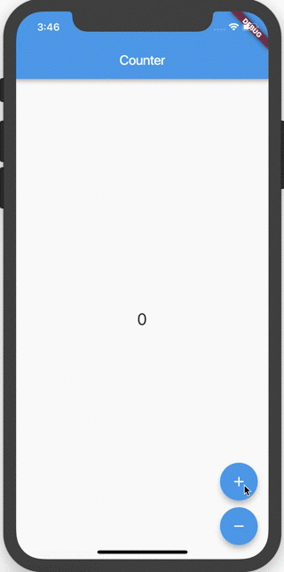

# Tutoriel Flutter d'un Compteur

> Dans ce tutoriel, nous allons construire un compteur avec Flutter en utilisant la bibliothèque Bloc.

## Configuration

Nous commencerons par créer un nouveau projet Flutter

[script](../_snippets/flutter_counter_tutorial/flutter_create.sh.md ':include')

Nous pouvons remplacer le contenu de `pubspec.yaml` par

[pubspec.yaml](../_snippets/flutter_counter_tutorial/pubspec.yaml.md ':include')

et ensuite installer toutes nos dépendances

[script](../_snippets/flutter_counter_tutorial/flutter_packages_get.sh.md ':include')

Notre application de compteur va juste avoir deux boutons pour incrémenter/décrémenter la valeur du compteur et un widget `Text` pour afficher la valeur courante. Commençons à concevoir les `CounterEvents`.

## Counter Events

[counter_event.dart](../_snippets/flutter_counter_tutorial/counter_event.dart.md ':include')

## Counter States

Puisque l'état de notre compteur peut être représenté par un entier, nous n'avons pas besoin de créer une classe personnalisée !

## Counter Bloc

[counter_bloc.dart](../_snippets/flutter_counter_tutorial/counter_bloc.dart.md ':include')

?> **Note**: À partir de la déclaration de la classe, nous pouvons dire que notre `CounterBloc` prendra `CounterEvents` comme entrée et sortira des entiers.

## Counter App

Maintenant que notre `CounterBloc` est complètement implémenté, nous pouvons commencer à créer notre application Flutter.

[main.dart](../_snippets/flutter_counter_tutorial/main.dart.md ':include')

?> **Note**: Nous utilisons le widget `BlocProvider` de `flutter_bloc` afin de rendre l'instance de `CounterBloc` disponible pour tout le sous-arbre (`CounterPage`). Le `BlocProvider` gère également la fermeture automatique du `CounterBloc` pour que nous n'ayons pas besoin d'utiliser un `StatefulWidget`.

## Counter Page

Enfin, il ne nous reste plus qu'à construire notre `Counter Page`.

[counter_page.dart](../_snippets/flutter_counter_tutorial/counter_page.dart.md ':include')

?> **Note**: Nous pouvons accéder à l'instance `CounterBloc` en utilisant `BlocProvider.of<CounterBloc>(contexte)` parce que nous avons enveloppé notre `CounterPage` dans un `BlocProvider`.

?> **Note**: Nous utilisons le widget `BlocBuilder` de `flutter_bloc` afin de reconstruire notre interface utilisateur en réponse aux changements d'état (changements de compteur).

?> **Note**: `BlocBuilder` prend un paramètre optionnel `bloc` mais nous pouvons spécifier le type du bloc et le type de l'état et `BlocBuilder` trouvera le bloc automatiquement donc nous n'avons pas besoin d'utiliser `BlocProvider.of<CounterBloc>(contexte)`.

!> Ne spécifiez le bloc dans `BlocBuilder` que si vous souhaitez fournir un bloc qui sera mis à la portée d'un seul widget et qui n'est pas accessible via un `BlocProvider` parent et le `BuildContext` courant.

Ca y est ! Nous avons séparé notre couche de présentation de notre couche logique métier. Notre `CounterPage` n'a aucune idée de ce qui se passe quand un utilisateur appuie sur un bouton ; il ajoute simplement un événement pour avertir le `CounterBloc`. De plus, notre `CounterBloc` n'a aucune idée de ce qui se passe avec l'état (valeur du compteur) ; il s'agit simplement de convertir les `CounterEvents` en entiers.

Nous pouvons exécuter notre application avec `flutter run` et la visualiser sur notre appareil ou simulateur/émulateur.

La source complète de cet exemple se trouve à l'adresse suivante [ici](https://github.com/felangel/Bloc/tree/master/packages/flutter_bloc/example).
