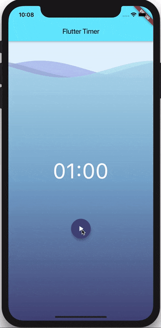

# Flutter Timer Tutorial

> In the following tutorial we’re going to cover how to build a timer application using the bloc library. The finished application should look like this:

## Setup

We’ll start off by creating a brand new Flutter project

[script](../_snippets/flutter_timer_tutorial/flutter_create.sh.md ':include')

We can then replace the contents of pubspec.yaml with:

[pubspec.yaml](../_snippets/flutter_timer_tutorial/pubspec.yaml.md ':include')

?> **Note:** We’ll be using the [flutter_bloc](https://pub.dev/packages/flutter_bloc), [equatable](https://pub.dev/packages/equatable), and [wave](https://pub.dev/packages/wave) packages in this app.

Next, run `flutter packages get` to install all the dependencies.

## Ticker

> The ticker will be our data source for the timer application. It will expose a stream of ticks which we can subscribe and react to.

Start off by creating `ticker.dart`.

[ticker.dart](../_snippets/flutter_timer_tutorial/ticker.dart.md ':include')

All our `Ticker` class does is expose a tick function which takes the number of ticks (seconds) we want and returns a stream which emits the remaining seconds every second.

Next up, we need to create our `TimerBloc` which will consume the `Ticker`.

## Timer Bloc

### TimerState

We’ll start off by defining the `TimerStates` which our `TimerBloc` can be in.

Our `TimerBloc` state can be one of the following:

- TimerInitial — ready to start counting down from the specified duration.
- TimerRunInProgress — actively counting down from the specified duration.
- TimerRunPause — paused at some remaining duration.
- TimerRunComplete — completed with a remaining duration of 0.

Each of these states will have an implication on what the user sees. For example:

- if the state is `TimerInitial` the user will be able to start the timer.
- if the state is `TimerRunInProgress` the user will be able to pause and reset the timer as well as see the remaining duration.
- if the state is `TimerRunPause` the user will be able to resume the timer and reset the timer.
- if the state is `TimerRunComplete` the user will be able to reset the timer.

In order to keep all of our bloc files together, let’s create a bloc directory with `bloc/timer_state.dart`.

?> **Tip:** You can use the [IntelliJ](https://plugins.jetbrains.com/plugin/12129-bloc-code-generator) or [VSCode](https://marketplace.visualstudio.com/items?itemName=FelixAngelov.bloc) extensions to autogenerate the following bloc files for you.

[timer_state.dart](../_snippets/flutter_timer_tutorial/timer_state.dart.md ':include')

Note that all of the `TimerStates` extend the abstract base class `TimerState` which has a duration property. This is because no matter what state our `TimerBloc` is in, we want to know how much time is remaining.

Next up, let’s define and implement the `TimerEvents` which our `TimerBloc` will be processing.

### TimerEvent

Our `TimerBloc` will need to know how to process the following events:

- TimerStarted — informs the TimerBloc that the timer should be started.
- TimerPaused — informs the TimerBloc that the timer should be paused.
- TimerResumed — informs the TimerBloc that the timer should be resumed.
- TimerReset — informs the TimerBloc that the timer should be reset to the original state.
- TimerTicked — informs the TimerBloc that a tick has occurred and that it needs to update its state accordingly.

If you didn’t use the [IntelliJ](https://plugins.jetbrains.com/plugin/12129-bloc-code-generator) or [VSCode](https://marketplace.visualstudio.com/items?itemName=FelixAngelov.bloc) extensions, then create `bloc/timer_event.dart` and let’s implement those events.

[timer_event.dart](../_snippets/flutter_timer_tutorial/timer_event.dart.md ':include')

Next up, let’s implement the `TimerBloc`!

### TimerBloc

If you haven’t already, create `bloc/timer_bloc.dart` and create an empty `TimerBloc`.

[timer_bloc.dart](../_snippets/flutter_timer_tutorial/timer_bloc_empty.dart.md ':include')

The first thing we need to do is define the `initialState` of our `TimerBloc`. In this case, we want the `TimerBloc` to start off in the `TimerInitial` state with a preset duration of 1 minute (60 seconds).

[timer_bloc.dart](../_snippets/flutter_timer_tutorial/timer_bloc_initial_state.dart.md ':include')

Next, we need to define the dependency on our `Ticker`.

[timer_bloc.dart](../_snippets/flutter_timer_tutorial/timer_bloc_ticker.dart.md ':include')

We are also defining a `StreamSubscription` for our `Ticker` which we will get to in a bit.

At this point, all that’s left to do is implement `mapEventToState`. For improved readability, I like to break out each event handler into its own helper function. We’ll start with the `TimerStarted` event.

[timer_bloc.dart](../_snippets/flutter_timer_tutorial/timer_bloc_start.dart.md ':include')

If the `TimerBloc` receives a `TimerStarted` event, it pushes a `TimerRunInProgress` state with the start duration. In addition, if there was already an open `_tickerSubscription` we need to cancel it to deallocate the memory. We also need to override the `close` method on our `TimerBloc` so that we can cancel the `_tickerSubscription` when the `TimerBloc` is closed. Lastly, we listen to the `_ticker.tick` stream and on every tick we add a `TimerTicked` event with the remaining duration.

Next, let’s implement the `TimerTicked` event handler.

[timer_bloc.dart](../_snippets/flutter_timer_tutorial/timer_bloc_tick.dart.md ':include')

Every time a `TimerTicked` event is received, if the tick’s duration is greater than 0, we need to push an updated `TimerRunInProgress` state with the new duration. Otherwise, if the tick’s duration is 0, our timer has ended and we need to push a `TimerRunComplete` state.

Now let’s implement the `TimerPaused` event handler.

[timer_bloc.dart](../_snippets/flutter_timer_tutorial/timer_bloc_pause.dart.md ':include')

In `_mapTimerPausedToState` if the `state` of our `TimerBloc` is `TimerRunInProgress`, then we can pause the `_tickerSubscription` and push a `TimerRunPause` state with the current timer duration.

Next, let’s implement the `TimerResumed` event handler so that we can unpause the timer.

[timer_bloc.dart](../_snippets/flutter_timer_tutorial/timer_bloc_resume.dart.md ':include')

The `TimerResumed` event handler is very similar to the `TimerPaused` event handler. If the `TimerBloc` has a `state` of `TimerRunPause` and it receives a `TimerResumed` event, then it resumes the `_tickerSubscription` and pushes a `TimerRunInProgress` state with the current duration.

Lastly, we need to implement the `TimerReset` event handler.

[timer_bloc.dart](../_snippets/flutter_timer_tutorial/timer_bloc.dart.md ':include')

If the `TimerBloc` receives a `TimerReset` event, it needs to cancel the current `_tickerSubscription` so that it isn’t notified of any additional ticks and pushes a `TimerInitial` state with the original duration.

If you didn’t use the [IntelliJ](https://plugins.jetbrains.com/plugin/12129-bloc-code-generator) or [VSCode](https://marketplace.visualstudio.com/items?itemName=FelixAngelov.bloc) extensions be sure to create `bloc/bloc.dart` in order to export all the bloc files and make it possible to use a single import for convenience.

[bloc.dart](../_snippets/flutter_timer_tutorial/timer_bloc_barrel.dart.md ':include')

That’s all there is to the `TimerBloc`. Now all that’s left is implement the UI for our Timer Application.

## Application UI

### MyApp

We can start off by deleting the contents of `main.dart` and creating our `MyApp` widget which will be the root of our application.

[main.dart](../_snippets/flutter_timer_tutorial/main1.dart.md ':include')

`MyApp` is a `StatelessWidget` which will manage initializing and closing an instance of `TimerBloc`. In addition, it’s using the `BlocProvider` widget in order to make our `TimerBloc` instance available to the widgets in our subtree.

Next, we need to implement our `Timer` widget.

### Timer

Our `Timer` widget will be responsible for displaying the remaining time along with the proper buttons which will enable users to start, pause, and reset the timer.

[timer.dart](../_snippets/flutter_timer_tutorial/timer1.dart.md ':include')

So far, we’re just using `BlocProvider` to access the instance of our `TimerBloc` and using a `BlocBuilder` widget in order to rebuild the UI every time we get a new `TimerState`.

Next, we’re going to implement our `Actions` widget which will have the proper actions (start, pause, and reset).

### Actions

[actions.dart](../_snippets/flutter_timer_tutorial/actions.dart.md ':include')

The `Actions` widget is just another `StatelessWidget` which uses `BlocProvider` to access the `TimerBloc` instance and then returns different `FloatingActionButtons` based on the current state of the `TimerBloc`. Each of the `FloatingActionButtons` adds an event in its `onPressed` callback to notify the `TimerBloc`.

Now we need to hook up the `Actions` to our `Timer` widget.

[timer.dart](../_snippets/flutter_timer_tutorial/timer2.dart.md ':include')

We added another `BlocBuilder` which will render the `Actions` widget; however, this time we’re using a newly introduced [flutter_bloc](https://pub.dev/packages/flutter_bloc) feature to control how frequently the `Actions` widget is rebuilt (introduced in `v0.15.0`).

If you want fine-grained control over when the `builder` function is called you can provide an optional `condition` to `BlocBuilder`. The `condition` takes the previous bloc state and current bloc state and returns a `boolean`. If `condition` returns `true`, `builder` will be called with `state` and the widget will rebuild. If `condition` returns `false`, `builder` will not be called with `state` and no rebuild will occur.

In this case, we don’t want the `Actions` widget to be rebuilt on every tick because that would be inefficient. Instead, we only want `Actions` to rebuild if the `runtimeType` of the `TimerState` changes (TimerInitial => TimerRunInProgress, TimerRunInProgress => TimerRunPause, etc...).

As a result, if we randomly colored the widgets on every rebuild, it would look like:

?> **Notice:** Even though the `Text` widget is rebuilt on every tick, we only rebuild the `Actions` if they need to be rebuilt.

Lastly, we need to add the super cool wave background using the [wave](https://pub.dev/packages/wave) package.

### Waves Background

[background.dart](../_snippets/flutter_timer_tutorial/background.dart.md ':include')

### Putting it all together

Our finished, `main.dart` should look like:

[main.dart](../_snippets/flutter_timer_tutorial/main2.dart.md ':include')

That’s all there is to it! At this point we have a pretty solid timer application which efficiently rebuilds only widgets that need to be rebuilt.

The full source for this example can be found [here](https://github.com/felangel/Bloc/tree/master/examples/flutter_timer).
