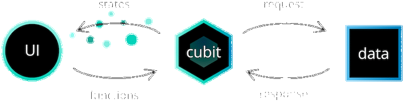

# Conceitos Principais (package:bloc)

?> Por favor, certifique-se de ler atentamente as seções a seguir antes de trabalhar com [package:bloc](https://pub.dev/packages/bloc).

Existem vários conceitos básicos que são críticos para entender como usar o pacote bloc.

Nas próximas seções, discutiremos cada um deles em detalhes, além de detalhar como eles se aplicariam a um aplicativo de contador.

## Streams

?> Confira a [documentação oficial do Dart](https://dart.dev/tutorials/language/streams) para mais informações sobre `Streams`.

> Um stream é uma sequência de dados assíncronos.

Para usar a biblioteca bloc, é fundamental ter uma compreensão básica sobre Streams e como eles funcionam.

> Se você não estiver familiarizado com `Streams`, pense em um cano com água fluindo por ele. O cano é o `Stream` e a água são os dados assíncronos.

Podemos criar um `Stream` no Dart escrevendo uma função `async*` (gerador assíncrono).

[count_stream.dart](../_snippets/core_concepts/count_stream.dart.md ':include')

Ao marcar uma função como `async*` nós podemos usar a palavra-chave `yield` para retornar um `Stream` de dados. No exemplo acima, estamos retornando um `Stream` de inteiros até o parâmetro inteiro `max`.

Toda vez que usamos `yield` em uma função `async*`, estamos enviando esses dados pelo Stream.

Podemos consumir o Stream` acima de várias maneiras. Se quiséssemos escrever uma função para retornar a soma de um Stream` de inteiros, poderia ser algo como:

[sum_stream.dart](../_snippets/core_concepts/sum_stream.dart.md ':include')

Ao marcar a função acima como `async`, podemos usar a palavra-chave `await` e retornar um `Future` de inteiros. Neste exemplo, estamos aguardando cada valor do stream e retornando a soma de todos os inteiros do stream.

Podemos juntar tudo desta forma:

[main.dart](../_snippets/core_concepts/streams_main.dart.md ':include')

Agora que temos uma compreensão básica de como os `Streams` funcionam no Dart, estamos prontos para aprender sobre o componente base do pacote bloc: um `Cubit`.

## Cubit

> Um `Cubit` é uma classe que estende `BlocBase` e pode ser estendida para gerenciar qualquer tipo de estado.

Um `Cubit` pode expor funções que podem ser invocadas para acionar mudanças de estado.

> Estados são os resultados de um `Cubit` e representam uma parte do estado do seu aplicativo. Os componentes da UI podem ser notificados pelos estados e redesenhar parte de seus elementos com base no estado atual.

> **Nota**: Para mais informações sobre as origens do `Cubit`, confira [a seguinte issue](https://github.com/felangel/cubit/issues/69).

### Criando um Cubit

Podemos criar um `CounterCubit` assim:

[counter_cubit.dart](../_snippets/core_concepts/counter_cubit.dart.md ':include')

Ao criar um `Cubit`, precisamos definir o tipo do estado que o `Cubit` estará gerenciando. No caso do `CounterCubit` acima, o estado pode ser representado por meio de um `int`, mas em casos mais complexos pode ser necessário usar uma `classe` em vez de um tipo primitivo.

A segunda coisa que precisamos fazer ao criar um `Cubit` é especificar o estado inicial. Podemos fazer isso chamando `super` com o valor do estado inicial. No código acima, estamos definindo o estado inicial como `0` internamente, mas também podemos permitir que o `Cubit` seja mais flexível aceitando um valor externo:

[counter_cubit.dart](../_snippets/core_concepts/counter_cubit_initial_state.dart.md ':include')

Isso nos permitiria criar instâncias do `CounterCubit` com diferentes estados iniciais, como:

[main.dart](../_snippets/core_concepts/counter_cubit_instantiation.dart.md ':include')

### Mudanças de Estado

> Cada `Cubit` tem a capacidade de emitir um novo estado via `emit`.

[counter_cubit.dart](../_snippets/core_concepts/counter_cubit_increment.dart.md ':include')

No código acima, o `CounterCubit` está expondo um método público chamado `increment` que pode ser chamado externamente para notificar o `CounterCubit` para incrementar seu estado. Quando `increment` é chamado, podemos acessar o estado atual do `Cubit` através do `state` e `emitir` um novo estado adicionando 1 ao estado atual.

!> O método `emit` é protegido, o que significa que só deve ser usado dentro de um `Cubit`.

### Usando um Cubit

Agora podemos pegar o `CounterCubit` que implementamos e colocá-lo em uso!

#### Uso Básico

[main.dart](../_snippets/core_concepts/counter_cubit_basic_usage.dart.md ':include')

No código acima, começamos criando uma instância do `CounterCubit`. Em seguida, imprimimos o estado atual do cubit que é o estado inicial (já que nenhum novo estado foi emitido ainda). Em seguida, chamamos a função `increment` para acionar uma mudança de estado. Finalmente, imprimimos novamente o estado do `Cubit` que foi de `0` para `1` e chamamos o método `close` do `Cubit` para fechar o fluxo de estado interno.

#### Uso de Stream

`Cubit` expõe um `Stream` que nos permite receber atualizações de estado em tempo real:

[main.dart](../_snippets/core_concepts/counter_cubit_stream_usage.dart.md ':include')

No trecho acima, estamos subscrevendo o `CounterCubit` e chamando print em cada mudança de estado. Então, estamos invocando a função de `increment` que emitirá um novo estado. Por fim, estamos chammando `cancel` em `subscription` quando não queremos mais receber atualizações e fechando o `Cubit`.

?> **Nota**: `await Future.delayed(Duration.zero)` foi adicionado a este exemplo para evitar o cancelamento imediato da subscrição.

!> Somente as mudanças de estado subsequentes serão recebidas ao chamar `listen` em um `Cubit`.

### Observando um Cubit

> Quando um `Cubit` emite um novo estado, ocorre uma `Change`. Podemos observar todas as mudanças de um dado `Cubit` alterando o método `onChange`.

[counter_cubit.dart](../_snippets/core_concepts/counter_cubit_on_change.dart.md ':include')

Podemos então interagir com o `Cubit` e observar o resultado de todas as alterações no console.

[main.dart](../_snippets/core_concepts/counter_cubit_on_change_usage.dart.md ':include')

O exemplo acima resultaria:

[script](../_snippets/core_concepts/counter_cubit_on_change_output.sh.md ':include')

?> **Nota**: Uma `Change` ocorre imediatamente antes que o estado do `Cubit` seja atualizado. Uma `Change` consiste no `currentState` e no `nextState`.

#### BlocObserver

Um bônus adicional de usar a biblioteca bloc é que podemos ter acesso a todas as `Changes` em um só lugar. Embora nesta aplicação tenhamos apenas um `Cubit`, é bastante comum em aplicativos maiores ter muitos `Cubits` gerenciando diferentes partes do estado da aplicação.

Se quisermos fazer algo em resposta a todas as `Changes`, podemos simplesmente criar nosso próprio `BlocObserver`.

[simple_bloc_observer_on_change.dart](../_snippets/core_concepts/simple_bloc_observer_on_change.dart.md ':include')

?> **Nota**: Tudo que precisamos fazer é estender o `BlocObserver` e substituir o método `onChange`.

Para usar o `SimpleBlocObserver`, precisamos apenas ajustar a função `main`:

[main.dart](../_snippets/core_concepts/simple_bloc_observer_on_change_usage.dart.md ':include')

O código acima resultaria então:

[script](../_snippets/core_concepts/counter_cubit_on_change_usage_output.sh.md ':include')

?> **Nota**: A substituição interna do `onChange` é chamada primeiro, seguida pela `onChange` no BlocObserver.

?> 💡 **Dica**: No `BlocObserver` temos acesso à instância do `Cubit` além do próprio `Change`.

### Manipulação de Erros

> Cada `Cubit` tem um método `addError` que pode ser usado para indicar que ocorreu um erro.

[counter_cubit.dart](../_snippets/core_concepts/counter_cubit_on_error.dart.md ':include')

?> **Nota**: `onError` pode ser substituído dentro do `Cubit` para lidar com todos os erros de um `Cubit` específico.

`onError` também pode ser substituído no `BlocObserver` para lidar com todos os erros reportados globalmente.

[simple_bloc_observer.dart](../_snippets/core_concepts/simple_bloc_observer_on_error.dart.md ':include')

Se executarmos o mesmo programa novamente, devemos ver a seguinte saída:

[script](../_snippets/core_concepts/counter_cubit_on_error_output.sh.md ':include')

?> **Nota**: Assim como com `onChange`, a substituição interna `onError` é invocada antes da substituição global do `BlocObserver`.

## Bloc

> Um `Bloc` é uma classe mais avançada que depende de `events` para disparar mudanças no `state` em vez de funções. `Bloc` também estende `BlocBase`, o que significa que ele possui uma API pública semelhante ao `Cubit`. No entanto, em vez de chamar uma `function` em um `Bloc` e emitir diretamente um novo `state`, os `Blocs` recebem `events` e convertem estes `events` de entrada em `states` de saída.

### Criando um Bloc

Criar um `Bloc` é semelhante a criar um `Cubit`, exceto que além de definir o estado que estaremos gerenciando, também devemos definir o evento que o `Bloc` poderá processar.

> Eventos são as entradas de um Bloc. Eles geralmente são adicionados em resposta a interações do usuário, como botões pressionados ou eventos de ciclo de vida, como carregamentos de página.

[counter_bloc.dart](../_snippets/core_concepts/counter_bloc.dart.md ':include')

Assim como ao criar o `CounterCubit`, devemos especificar um estado inicial passando-o para a superclasse via `super`.

### Mudanças de Estado

`Bloc` exige que registremos manipuladores de eventos por meio da API `on<Event>`, em oposição às funções do `Cubit`. Um manipulador de eventos é responsável por converter qualquer evento de entrada em zero ou mais estados de saída.

[counter_bloc.dart](../_snippets/core_concepts/counter_bloc_event_handler.dart.md ':include')

?> 💡 **Dica**: um `EventHandler` tem acesso ao evento adicionado, bem como a um `Emitter` que pode ser usado para emitir zero ou mais estados em resposta ao evento de entrada.

Podemos então atualizar o `EventHandler` para manipular o evento `CounterIncrementPressed`:

[counter_bloc.dart](../_snippets/core_concepts/counter_bloc_increment.dart.md ':include')

No trecho acima, registramos um `EventHandler` para gerenciar todos os eventos `CounterIncrementPressed`. Para cada evento `CounterIncrementPressed` de entrada, podemos acessar o estado atual do bloc através do `state` e `emit(state + 1)`.

?> **Nota**: Como a classe `Bloc` estende `BlocBase`, temos acesso ao estado atual do bloc a qualquer momento através do `state`, assim como no `Cubit`.

!> Blocs nunca devem `emitir` diretamente novos estados. Em vez disso, cada mudança de estado deve ser gerada em resposta a um evento de entrada em um `EventHandler`.

!> Tanto os blocs quanto os cubits irão ignorar os estados duplicados. Se emitirmos `State nextState` onde `state == nextState`, nenhuma mudança de estado ocorrerá.

### Usando um Bloc

Neste ponto, podemos criar uma instância do nosso `CounterBloc` e colocá-lo em uso!

#### Uso Básico

[main.dart](../_snippets/core_concepts/counter_bloc_usage.dart.md ':include')

No código acima, começamos criando uma instância do `CounterBloc`. Em seguida, imprimimos o estado atual do `Bloc` que é o estado inicial (já que nenhum novo estado foi emitido ainda). Em seguida, adicionamos o evento `CounterIncrementPressed` para acionar uma mudança de estado. Por fim, imprimimos novamente o estado do `Bloc` que foi de `0` para `1` e chamamos `close` no `Bloc` para fechar o fluxo de estado interno.

?> **Nota**: `await Future.delayed(Duration.zero)` foi adicionado para garantir que aguardamos a próxima iteração do loop de eventos (permitindo que o `EventHandler` processe o evento).

#### Uso de Stream

Assim como no `Cubit`, um `Bloc` é um tipo especial de `Stream`, o que significa que também podemos subscrever um `Bloc` para atualizações em tempo real de seu estado:

[main.dart](../_snippets/core_concepts/counter_bloc_stream_usage.dart.md ':include')

No código acima, estamos subscrevendo o `CounterBloc` e chamando print em cada mudança de estado. Em seguida, estamos adicionando o evento `CounterIncrementPressed` que aciona o `EventHandler` `on<CounterIncrementPressed>` e emite um novo estado. Por fim, estamos chamando `cancel` na subscrição, quando não queremos mais receber atualizações, e fechando o `Bloc`.

?> **Nota**: `await Future.delayed(Duration.zero)` foi adicionado a este exemplo para evitar o cancelamento imediato da subscrição.

### Observando um Bloc

Como `Bloc` estende `BlocBase`, podemos observar todas as mudanças de estado de um `Bloc` usando `onChange`.

[counter_bloc.dart](../_snippets/core_concepts/counter_bloc_on_change.dart.md ':include')

Podemos então atualizar `main.dart` para:

[main.dart](../_snippets/core_concepts/counter_bloc_on_change_usage.dart.md ':include')

Agora, se executarmos o código acima, a saída será:

[script](../_snippets/core_concepts/counter_bloc_on_change_output.sh.md ':include')

Um importante fator de diferenciação entre `Bloc` e `Cubit` é que, como `Bloc` é orientado a eventos, também podemos capturar informações sobre o que desencadeou a mudança de estado.

Podemos fazer isso substituindo `onTransition`.

> A mudança de um estado para outro é chamada de `Transition`. Uma `Transition` consiste no estado atual, no evento e no próximo estado.

[counter_bloc.dart](../_snippets/core_concepts/counter_bloc_on_transition.dart.md ':include')

Se executarmos novamente o mesmo código `main.dart` de antes, devemos ver a seguinte saída:

[script](../_snippets/core_concepts/counter_bloc_on_transition_output.sh.md ':include')

?> **Nota**: `onTransition` é invocado antes de `onChange` e contém o evento que disparou a mudança de `currentState` para `nextState`.

#### BlocObserver

Assim como antes, podemos substituir `onTransition` em um `BlocObserver` personalizado para observar em um único local todas as transições que ocorrem.

[simple_bloc_observer.dart](../_snippets/core_concepts/simple_bloc_observer_on_transition.dart.md ':include')

Podemos inicializar o `SimpleBlocObserver` como antes:

[main.dart](../_snippets/core_concepts/simple_bloc_observer_on_transition_usage.dart.md ':include')

Agora, se executarmos o código acima, a saída deve ser semelhante a:

[script](../_snippets/core_concepts/simple_bloc_observer_on_transition_output.sh.md ':include')

?> **Note**: `onTransition` é invocado primeiro (local antes de global) seguido por `onChange`.

Outra característica única das instâncias `Bloc` é que elas nos permitem sobrescrever `onEvent` que é chamado sempre que um novo evento é adicionado ao `Bloc`. Assim como `onChange` e `onTransition`, `onEvent` pode ser substituído localmente e globalmente.

[counter_bloc.dart](../_snippets/core_concepts/counter_bloc_on_event.dart.md ':include')

[simple_bloc_observer.dart](../_snippets/core_concepts/simple_bloc_observer_on_event.dart.md ':include')

Podemos executar o mesmo `main.dart` de antes e devemos ver a seguinte saída:

[script](../_snippets/core_concepts/simple_bloc_observer_on_event_output.sh.md ':include')

?> **Nota**: `onEvent` é chamado assim que o evento é adicionado. O `onEvent` local é invocado antes do `onEvent` global no `BlocObserver`.

### Manipulação de Erros

Assim como no `Cubit`, cada `Bloc` possui um método `addError` e `onError`. Podemos indicar que ocorreu um erro chamando `addError` de qualquer lugar dentro do nosso `Bloc`. Podemos então reagir a todos os erros substituindo `onError` assim como com o `Cubit`.

[counter_bloc.dart](../_snippets/core_concepts/counter_bloc_on_error.dart.md ':include')

Se executarmos novamente o mesmo `main.dart` de antes, podemos ver como fica quando um erro é relatado:

[script](../_snippets/core_concepts/counter_bloc_on_error_output.sh.md ':include')

?> **Nota**: O `onError` local é invocado primeiro, seguido pelo `onError` global no `BlocObserver`.

?> **Nota**: `onError` e `onChange` funcionam exatamente da mesma maneira para instâncias `Bloc` e `Cubit`.

!> Quaisquer exceções não tratadas que ocorram em um `EventHandler` também são relatadas a `onError`.

## Cubit vs. Bloc

Agora que abordamos o básico das classes Cubit e Bloc, você deve estar se perguntando quando deve usar o Cubit e quando deve usar o Bloc.

### Vantagens do Cubit

#### Simplicidade

Uma das maiores vantagens de usar o `Cubit` é a simplicidade. Ao criar um `Cubit`, só temos que definir o estado, bem como as funções que queremos expor para alterar o estado. Em comparação, ao criar um `Bloc`, temos que definir os estados, eventos e a implementação do `EventHandler`. Isso torna o `Cubit` mais fácil de entender e há menos código envolvido.

Agora vamos dar uma olhada nas duas implementações de contador:

##### CounterCubit

[counter_cubit.dart](../_snippets/core_concepts/counter_cubit_full.dart.md ':include')

##### CounterBloc

[counter_bloc.dart](../_snippets/core_concepts/counter_bloc_full.dart.md ':include')

A implementação do `Cubit` é mais concisa e ao invés de definir eventos separadamente, as funções agem como eventos. Além disso, ao usar um `Cubit`, podemos simplesmente chamar `emit` de qualquer lugar para acionar uma mudança de estado.

### Vantagens do Bloc

#### Rastreabilidade

Uma das maiores vantagens de usar o `Bloc` é conhecer a sequência de mudanças de estado, bem como exatamente o que desencadeou essas mudanças. Para o estado que é crítico para a funcionalidade de um aplicativo, pode ser muito benéfico usar uma abordagem mais orientada a eventos para capturar todos os eventos, além das alterações de estado.

Um caso de uso comum pode ser o gerenciamento de `AuthenticationState`. Para simplificar, digamos que podemos representar `AuthenticationState` por meio de um `enum`:

[authentication_state.dart](../_snippets/core_concepts/authentication_state.dart.md ':include')

Pode haver muitas razões pelas quais o estado do aplicativo pode mudar de `authenticated` para `unauthenticated`. Por exemplo, o usuário pode ter tocado em um botão de logout e solicitado para sair do aplicativo. Por outro lado, talvez o token de acesso do usuário tenha sido revogado e ele tenha sido desconectado à força. Ao usar o `Bloc`, podemos rastrear claramente como o estado do aplicativo chegou a um determinado estado.

[script](../_snippets/core_concepts/authentication_transition.sh.md ':include')

A `Transition` acima nos dá todas as informações de que precisamos para entender por que o estado mudou. Se tivéssemos usado um `Cubit` para gerenciar o `AuthenticationState`, nossos logs seriam assim:

[script](../_snippets/core_concepts/authentication_change.sh.md ':include')

Isso nos diz que o usuário foi desconectado, mas não explica por que, o que pode ser crítico para depurar e entender como o estado do aplicativo está mudando ao longo do tempo.

#### Transformações Avançadas de Eventos

Outra área em que o `Bloc` se destaca sobre o `Cubit` é quando precisamos tirar proveito de operadores reativos, como `buffer`, `debounceTime`, `throttle`, etc.

`Bloc` tem um coletor de eventos que nos permite controlar e transformar o fluxo de entrada de eventos.

Por exemplo, se estivéssemos construindo uma pesquisa em tempo real, provavelmente desejaríamos atrasar as solicitações para o backend para evitar a limitação de taxa, bem como reduzir o custo/carga no backend.

Com `Bloc`, podemos fornecer um `EventTransformer` personalizado para alterar a maneira como os eventos de entrada são processados ​​pelo `Bloc`.

[counter_bloc.dart](../_snippets/core_concepts/debounce_event_transformer.dart.md ':include')

Com o código acima, podemos facilmente atrasar os eventos de entrada com muito pouco código adicional.

?> 💡 **Dica**: Confira [package:bloc_concurrency](https://pub.dev/packages/bloc_concurrency) para um conjunto opinativo de transformadores de eventos.

?> 💡 **Dica**: Se você ainda não tiver certeza sobre qual usar, comece com o `Cubit` e depois refatore ou escale para um `Bloc` conforme necessário.
