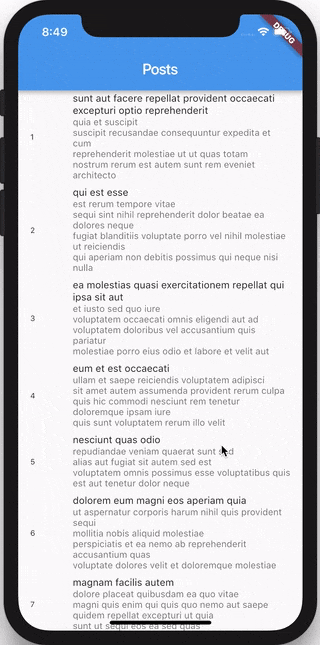

# Flutter Infinite List Tutorial

> Neste tutorial, implementaremos um aplicativo que busca dados na rede e os carrega à medida que o usuário rola usando o Flutter e a biblioteca bloc.

## Setup

Vamos começar criando um novo projeto Flutter

[script](../_snippets/flutter_infinite_list_tutorial/flutter_create.sh.md ':include')

Podemos então avançar e substituir o conteúdo de pubspec.yaml por

[pubspec.yaml](../_snippets/flutter_infinite_list_tutorial/pubspec.yaml.md ':include')

e instale todas as nossas dependências

[script](../_snippets/flutter_infinite_list_tutorial/flutter_packages_get.sh.md ':include')

## REST API

Para este aplicativo de demonstração, usaremos [jsonplaceholder](http://jsonplaceholder.typicode.com) como nossa fonte de dados.

?> jsonplaceholder é uma API REST online que serve dados falsos; é muito útil para criar protótipos.

Abra uma nova guia no seu navegador e visite https://jsonplaceholder.typicode.com/posts?_start=0&_limit=2 para ver o que a API retorna.

[posts.json](../_snippets/flutter_infinite_list_tutorial/posts.json.md ':include')

?> **Nota:** em nossa URL, especificamos o início e o limite como parâmetros de consulta para a solicitação GET.

Ótimo, agora que sabemos como serão os nossos dados, vamos criar o modelo.

## Modelo

Crie `post.dart` e vamos começar a criar o modelo do nosso objeto Post.

[post.dart](../_snippets/flutter_infinite_list_tutorial/post.dart.md ':include')

O `Post` é apenas uma classe com um `id`, `title` e `body`.

?> Substituímos a função `toString` para ter uma representação de string personalizada do nosso` Post` para mais tarde.

?> Estendemos [`Equatable`] (https://pub.dev/packages/equatable) para que possamos comparar `Posts`; por padrão, o operador de igualdade retorna true se e somente se este e outro forem a mesma instância.

Agora que temos o nosso modelo de objeto "Post", vamos começar a trabalhar no Business Logic Component (bloc).

## Eventos Post

Antes de mergulharmos na implementação, precisamos definir o que nosso `PostBloc` fará.

Em um nível alto, ele responderá à entrada do usuário (rolagem) e buscará mais postagens para que a camada de apresentação as exiba. Vamos começar criando nosso "Evento".

Nosso `PostBloc` estará respondendo apenas a um único evento; `Buscar` que será adicionado pela camada de apresentação sempre que precisar de mais mensagens para apresentar. Como nosso evento `PostFetched` é um tipo de `PostEvent`, podemos criar `bloc/post_event.dart` e implementar o evento dessa forma.

[post_event.dart](../_snippets/flutter_infinite_list_tutorial/post_event.dart.md ':include')

Para recapitular, nosso `PostBloc` receberá `PostEvents` e os converterá em `PostStates`. Definimos todos os nossos `PostEvents` (PostFetched); portanto, a seguir, vamos definir nosso `PostState`.

## Estados Post

Nossa camada de apresentação precisará ter várias informações para se apresentar adequadamente:

- `PostInitial`- informa a camada de apresentação que precisa para renderizar um indicador de carregamento enquanto o lote inicial de postagens é carregado

- `PostSuccess`- informará a camada de apresentação que possui conteúdo para renderizar
  - `posts`- será o `List <Post>` que será exibido
  - `hasReachedMax`- diz à camada de apresentação se atingiu ou não o número máximo de postagens
- `PostFailure`- irá dizer à camada de apresentação que ocorreu um erro ao buscar postagens

Agora podemos criar `bloc/post_state.dart` e implementá-lo dessa maneira.

[post_state.dart](../_snippets/flutter_infinite_list_tutorial/post_state.dart.md ':include')

?> Implementamos o `copyWith` para que possamos copiar uma instância do `PostSuccess` e atualizar zero ou mais propriedades convenientemente (isso será útil mais tarde).

Agora que temos nossos `Events` e `States` implementados, podemos criar nosso `PostBloc`.

Para facilitar a importação de nossos estados e eventos com uma única importação, podemos criar `bloc/bloc.dart` que exporta todos eles (adicionaremos nossa exportação `post_bloc.dart` na próxima seção).

[bloc.dart](../_snippets/flutter_infinite_list_tutorial/bloc_initial.dart.md ':include')

## Bloc Post

Para simplificar, nosso `PostBloc` terá uma dependência direta de um `cliente http`; no entanto, em um aplicativo de produção, você pode injetar um cliente api e usar o padrão de repositório [docs] (./ architecture.md).

Vamos criar `post_bloc.dart` e criar nossoc`PostBloc` vazio.

[post_bloc.dart](../_snippets/flutter_infinite_list_tutorial/post_bloc_initial.dart.md ':include')

?> **Nota:** apenas a partir da declaração da classe, podemos dizer que nosso PostBloc aceitará os PostEvents como entrada e saída de PostStates.

Podemos começar implementando `initialState`, que será o estado do nosso `PostBloc` antes que quaisquer eventos sejam adicionados.

[post_bloc.dart](../_snippets/flutter_infinite_list_tutorial/post_bloc_initial_state.dart.md ':include')

Em seguida, precisamos implementar o `mapEventToState`, que será acionado toda vez que um `PostEvent` for adicionado.

[post_bloc.dart](../_snippets/flutter_infinite_list_tutorial/post_bloc_map_event_to_state.dart.md ':include')

Nosso `PostBloc` renderá sempre que houver um novo estado, pois retorna um `Stream <PostState>`. Confira os [principais conceitos](https://bloclibrary.dev/#/coreconcepts?id=streams) para obter mais informações sobre `Streams` e outros conceitos principais.

Agora, toda vez que um `PostEvent` é adicionado, se for um evento` PostFetched` e houver mais postagens a serem buscadas, nosso `PostBloc` buscará as próximas 20 postagens.

A API retornará uma matriz vazia se tentarmos buscar além do número máximo de postagens (100), portanto, se retornarmos uma matriz vazia, nosso bloc `produzirá` o currentState, exceto que definiremos `hasReachedMax` como true.

Se não podemos recuperar os posts, lançamos uma exceção e `yield` `PostFailure ()`.

Se pudermos recuperar as postagens, retornamos `PostSuccess ()`, que pega toda a lista de postagens.

Uma otimização que podemos fazer é `rejeitar` os `Eventos` para evitar spam desnecessariamente em nossa API. Podemos fazer isso substituindo o método `transform` no nosso` PostBloc`.

?> **Nota:** Sobrescrevendo o `transform` nos permite transformar a Stream<Event> antes que o mapEventToState seja chamado. Isso permite que operações como distinct(), debounceTime(), etc ... sejam aplicadas.

[post_bloc.dart](../_snippets/flutter_infinite_list_tutorial/post_bloc_transform_events.dart.md ':include')

Nosso `PostBloc` finalizado deve ficar assim:

[post_bloc.dart](../_snippets/flutter_infinite_list_tutorial/post_bloc.dart.md ':include')

Não se esqueça de atualizar o `bloc/bloc.dart` para incluir o nosso` PostBloc`!

[bloc.dart](../_snippets/flutter_infinite_list_tutorial/bloc.dart.md ':include')

Ótimo! Agora que terminamos de implementar a lógica de negócios, tudo o que resta fazer é implementar a camada de apresentação.

## Camada de Apresentação

Em nosso `main.dart`, podemos começar implementando nossa função principal e chamando `runApp` para renderizar nosso widget raiz.

No nosso widget `App`, usamos o `BlocProvider` para criar e fornecer uma instância do `PostBloc` para a subárvore. Além disso, adicionamos um evento `PostFetched` para que, quando o aplicativo for carregado, ele solicite o lote inicial de Posts.

[main.dart](../_snippets/flutter_infinite_list_tutorial/main.dart.md ':include')

Em seguida, precisamos implementar nosso widget `HomePage`, que apresentará nossas postagens e se conectará ao nosso `PostBloc`.

[home_page.dart](../_snippets/flutter_infinite_list_tutorial/home_page.dart.md ':include')

?> `HomePage` é um `StatefulWidget` porque precisará manter um `ScrollController`. Em `initState`, adicionamos um ouvinte ao nosso `ScrollController` para que possamos responder aos eventos de rolagem. Também acessamos nossa instância `PostBloc` através de `BlocProvider.of <PostBloc> (context)`.

Seguindo em frente, nosso método de compilação retorna um `BlocBuilder`. O `BlocBuilder` é um widget Flutter do [pacote flutter_bloc](https://pub.dev/packages/flutter_bloc) que lida com a construção de um widget em resposta a novos estados do bloc. Sempre que nosso estado `PostBloc` mudar, nossa função de construtor será chamada com o novo `PostState`.

!> Precisamos lembrar de descartar nosso `ScrollController` quando o StatefulWidget for descartado.

Sempre que o usuário rola, calculamos a que distância estão da parte inferior da página e se a distância é ≤ nosso `_scrollThreshold`, adicionamos um evento `PostFetched` para carregar mais postagens.

Em seguida, precisamos implementar nosso widget `BottomLoader`, que indicará ao usuário que estamos carregando mais postagens.

[bottom_loader.dart](../_snippets/flutter_infinite_list_tutorial/bottom_loader.dart.md ':include')
Por fim, precisamos implementar nosso `PostWidget` que renderizará um Post individual.

[post.dart](../_snippets/flutter_infinite_list_tutorial/post_widget.dart.md ':include')

Neste ponto, devemos poder executar nosso aplicativo e tudo deve funcionar; no entanto, há mais uma coisa que podemos fazer.

Um bônus adicional de usar a biblioteca de blocs é que podemos ter acesso a todas as `Transições` em um só lugar.

> A mudança de um estado para outro é chamada de `Transição`.

?> Uma `Transição` consiste no estado atual, no evento e no próximo estado.

Mesmo que neste aplicativo tenha apenas um bloc, é bastante comum em aplicativos maiores ter muitos blocs gerenciando diferentes partes do estado do aplicativo.

Se quisermos fazer algo em resposta a todas as `Transições`, podemos simplesmente criar nosso próprio `BlocDelegate`.

[simple_bloc_delegate.dart](../_snippets/flutter_infinite_list_tutorial/simple_bloc_delegate.dart.md ':include')

?> Tudo o que precisamos fazer é estender o `BlocDelegate` e substituir o método `onTransition`.

Para dizer ao Bloc para usar nosso `SimpleBlocDelegate`, precisamos apenas ajustar nossa função principal.

[main.dart](../_snippets/flutter_infinite_list_tutorial/bloc_delegate_main.dart.md ':include')

Agora, quando executamos nosso aplicativo, toda vez que ocorre uma transição do bloc, podemos ver a transição impressa no console.

?> Na prática, você pode criar diferentes `BlocDelegates` e, como todas as alterações de estado são registradas, somos capazes de instrumentar nossos aplicativos com muita facilidade e rastrear todas as interações do usuário e alterações de estado em um só lugar!

Isso é tudo! Agora implementamos com sucesso uma lista infinita no flutter usando os pacotes [bloc](https://pub.dev/packages/bloc) e [flutter_bloc](https://pub.dev/packages/flutter_bloc) e nós separamos com êxito nossa camada de apresentação de nossa lógica de negócios.

Nossa `HomePage` não faz ideia de onde as `Posts` são provenientes ou como estão sendo recuperadas. Por outro lado, nosso `PostBloc` não faz ideia de como o `State` está sendo renderizado, ele simplesmente converte eventos em estados.

O código fonte completo deste exemplo pode ser encontrado [aqui](https://github.com/felangel/Bloc/tree/master/examples/flutter_infinite_list).
