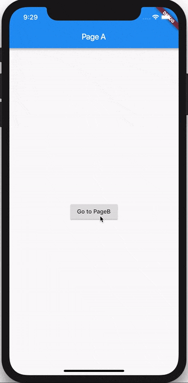

# Receitas: Navegação

> Nesta receita, veremos como usar o `BlocBuilder` e / ou o `BlocListener` para navegar. Vamos explorar duas abordagens: Navegação Direta e Navegação de Rota.

## Navegação Direta

> Neste exemplo, veremos como usar o BlocBuilder para mostrar uma página específica (widget) em resposta a uma mudança de estado em um bloc sem o uso de uma rota.

### Bloc

Vamos construir o `MyBloc`, que pegará o` MyEvents` e os converterá em `MyStates`.

#### MyEvent

Para simplificar, nosso `MyBloc` responderá apenas a dois `MyEvents`: `eventA` e` eventB`.

[my_event.dart](../_snippets/recipes_flutter_navigation/my_event.dart.md ':include')

#### MyState

Nosso `MyBloc` pode ter um dos dois `DataStates` diferentes:

- `StateA` - o estado do bloc quando `PageA` é renderizado.
- `StateB` - o estado do bloc quando `PageB` é renderizado.

[my_state.dart](../_snippets/recipes_flutter_navigation/my_state.dart.md ':include')

#### MyBloc

Nosso `MyBloc` deve ser algo como isto:

[my_bloc.dart](../_snippets/recipes_flutter_navigation/my_bloc.dart.md ':include')

### Camada de UI

Agora vamos dar uma olhada em como conectar nosso `MyBloc` a um widget e mostrar uma página diferente com base no estado do bloc.

[main.dart](../_snippets/recipes_flutter_navigation/direct_navigation/main.dart.md ':include')

?> Usamos o widget `BlocBuilder` para renderizar o widget correto em resposta a alterações de estado em nosso` MyBloc`.

?> Usamos o widget `BlocProvider` para tornar nossa instância do `MyBloc` disponível para toda a árvore do widget.

O código completo dessa receita pode ser encontrado [aqui](https://gist.github.com/felangel/386c840aad41c7675ab8695f15c4cb09).

## Navegação por Rotas

> Neste exemplo, veremos como usar o BlocListener para navegar para uma página específica (widget) em resposta a uma mudança de estado em um bloc usando uma rota.

### Bloc

Vamos reutilizar o mesmo `MyBloc` do exemplo anterior.

### Camada de UI

Vamos dar uma olhada em como direcionar para uma página diferente com base no estado do `MyBloc`.

[main.dart](../_snippets/recipes_flutter_navigation/route_navigation/main.dart.md ':include')

?> Usamos o widget `BlocListener` para empurrar uma nova rota em resposta a alterações de estado em nosso `MyBloc`.

!> Para fins deste exemplo, estamos adicionando um evento apenas para navegação. Em um aplicativo real, você não deve criar eventos de navegação explícitos. Se não houver uma "lógica comercial" necessária para ativar a navegação, você deve sempre navegar diretamente em resposta à entrada do usuário (no retorno de chamada `onPressed`, etc ...). Navegue apenas em resposta a alterações de estado se alguma "lógica de negócios" for necessária para determinar para onde navegar.

O código completo dessa receita pode ser encontrado [aqui](https://gist.github.com/felangel/6bcd4be10c046ceb33eecfeb380135dd).
