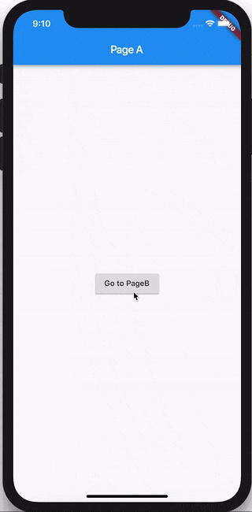

# Receitas: Navegação

> Nesta receita, veremos como usar o `BlocBuilder` e / ou o `BlocListener` para navegar. Vamos explorar duas abordagens: Navegação Direta e Navegação de Rota.

## Navegação Direta

> Neste exemplo, veremos como usar o BlocBuilder para mostrar uma página específica (widget) em resposta a uma mudança de estado em um bloc sem o uso de uma rota.



### Bloc

Vamos construir o `MyBloc`, que pegará o` MyEvents` e os converterá em `MyStates`.

#### MyEvent

Para simplificar, nosso `MyBloc` responderá apenas a dois `MyEvents`: `eventA` e` eventB`.

```dart
enum MyEvent { eventA, eventB }
```

#### MyState

Nosso `MyBloc` pode ter um dos dois `DataStates` diferentes:

- `StateA` - o estado do bloc quando `PageA` é renderizado.
- `StateB` - o estado do bloc quando `PageB` é renderizado.

```dart
abstract class MyState {}

class StateA extends MyState {}

class StateB extends MyState {}
```

#### MyBloc

Nosso `MyBloc` deve ser algo como isto:

```dart
import 'package:bloc/bloc.dart';

class MyBloc extends Bloc<MyEvent, MyState> {
  @override
  MyState get initialState => StateA();

  @override
  Stream<MyState> mapEventToState(MyEvent event) async* {
    switch (event) {
      case MyEvent.eventA:
        yield StateA();
        break;
      case MyEvent.eventB:
        yield StateB();
        break;
    }
  }
}
```

### Camada de UI

Agora vamos dar uma olhada em como conectar nosso `MyBloc` a um widget e mostrar uma página diferente com base no estado do bloc.

```dart
import 'package:flutter/material.dart';
import 'package:meta/meta.dart';
import 'package:bloc/bloc.dart';
import 'package:flutter_bloc/flutter_bloc.dart';

void main() {
  runApp(
    BlocProvider(
      create: (context) => MyBloc(),
      child: MyApp(),
    ),
  );
}

enum MyEvent { eventA, eventB }

@immutable
abstract class MyState {}

class StateA extends MyState {}

class StateB extends MyState {}

class MyBloc extends Bloc<MyEvent, MyState> {
  @override
  MyState get initialState => StateA();

  @override
  Stream<MyState> mapEventToState(MyEvent event) async* {
    switch (event) {
      case MyEvent.eventA:
        yield StateA();
        break;
      case MyEvent.eventB:
        yield StateB();
        break;
    }
  }
}

class MyApp extends StatelessWidget {
  @override
  Widget build(BuildContext context) {
    return MaterialApp(
      home: BlocBuilder<MyBloc, MyState>(
        builder: (_, state) => state is StateA ? PageA() : PageB(),
      ),
    );
  }
}

class PageA extends StatelessWidget {
  @override
  Widget build(BuildContext context) {
    return Scaffold(
      appBar: AppBar(
        title: Text('Page A'),
      ),
      body: Center(
        child: RaisedButton(
          child: Text('Go to PageB'),
          onPressed: () {
            BlocProvider.of<MyBloc>(context).add(MyEvent.eventB);
          },
        ),
      ),
    );
  }
}

class PageB extends StatelessWidget {
  @override
  Widget build(BuildContext context) {
    return Scaffold(
      appBar: AppBar(
        title: Text('Page B'),
      ),
      body: Center(
        child: RaisedButton(
          child: Text('Go to PageA'),
          onPressed: () {
            BlocProvider.of<MyBloc>(context).add(MyEvent.eventA);
          },
        ),
      ),
    );
  }
}
```

?> Usamos o widget `BlocBuilder` para renderizar o widget correto em resposta a alterações de estado em nosso` MyBloc`.

?> Usamos o widget `BlocProvider` para tornar nossa instância do `MyBloc` disponível para toda a árvore do widget.

O código completo dessa receita pode ser encontrado [aqui](https://gist.github.com/felangel/386c840aad41c7675ab8695f15c4cb09).

## Navegação por Rotas

> Neste exemplo, veremos como usar o BlocListener para navegar para uma página específica (widget) em resposta a uma mudança de estado em um bloc usando uma rota.


### Bloc

Vamos reutilizar o mesmo `MyBloc` do exemplo anterior.

### Camada de UI

Vamos dar uma olhada em como direcionar para uma página diferente com base no estado do `MyBloc`.

```dart
import 'package:flutter/material.dart';
import 'package:meta/meta.dart';
import 'package:bloc/bloc.dart';
import 'package:flutter_bloc/flutter_bloc.dart';

void main() {
  runApp(
    BlocProvider(
      create: (context) => MyBloc(),
      child: MyApp(),
    ),
  );
}

enum MyEvent { eventA, eventB }

@immutable
abstract class MyState {}

class StateA extends MyState {}

class StateB extends MyState {}

class MyBloc extends Bloc<MyEvent, MyState> {
  @override
  MyState get initialState => StateA();

  @override
  Stream<MyState> mapEventToState(MyEvent event) async* {
    switch (event) {
      case MyEvent.eventA:
        yield StateA();
        break;
      case MyEvent.eventB:
        yield StateB();
        break;
    }
  }
}

class MyApp extends StatelessWidget {
  @override
  Widget build(BuildContext context) {
    return MaterialApp(
      routes: {
        '/': (context) => PageA(),
        '/pageB': (context) => PageB(),
      },
      initialRoute: '/',
    );
  }
}

class PageA extends StatelessWidget {
  @override
  Widget build(BuildContext context) {
    return BlocListener<MyBloc, MyState>(
      listener: (context, state) {
        if (state is StateB) {
          Navigator.of(context).pushNamed('/pageB');
        }
      },
      child: Scaffold(
        appBar: AppBar(
          title: Text('Page A'),
        ),
        body: Center(
          child: RaisedButton(
            child: Text('Go to PageB'),
            onPressed: () {
              BlocProvider.of<MyBloc>(context).add(MyEvent.eventB);
            },
          ),
        ),
      ),
    );
  }
}

class PageB extends StatelessWidget {
  @override
  Widget build(BuildContext context) {
    return Scaffold(
      appBar: AppBar(
        title: Text('Page B'),
      ),
      body: Center(
        child: RaisedButton(
          child: Text('Pop'),
          onPressed: () {
            Navigator.of(context).pop();
          },
        ),
      ),
    );
  }
}
```

?> Usamos o widget `BlocListener` para empurrar uma nova rota em resposta a alterações de estado em nosso `MyBloc`.

!> Para fins deste exemplo, estamos adicionando um evento apenas para navegação. Em um aplicativo real, você não deve criar eventos de navegação explícitos. Se não houver uma "lógica comercial" necessária para ativar a navegação, você deve sempre navegar diretamente em resposta à entrada do usuário (no retorno de chamada `onPressed`, etc ...). Navegue apenas em resposta a alterações de estado se alguma "lógica de negócios" for necessária para determinar para onde navegar.

O código completo dessa receita pode ser encontrado [aqui](https://gist.github.com/felangel/6bcd4be10c046ceb33eecfeb380135dd).
