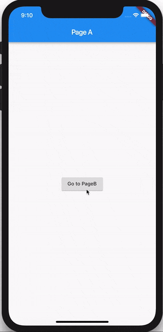
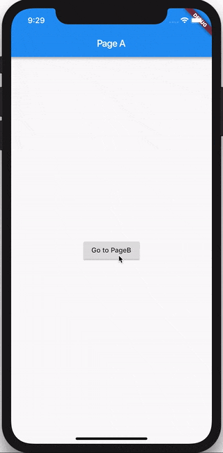

# Recipes: Navigation

> In this recipe, we're going to take a look at how to use `BlocBuilder` and/or `BlocListener` to do navigation. We're going to explore two approaches: Direct Navigation and Route Navigation.

## Direct Navigation

> In this example, we're going to take a look at how to use `BlocBuilder` to show a specific page (widget) in response to a state change in a bloc without the use of a route.

### Bloc

Let's build `MyBloc` which will take `MyEvents` and convert them into `MyStates`.

#### MyEvent

For simplicity, our `MyBloc` will only respond to a two `MyEvents`: `eventA` and `eventB`.

[my_event.dart](_snippets/recipes_flutter_navigation/my_event.dart.md ':include')

#### MyState

Our `MyBloc` can have one of two different `DataStates`:

- `StateA` - the state of the bloc when `PageA` is rendered.
- `StateB` - the state of the bloc when `PageB` is rendered.

[my_state.dart](_snippets/recipes_flutter_navigation/my_state.dart.md ':include')

#### MyBloc

Our `MyBloc` should look something like this:

[my_bloc.dart](_snippets/recipes_flutter_navigation/my_bloc.dart.md ':include')

### UI Layer

Now let's take a look at how to hook up our `MyBloc` to a widget and show a different page based on the bloc state.

[main.dart](_snippets/recipes_flutter_navigation/direct_navigation/main.dart.md ':include')

?> We use the `BlocBuilder` widget in order to render the correct widget in response to state changes in our `MyBloc`.

?> We use the `BlocProvider` widget in order to make our instance of `MyBloc` available to the entire widget tree.

The full source for this recipe can be found [here](https://gist.github.com/felangel/386c840aad41c7675ab8695f15c4cb09).

## Route Navigation

> In this example, we're going to take a look at how to use `BlocListener` to navigate to a specific page (widget) in response to a state change in a bloc using a route.

### Bloc

We're going to reuse the same `MyBloc` from the previous example.

### UI Layer

Let's take a look at how to route to a different page based on the state of `MyBloc`.

[main.dart](_snippets/recipes_flutter_navigation/route_navigation/main.dart.md ':include')

?> We use the `BlocListener` widget in order to push a new route in response to state changes in our `MyBloc`.

!> For the sake of this example we are adding an event just for navigation. In a real application, you should not create explicit navigation events. If there is no "business logic" necessary in order to trigger navigation you should always directly navigate in response to user input (in the `onPressed` callback, etc...). Only navigate in response to state changes if some "business logic" is required in order to determine where to navigate.

The full source for this recipe can be found [here](https://gist.github.com/felangel/6bcd4be10c046ceb33eecfeb380135dd).
