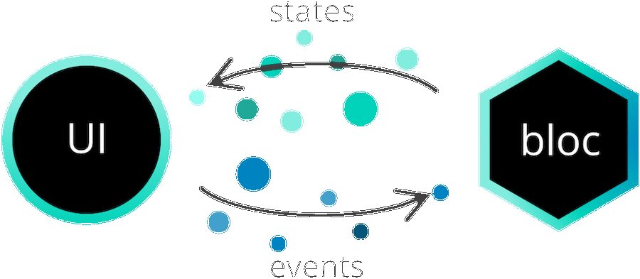

# Архитектура

Использование `bloc` позволяет нам разделить наше приложение на три слоя:

- Presentation (Представление)
- Business Logic (Бизнес логика)
- Data (Данные)
  - Repository (Хранилище)
  - Data Provider (Поставщик данных)

Мы начнем с самого нижнего уровня (самого дальнего от пользовательского интерфейса) и перейдем к уровню представления.

## Data Layer (Слой данных)

> Ответственность уровня данных заключается в извлечении/манипулировании данными из одного или нескольких источников.

Слой данных можно разделить на две части:

- Repository (Хранилище)
- Data Provider (Поставщик данных)

Этот уровень является самым низким уровнем приложения и взаимодействует с базами данных, сетевыми запросами и другими асинхронными источниками данных.

### Data Provider (Поставщик данных)

> Ответственность поставщика данных заключается в предоставлении необработанных данных. Поставщик данных должен быть универсальным.

Поставщик данных обычно предоставляет простые API для выполнения операций [CRUD](https://en.wikipedia.org/wiki/Create,_read,_update_and_delete). Мы могли бы иметь методы `createData`, `readData`, `updateData` и `deleteData` как часть нашего уровня данных.

[data_provider.dart](../_snippets/architecture/data_provider.dart.md ':include')

### Repository (Хранилище)

> Уровень хранилища представляет собой оболочку вокруг одного или нескольких поставщиков данных, с которыми связывается уровень `Bloc`.

[repository.dart](../_snippets/architecture/repository.dart.md ':include')

Как видите, наш уровень хранилища может взаимодействовать с несколькими поставщиками данных и выполнять преобразования данных перед передачей результата на уровень бизнес-логики.

## Слой Bloc (слой бизнес логики)

> Ответственность уровня блока заключается в том, чтобы отвечать на события из уровня представления новыми состояниями. Уровень блока может зависеть от одного или нескольких хранилищ для извлечения данных, необходимых для создания состояния приложения.

Думайте о `bloc` уровне как о мосте между пользовательским интерфейсом (уровень представления) и уровнем данных (data layer). Слой блока принимает события, сгенерированные пользовательским вводом, а затем связывается с репозиторием, чтобы создать новое состояние для уровня представления для дальнейшего использования.

[business_logic_component.dart](../_snippets/architecture/business_logic_component.dart.md ':include')

### Взаимодействие между блоками

> Каждый `bloc` имеет поток состояний, на который могут подписаться другие блоки, чтобы реагировать на изменения внутри себя.

`Blocs` могут зависеть от других `blocs`, чтобы реагировать на изменения их состояния. В следующем примере `MyBloc` зависит от `OtherBloc` и может добавлять события в ответ на изменения состояния в `OtherBloc`. `StreamSubscription` закрывается в переопределении `close` в `MyBloc`, чтобы избежать утечек памяти.

[bloc_to_bloc_communication.dart](../_snippets/architecture/bloc_to_bloc_communication.dart.md ':include')

## Слой представления

> Ответственность уровня представления состоит в том, чтобы выяснить, как визуализировать себя на основе одного или нескольких состояний `bloc`. Кроме того, он должен обрабатывать пользовательский ввод и события жизненного цикла приложения.

Большинство приложений начинается с события `AppStart`, которое при запуске сначала извлекает необходимые данные, представляемые пользователю.

В этом сценарии уровень представления добавил бы событие `AppStart`.

Кроме того, слой представления должен будет выяснить, что визуализировать на экране на основе состояния слоя `bloc`.

[presentation_component.dart](../_snippets/architecture/presentation_component.dart.md ':include')

Пока что, несмотря на то, что у нас уже имелись некоторые фрагменты кода, все это было на довольно высоком уровне. В этом же разделе мы соберем все вместе когда создадим несколько примеров приложений.
