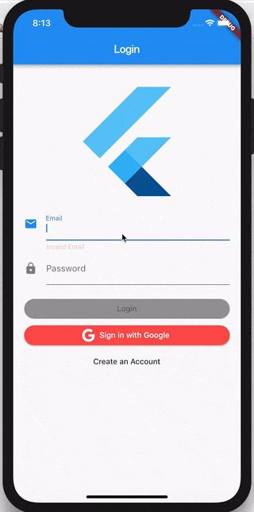

# Flutter Firebase Login

> В следующем руководстве мы собираемся создать `Login Flow` в Firebase на Flutter, используя библиотеку Bloc.

## Настройка

Мы начнем с создания нового проекта Flutter

[flutter_create.sh](../_snippets/flutter_firebase_login_tutorial/flutter_create.sh.md ':include')

Сначала нам нужно заменить содержимое файла `pubspec.yaml` на:

[pubspec.yaml](../_snippets/flutter_firebase_login_tutorial/pubspec.yaml.md ':include')

Обратите внимание, что мы указываем каталог `assets` для локальных ресурсов всех наших приложений. Создайте каталог `assets` в корне вашего проекта и добавьте ресурс [flutter logo](https://github.com/felangel/bloc/blob/master/examples/flutter_firebase_login/assets/flutter_logo.png), который мы позже будем использовать).

затем установите все зависимости

[flutter_packages_get.sh](../_snippets/flutter_firebase_login_tutorial/flutter_packages_get.sh.md ':include')

Последнее что нам нужно сделать, это следовать [инструкциям по использованию firebase_auth](https://pub.dev/packages/firebase_auth#usage), чтобы подключить наше приложение к `Firebase` и включить [google_signin](https://pub.dev/packages/google_sign_in).

## Хранилище пользователя

Как и во [Flutter Login](ru/flutterlogintutorial.md) нам нужно будет создать наш `UserRepository`, который будет отвечать за абстрагирование базовой реализации того как мы аутентифицируем и получаем информацию пользователя.

Давайте создадим `user_repository.dart` и начнем.

Мы можем начать с определения нашего класса `UserRepository` и реализации конструктора. Вы сразу можете увидеть, что `UserRepository` будет зависеть как от `FirebaseAuth`, так и от `GoogleSignIn`.

[user_repository.dart](../_snippets/flutter_firebase_login_tutorial/user_repository_constructor.dart.md ':include')

?> **Примечание:** Если `FirebaseAuth` и/или `GoogleSignIn` не внедрены в `UserRepository`, то мы создаем их экземпляры внутри себя. Это позволяет нам внедрять фиктивные экземпляры, чтобы мы могли легко протестировать `UserRepository`.

Первый метод, который мы собираемся реализовать мы будем называть `signInWithGoogle` и он будет аутентифицировать пользователя с помощью пакета `GoogleSignIn`.

[user_repository.dart](../_snippets/flutter_firebase_login_tutorial/sign_in_with_google.dart.md ':include')

Далее мы реализуем метод `signInWithCredentials`, который позволит пользователям входить со своими учетными данными, используя `FirebaseAuth`.

[user_repository.dart](../_snippets/flutter_firebase_login_tutorial/sign_in_with_credentials.dart.md ':include')

Далее нам нужно реализовать метод `signUp`, который позволяет пользователям создавать учетные записи, если они решат не использовать `Google Sign In`.

[user_repository.dart](../_snippets/flutter_firebase_login_tutorial/sign_up.dart.md ':include')

Нам нужно реализовать метод `signOut`, чтобы мы могли дать пользователям возможность выйти из системы и очистить информацию о своем профиле с устройства.

[user_repository.dart](../_snippets/flutter_firebase_login_tutorial/sign_out.dart.md ':include')

Наконец, нам понадобятся два дополнительных метода: `isSignedIn` и `getUser`, чтобы мы могли проверить, прошел ли пользователь аутентификацию и получить информацию о нем.

[user_repository.dart](../_snippets/flutter_firebase_login_tutorial/is_signed_in_and_get_user.dart.md ':include')

?> **Примечание:** `getUser` только для простоты возвращает адрес электронной почты текущего пользователя, но мы можем определить нашу собственную модель `User` и заполнить ее намного большим количеством информации о пользователе в более сложных приложениях.

Наш готовый файл `user_repository.dart` должен выглядеть так:

[user_repository.dart](../_snippets/flutter_firebase_login_tutorial/user_repository.dart.md ':include')

Далее мы собираемся построить наш `AuthenticationBloc`, который будет отвечать за обработку `AuthenticationState` приложения в ответ на `AuthenticationEvents`.

## Auth состояния

Нам нужно определить, как мы собираемся управлять состоянием нашего приложения и создать необходимые блоки (компоненты бизнес-логики).

На высоком уровне нам нужно будет управлять состоянием аутентификации пользователя. Состояние аутентификации пользователя может быть одним из следующих:

- AuthenticationInitial - ожидание проверки подлинности пользователя при запуске приложения
- AuthenticationSuccess - пользователь успешно аутентифицирован
- AuthenticationFailure - пользователь не аутентифицирован

Каждое из этих состояний будет влиять на то, что видит пользователь.

Например:

- если состояние аутентификации не было инициализировано, пользователь может видеть заставку
- если состояние аутентификации было аутентифицировано, пользователь может увидеть домашний экран
- если состояние аутентификации не было аутентифицировано, пользователь может увидеть форму входа в систему

> Очень важно определить, какими будут различные состояния, прежде чем погрузиться в реализацию.

Теперь, когда мы идентифицировали наши состояния аутентификации, мы можем реализовать наш класс `AuthenticationState`.

Создайте папку/каталог с именем `authentication_bloc` где мы сможем создать наши файлы блоков аутентификации.

[authentication_bloc_dir.sh](../_snippets/flutter_firebase_login_tutorial/authentication_bloc_dir.sh.md ':include')

?> **Совет:** Вы можете использовать [IntelliJ](https://plugins.jetbrains.com/plugin/12129-bloc-code-generator) или [VSCode](https://marketplace.visualstudio.com/items?itemName=FelixAngelov.bloc#overview) расширения для автоматического создания файлов для вас.

[authentication_state.dart](../_snippets/flutter_firebase_login_tutorial/authentication_state.dart.md ':include')

?> **Примечание**: Пакет [`equatable`](https://pub.dev/packages/equatable) используется для сравнения двух экземпляров `AuthenticationState`. По умолчанию `==` возвращает true только если два объекта являются одним и тем же экземпляром.

?> **Примечание**: `toString` переопределяется, чтобы упростить чтение `AuthenticationState` при печати его на консоли или в `Transitions`.

!> Поскольку мы используем `Equatable`, чтобы позволить нам сравнивать различные экземпляры `AuthenticationState`, нам нужно передать все свойства суперклассу. Без `List<Object> get props => [displayName]` мы не сможем правильно сравнить различные экземпляры `AuthenticationSuccess`.

## Auth события

Теперь, когда мы определили `AuthenticationState`, нам нужно определить `AuthenticationEvents`, на который будет реагировать наш `AuthenticationBloc`.

Нам понадобится:

- событие `AuthenticationStarted`, чтобы уведомить блок о том, что ему нужно проверить, аутентифицирован ли пользователь в настоящее время или нет.
- событие `AuthenticationLoggedIn`, чтобы уведомить блок о том, что пользователь успешно вошел в систему.
- событие `AuthenticationLoggedOut`, чтобы уведомить блок о том, что пользователь успешно вышел из системы.

[authentication_event.dart](../_snippets/flutter_firebase_login_tutorial/authentication_event.dart.md ':include')

## Auth блок

Теперь, когда у нас определены `AuthenticationState` и `AuthenticationEvents`, мы можем приступить к реализации `AuthenticationBloc`, который будет управлять проверкой и обновлением пользовательского `AuthenticationState` в ответ на `AuthenticationEvents`.

Мы начнем с создания нашего класса `AuthenticationBloc`.

[authentication_bloc.dart](../_snippets/flutter_firebase_login_tutorial/authentication_bloc_constructor.dart.md ':include')

?> **Примечание**: Из определения класса мы уже знаем, что этот блок будет преобразовывать `AuthenticationEvents` в `AuthenticationStates`.

?> **Примечание**: `AuthenticationBloc` зависит от `UserRepository`.

Мы можем начать с переопределения `initialState` в состояние `AuthenticationInitial()`.

[authentication_bloc.dart](../_snippets/flutter_firebase_login_tutorial/authentication_bloc_initial_state.dart.md ':include')

Теперь все, что осталось, это реализовать `mapEventToState`.

[authentication_bloc.dart](../_snippets/flutter_firebase_login_tutorial/authentication_bloc_map_event_to_state.dart.md ':include')

Мы создали отдельные приватные вспомогательные функции для преобразования каждого `AuthenticationEvent` в надлежащий `AuthenticationState`, чтобы сохранить `mapEventToState` чистым и легким для чтения.

?> **Примечание:** Мы используем `yield*` (yield-each) в `mapEventToState`, чтобы разделить обработчики событий на их собственные функции. `yield*` вставляет все элементы последовательности в стройную последовательность, как если бы у нас был отдельный выход для каждого элемента.

Наш полный `authentication_bloc.dart` теперь должен выглядеть так:

[authentication_bloc.dart](../_snippets/flutter_firebase_login_tutorial/authentication_bloc.dart.md ':include')

Теперь, когда наш `AuthenticationBloc` полностью реализован, давайте приступим к работе на уровне представления.

## Приложение

Мы начнем с удаления всего из `main.dart` и реализуем основную функцию самостоятельно.

[main.dart](../_snippets/flutter_firebase_login_tutorial/main1.dart.md ':include')

Мы оборачиваем весь наш виджет `App` в `BlocProvider`, чтобы сделать `AuthenticationBloc` доступным для всего дерева виджетов.

?> `WidgetsFlutterBinding.ensureInitialized()` требуется во Flutter v1.9.4 перед использованием любых плагинов, если код выполняется перед `runApp`.

?> `BlocProvider` также автоматически закрывает `AuthenticationBloc`, поэтому нам не нужно этого делать.

Далее нам нужно реализовать наш виджет `App`.

> `App` будет `StatelessWidget` и будет отвечать за реакцию на состояние `AuthenticationBloc` и отрисовку соответствующего виджета.

[main.dart](../_snippets/flutter_firebase_login_tutorial/main2.dart.md ':include')

Мы используем `BlocBuilder` для визуализации интерфейса на основе состояния `AuthenticationBloc`.

Пока что у нас нет виджетов для рендеринга, но мы вернемся к этому как только мы сделаем `SplashScreen`, `LoginScreen` и `HomeScreen`.

## Делегат блока

Прежде чем мы зайдем слишком далеко, всегда удобно реализовать наш собственный `BlocDelegate`, который позволяет нам переопределять `onTransition` и `onError` и поможет нам увидеть все изменения состояния блока (переходы) и ошибки в одном месте!

Создайте `simple_bloc_delegate.dart` и давайте быстро реализуем наш собственный делегат.

[simple_bloc_delegate.dart](../_snippets/flutter_firebase_login_tutorial/simple_bloc_delegate.dart.md ':include')

Теперь мы можем подключить наш `BlocDelegate` к нашему `main.dart`.

[main.dart](../_snippets/flutter_firebase_login_tutorial/main3.dart.md ':include')

## Заставка

Затем нам нужно создать виджет `SplashScreen`, который будет отображаться, пока наш `AuthenticationBloc` определяет, вошел ли пользователь в систему.

Давайте создадим `splash_screen.dart` и реализуем его!

[splash_screen.dart](../_snippets/flutter_firebase_login_tutorial/splash_screen.dart.md ':include')

Как вы можете заметить, этот виджет очень минималистичен и вы, возможно, захотите добавить какое-нибудь изображение или анимацию, чтобы он выглядел лучше. Ради простоты мы просто оставим все как есть.

Теперь давайте подключим его к нашему `main.dart`.

[main.dart](../_snippets/flutter_firebase_login_tutorial/main4.dart.md ':include')

Теперь, когда наш `AuthenticationBloc` имеет `AuthenticationInitial`, мы будем отображать наш виджет `SplashScreen`!

## Домашний экран

Затем нам нужно будет создать наш `HomeScreen`, чтобы мы могли переместить пользователя туда после того, как он успешно вошел в систему. В этом случае наш `HomeScreen` позволит пользователю выйти из системы, а также отобразит его текущее имя (адрес электронной почты).

Давайте создадим `home_screen.dart` и начнем.

[home_screen.dart](../_snippets/flutter_firebase_login_tutorial/home_screen.dart.md ':include')

`HomeScreen` - это `StatelessWidget`, для которого требуется ввести имя, чтобы оно могло отобразить приветственное сообщение. Он также использует `BlocProvider` для доступа к `AuthenticationBloc` через `BuildContext`, так что когда пользователь нажимает кнопку выхода из системы, мы можем добавить событие `AuthenticationLoggedOut`.

Теперь давайте обновим наше приложение для отображения `HomeScreen` если для `AuthenticationState` установлено значение `AuthenticationSuccess`.

[main.dart](../_snippets/flutter_firebase_login_tutorial/main5.dart.md ':include')

## Состояния входа

Наконец-то пришло время начать работу над процессом входа в систему. Мы начнем с определения различных `LoginStates`, которые у нас будут далее.

Создайте каталог `login` и создайте стандартный каталог и файлы блоков.

[login_bloc_dir.sh](../_snippets/flutter_firebase_login_tutorial/login_bloc_dir.sh.md ':include')

`login/bloc/login_state.dart` должен выглядеть так:

[login_state.dart](../_snippets/flutter_firebase_login_tutorial/login_state.dart.md ':include')

Состояния, которые мы представляем:

`initial` - начальное состояние LoginForm.
`loading` - это состояние LoginForm, когда мы проверяем учетные данные
`fail` - это состояние LoginForm, когда попытка входа не удалась.
`success` - это состояние LoginForm, когда попытка входа в систему была успешной.

Для удобства мы также определили функцию `copyWith` и `update` (которую мы вскоре добавим).

Теперь, когда мы определили `LoginState`, давайте взглянем на класс `LoginEvent`.

## Login события

Откройте `login/bloc/login_event.dart` и давайте определим и реализуем наши события.

[login_event.dart](../_snippets/flutter_firebase_login_tutorial/login_event.dart.md ':include')

Определенные нами события:

`LoginEmailChanged` - уведомляет блок о том, что пользователь изменил адрес электронной почты.
`LoginPasswordChanged` - уведомляет блок о том, что пользователь сменил пароль
`LoginWithGooglePressed` - уведомляет блок о том, что пользователь нажал кнопку входа в Google
`LoginWithCredentialsPressed` - уведомляет блок о том, что пользователь нажал кнопку обычного входа.

## Файл индекса

Прежде чем мы реализуем `LoginBloc`, давайте удостоверимся, что наш индексный файл готов и мы могли легко импортировать все файлы, связанные с `LoginBloc` с помощью одного импорта.

[bloc.dart](../_snippets/flutter_firebase_login_tutorial/login_barrel.dart.md ':include')

## Login блок

Пришло время реализовать наш `LoginBloc`. Как всегда, нам нужно расширить `Bloc` и определить наш `initialState`, а также `mapEventToState`.

[login_bloc.dart](../_snippets/flutter_firebase_login_tutorial/login_bloc.dart.md ':include')

**Примечание:** Мы переопределяем `transformEvents`, чтобы отменить события `LoginEmailChanged` и `LoginPasswordChanged` и дать пользователю время прекратить вводить текст перед проверкой ввода.

Мы используем класс `Validators` для проверки адреса электронной почты и пароля, которые мы собираемся реализовать далее.

## Валидаторы

Давайте создадим `validators.dart` и осуществим проверку электронной почты и проверку пароля.

[validators.dart](../_snippets/flutter_firebase_login_tutorial/validators.dart.md ':include')

Здесь ничего особенного не происходит. Это просто старый добрый код Dart, который использует регулярные выражения для проверки адреса электронной почты и пароля. На этом этапе у нас должен быть полностью функциональный `LoginBloc`, который мы можем подключить к пользовательскому интерфейсу.

## Экран входа

Теперь, когда мы завершили `LoginBloc`, пришло время создать виджет `LoginScreen`, который будет отвечать за создание и закрытие `LoginBloc`, а также за предоставление `Scaffold` для нашего виджета `LoginForm`.

Создайте `login/login_screen.dart` и давайте его реализуем.

[login_screen.dart](../_snippets/flutter_firebase_login_tutorial/login_screen.dart.md ':include')

Опять же, мы расширяем `StatelessWidget` и используем `BlocProvider` для инициализации и закрытия `LoginBloc`, а также для того, чтобы сделать экземпляр `LoginBloc` доступным для всех виджетов в поддереве.

На этом этапе нам нужно реализовать виджет `LoginForm`, который будет отвечать за отображение кнопок формы и отправки, чтобы пользователь мог аутентифицировать себя.

## Форма входа

Создайте `login/login_form.dart` и давайте создадим нашу форму.

[login_form.dart](../_snippets/flutter_firebase_login_tutorial/login_form.dart.md ':include')

Наш виджет `LoginForm` является `StatefulWidget`, потому что он должен поддерживать свой собственный `TextEditingControllers` для ввода адреса электронной почты и пароля.

Мы используем виджет `BlocListener`, чтобы выполнять одноразовые действия в ответ на изменения состояния. В этом случае мы показываем разные виджеты `SnackBar` в ответ на состояние ожидания/сбоя. Кроме того, если отправка прошла успешно, мы используем метод `listener` для уведомления `AuthenticationBloc` о том, что пользователь успешно вошел в систему.

?> **Совет:** Ознакомьтесь с [рецепт SnackBar](ru/recipesfluttershowsnackbar.md) для получения более подробной информации.

Мы используем виджет `BlocBuilder`, чтобы перестроить пользовательский интерфейс в ответ на различные `LoginStates`.

Всякий раз, когда электронная почта или пароль изменяются, мы добавляем событие в `LoginBloc`, чтобы он мог проверить текущее состояние формы и вернуть новое состояние.

?> **Примечание:** Мы используем `Image.asset` для загрузки логотипа Flutter из нашего каталога ресурсов.

На данный момент вы заметите, что мы не реализовали `LoginButton`, `GoogleLoginButton` или `CreateAccountButton`, но мы сделаем это дальше.

## Кнопка входа

Создайте `login/login_button.dart` и давайте быстро реализуем наш виджет `LoginButton`.

[login_button.dart](../_snippets/flutter_firebase_login_tutorial/login_button.dart.md ':include')

Здесь нет ничего особенного; просто `StatelessWidget`, который имеет некоторые стили и обратный вызов `onPressed`, то есть мы можем иметь собственный `VoidCallback` при каждом нажатии кнопки.

## Кнопка входа в Google

Создайте `login/google_login_button.dart` и давайте приступим к работе над нашим входом в Google.

[google_login_button.dart](../_snippets/flutter_firebase_login_tutorial/google_login_button.dart.md ':include')

Опять же, здесь не так уж много и происходит. У нас есть еще один `StatelessWidget`; однако на этот раз мы не выставляем обратный вызов `onPressed`. Вместо этого мы обрабатываем `onPressed` внутри и добавляем событие `LoginWithGooglePressed` в наш `LoginBloc`, который будет обрабатывать процесс входа в Google.

?> **Примечание:** Мы используем [font_awesome_flutter](https://pub.dev/packages/font_awesome_flutter) для классного значка Google.

## Кнопка создания учетной записи

Последней из трех кнопок является `CreateAccountButton`. Давайте создадим `login/create_account_button.dart` и приступим к работе.

[create_account_button.dart](../_snippets/flutter_firebase_login_tutorial/create_account_button.dart.md ':include')

В этом случае мы снова имеем `StatelessWidget` и снова обрабатываем обратный вызов `onPressed`. На этот раз, однако, мы выставляем новый маршрут в ответ на нажатие кнопки на `RegisterScreen`. Давайте строить это дальше!

## Состояние регистрации

Как и при входе в систему нам нужно определить наши значения `RegisterStates`, прежде чем продолжить.

Создайте каталог `register` и стандартный `bloc` каталог с файлами.

[register_bloc_dir.sh](../_snippets/flutter_firebase_login_tutorial/register_bloc_dir.sh.md ':include')

`register/bloc/register_state.dart` должен выглядеть так:

[register_state.dart](../_snippets/flutter_firebase_login_tutorial/register_state.dart.md ':include')

?> **Примечание:** `RegisterState` очень похож на `LoginState` и мы могли бы создать одно состояние и разделить его между двумя; однако весьма вероятно, что функции входа в систему и регистрации будут различаться и в большинстве случаев лучше их не связывать.

Далее мы перейдем к классу `RegisterEvent`.

## События регистрации

Откройте `register/bloc/register_event.dart` и давайте реализуем наши события.

[register_event.dart](../_snippets/flutter_firebase_login_tutorial/register_event.dart.md ':include')

?> **Примечание:** Опять же, реализация `RegisterEvent` выглядит очень похоже на реализацию `LoginEvent`, но, поскольку они являются отдельными функциями, мы сохраняем их независимость в этом примере.

## Индекс регистрации

Опять же, как и при входе в систему, нам нужно создать файл индекса для экспорта файлов, связанных с блоком регистрации.

Откройте `bloc.dart` в нашей директории `register/bloc` и экспортируйте три файла.

[bloc.dart](../_snippets/flutter_firebase_login_tutorial/register_barrel.dart.md ':include')

## Блок регистрации

Теперь давайте откроем `register/bloc/register_bloc.dart` и реализуем `RegisterBloc`.

[register_bloc.dart](../_snippets/flutter_firebase_login_tutorial/register_bloc.dart.md ':include')

Как и прежде, нам нужно расширить `Bloc`, реализовать `initialState` и `mapEventToState`. По желанию, мы снова переопределяем `transformEvents`, чтобы дать пользователям время закончить печатать, прежде чем мы проверим форму.

Теперь, когда `RegisterBloc` полностью функционален, нам просто нужно создать уровень представления.

## Экран регистрации

Подобно `LoginScreen`, наш `RegisterScreen` будет `StatelessWidget`, отвечающим за инициализацию и закрытие `RegisterBloc`. Он также предоставит Scaffold для `RegisterForm`.

Создайте `register/register_screen.dart` и давайте реализуем это.

[register_screen.dart](../_snippets/flutter_firebase_login_tutorial/register_screen.dart.md ':include')

## Регистрационная форма

Далее, давайте создадим `RegisterForm`, которая предоставит поля формы для пользователя, чтобы создать свою учетную запись.

Создайте `register/register_form.dart` и давайте его создадим.

[register_form.dart](../_snippets/flutter_firebase_login_tutorial/register_form.dart.md ':include')

Опять же, нам нужно управлять `TextEditingControllers` для ввода текста, поэтому наша `RegisterForm` должна быть `StatefulWidget`. Кроме того, мы снова используем `BlocListener`, чтобы выполнить одноразовые действия в ответ на изменения состояния, такие как показ `SnackBar`, когда регистрация ожидает или не удается. Мы также добавляем событие `AuthenticationLoggedIn` в `AuthenticationBloc` если регистрация прошла успешно, чтобы мы могли немедленно войти в систему.

?> **Примечание:** Мы используем `BlocBuilder`, чтобы заставить наш пользовательский интерфейс реагировать на изменения в состоянии `RegisterBloc`.

Давайте создадим наш виджет `RegisterButton` дальше.

## Кнопка регистрации

Создайте `register/register_button.dart` и начнем.

[register_button.dart](../_snippets/flutter_firebase_login_tutorial/register_button.dart.md ':include')

Очень похоже на то, как мы настраивали `LoginButton`, `RegisterButton` имеет некоторый пользовательский стиль и предоставляет `VoidCallback`, чтобы мы могли обрабатывать каждый раз, когда пользователь нажимает кнопку в родительском виджете.

Все, что осталось сделать - это обновить наш виджет `App` в `main.dart`, чтобы показать `LoginScreen`, если для `AuthenticationState` установлено значение `AuthenticationFailure`.

[main.dart](../_snippets/flutter_firebase_login_tutorial/main6.dart.md ':include')

На данный момент у нас есть довольно надежная реализация входа в систему с использованием `Firebase` и мы отделили наш уровень представления от уровня бизнес-логики с помощью библиотеки `Bloc`.

Полный исходный код этого примера можно найти [здесь](https://github.com/felangel/Bloc/tree/master/examples/flutter_firebase_login).
