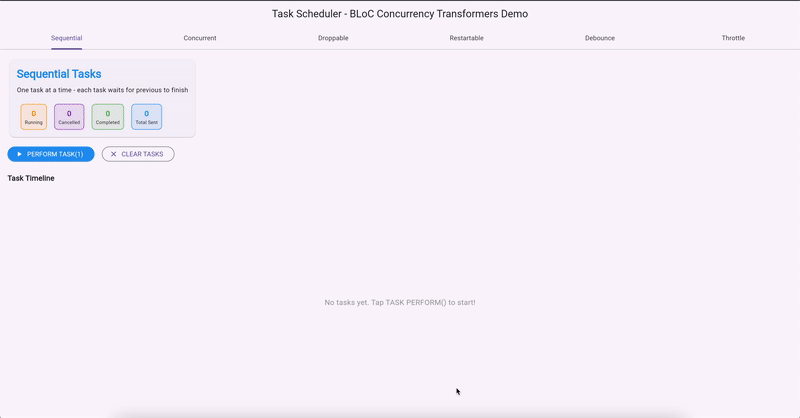
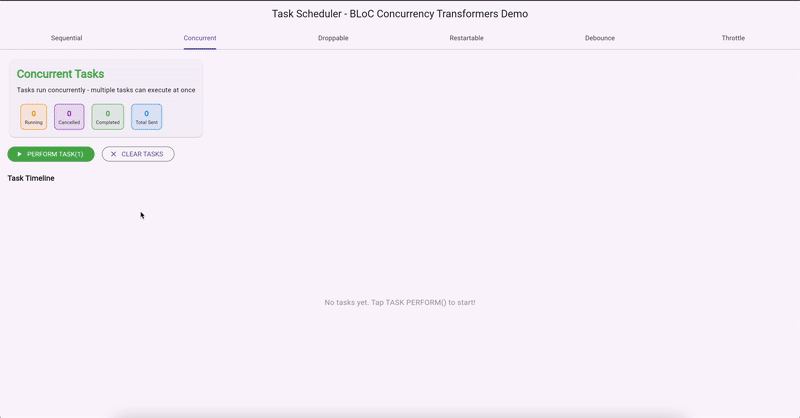
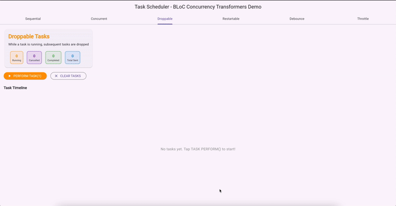
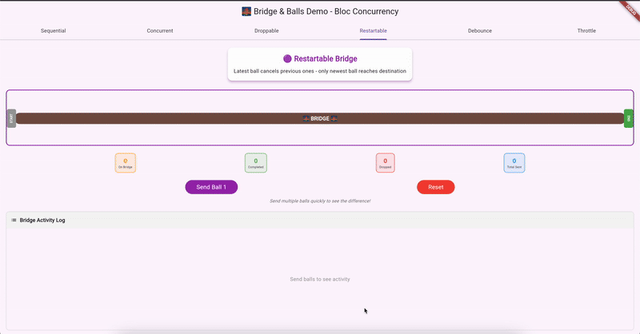
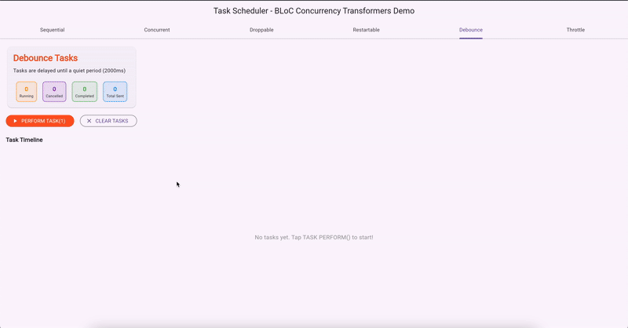
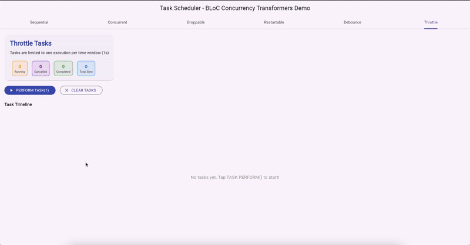

A Flutter app that uses [BlocConcurrency](https://pub.dev/packages/bloc_concurrency).

## 🔄 Transformers

- **`sequential()`** – Processes one event at a time in the order received; waits for the previous to finish.  

  

- **`concurrent()`** – Processes all incoming events simultaneously in parallel.  

  

- **`droppable()`** – Drops new events if a previous one is still being processed.  

  

- **`restartable()`** – Cancels the currently processing event and starts the latest one.

  

- **`debounceTime(Duration)`** – Delays event handling until a quiet period passes (e.g. user stops typing).  

  

- **`throttleTime(Duration)`** – Limits event processing to one per time window, ignoring rapid bursts.  

  
